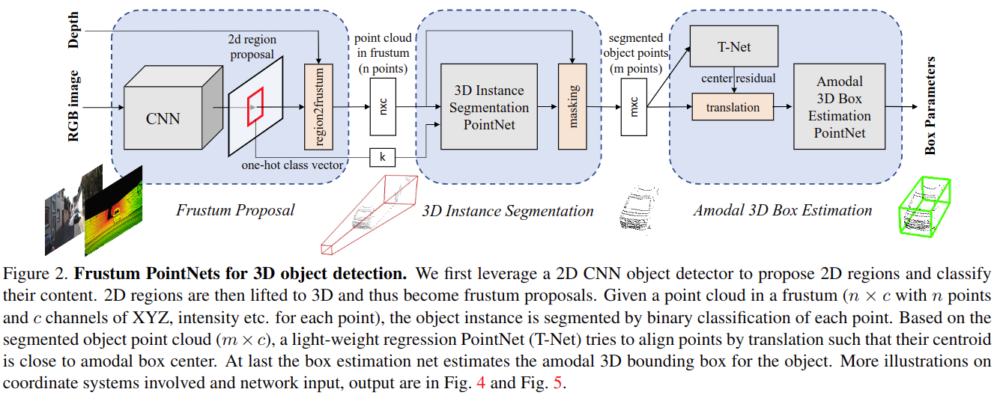

# Frustum PointNets for 3D Object Detection from RGB-D Data

元の論文の公開ページ : https://arxiv.org/abs/1711.08488  
Github Issues : 

## どんなもの?

## 先行研究と比べてどこがすごいの?

## 技術や手法のキモはどこ? or 提案手法の詳細
2D画像で検知した範囲から3D錐台状に点群を切り抜き、そこからオブジェクトの検出を行う。各オブジェクトはクラスとアモーダル3Dバウンディングボックスを持つ。アモーダルボックスはオブジェクトの一部が欠けていてもバウンディングする。このボックスはサイズ$h,w,l$、中央座標$c_ x,c_ y, c_ z$、方向$\theta,\phi,\psi$の値によって表現される。ただし、実装では鳥瞰図から見た方向$\theta$のみを扱う。

提案手法の概要図は図2の通り。

## どうやって有効だと検証した?

## 議論はある?

## 次に読むべき論文は?
- なし

## 論文関連リンク
1. なし

## 会議
CVPR 2018

## 著者
Charles R. Qi, Wei Liu, Chenxia Wu, Hao Su, Leonidas J. Guibas.

## 投稿日付(yyyy/MM/dd)
2017/11/22

## コメント
なし

## key-words
Point_Cloud, Detection, 2D_Image

## status
未完
