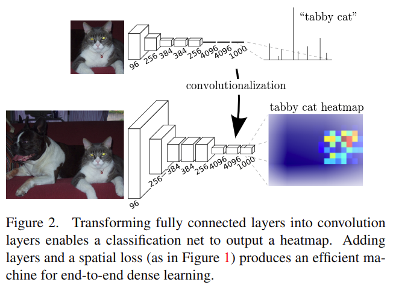

# Fully Convolutional Networks for Semantic Segmentation

元の論文の公開ページ : [arxiv](https://arxiv.org/abs/1411.4038)  
Github Issues : [#79](https://github.com/Obarads/obarads.github.io/issues/79)

## どんなもの?
任意のサイズの画像を取り込み、それに対応する密な予測(セグメンテーション)を行うEnd-to-Endなモデルを提案した。このモデルはfully convolutional networksとなっている。

## 先行研究と比べてどこがすごいの?
- End-to-End(non hybrid model)で学習できる。
- 本提案の密な予測(セグメンテーション)モデルは既存モデルの様々な方法(スーパーピクセルなど、詳細は2章参照)の処理を必要としないシンプルなものである。ただし、FCNsの観点からいくつかの処理(訓練手法、アップサンプリング)について検討する。
- 分類問題を解いた事前学習モデルを適応、拡張、微調整することで精度向上を図る。
- End-to-Endで微調整する(かな?)。

## 技術や手法のキモはどこ? or 提案手法の詳細
### Fully convolutional networks
畳み込み層のみを持つネットワークをdeep filterもしくはfully convolutional network(FCN、全畳込みネットワーク)と呼ぶ。FCNは任意のサイズの入力を処理し、対応する空間次元の出力を生成する(全結合層が含まれていないため、入力サイズに依存しない(ただし下限はある?))。

#### Adapting classifiers for dense prediction
既存の分類モデルは全結合層を持っているため固定長サイズ入力と分類タスクのための出力となっている。しかしながら、全結合層は$1\times 1$の畳み込みと見ることができる([1]、計算してみればわかる)。そのため、密な予測をするために全結合層を畳み込み層に換装させても問題ない。換装は図2の通り。分類タスク時に学習した重みを活かして、換装後(微調整後?)に任意のオブジェクトに沿ったヒートマップの出力を行うことができる。

また、計算速度も早くなる(ここの解説はよくわからなかった)。具体的には、$227\times227$入力のAlexNet分類モデルが1.2msかかるのに対し、$500\times 500$入力から$10\times10$のマップ出力を行うのに22msかかる。これは、既存のアプローチより5倍以上速い(?)(この辺、他の資料参照)。

#### Shift-and-stitch is filter rarefaction
省略

#### Upsampling is backwards strided convolution
畳み込みを施した特徴マップは入力時よりも解像度が下がる。これを入力時と同じ解像度に復元するため、アップサンプリング(ここのアップサンプリングはkeras等で実装されている層のことを指さない)を行う。アップサンプリングにはbackwards convolution(別名deconvolution)を行う。deconvolution層は非線形アップサンプリングを行う。

#### Patchwise training is loss sampling
省略

### Segmentation Architecture
ILSVRC分類器をFCNsに組み込んで微調整を行うが、ここで最終出力の空間的な精度を向上させるためにskipアーキテクチャを使用して学習を行う。

#### From classifier to dense FCN
事前訓練した分類モデルにはAlexNetやVGG16、GoogLeNetがあるため、これらのモデルの中でどれが一番FCNの精度を上げられるかバリデーションデータで実験した。結果は表1の通り。

#### Combining what and where
単純に階層的な処理を行うだけでは、粗のないきれいな出力を得ることができない。そこで、スキップ機構[2]を提案するアーキテクチャに追加する。スキップ機構をつけたアーキテクチャは図3の示す通り。尚、アップリングするための階層が畳み込み層より少ないのは、参照する情報の解像度が少ないためである。結果として、出力がより精巧になった。視覚的結果は図4の通り。

#### Experimental framework
かなり細かい実装情報が載っている。省略。

## どうやって有効だと検証した?
省略

## 議論はある?
省略

## 次に読むべき論文は?
- なし

## 論文関連リンク
1. [NegativeMind, FCN (Fully Convolutional Network)：ディープラーニングによるSemantic Segmentation手法, 2019.](https://blog.negativemind.com/2019/03/11/semantic-segmentation-by-fully-convolutional-network/)
2. [C. M. Bishop. Pattern recognition and machine learning, page 229. Springer-Verlag New York, 2006.](https://www.springer.com/gp/book/9780387310732)

## 会議
CVPR 2015

## 著者
Jonathan Long, Evan Shelhamer, Trevor Darrell.

## 投稿日付(yyyy/MM/dd)
2014/11/14

## コメント
なし

## key-words
RGB_Image, Semantic_Segmentation, CV, Paper

## status
修正

## read
A, I, M

## Citation
