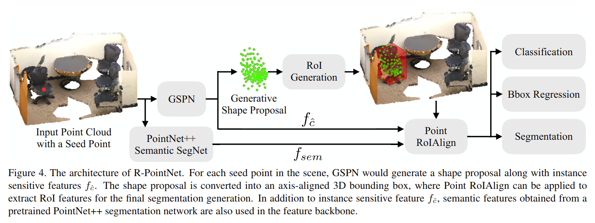

# GSPN: Generative Shape Proposal Network for 3D Instance Segmentation in Point Cloud

元の論文の公開ページ : [arxiv](https://arxiv.org/abs/1812.03320)
Github Issues : [#80](https://github.com/Obarads/obarads.github.io/issues/80)

## どんなもの?

## 先行研究と比べてどこがすごいの?
バウンドボックスによるオブジェクト検知はシンプルであるがあまり幾何学的形状の理解を必要としない(オブジェクトの境界に沿った分割を行わないため)。そのため、オブジェクト提案の領域が重複する箇所が発生する場合がある。また、オブジェクト提案はobjectness(物体っぽさ)をあまり考慮していない(Fast R-CNNなどが例)。これとは対照的にこの研究では幾何学的理解をより重視する手法を提案した。

## 技術や手法のキモはどこ? or 提案手法の詳細
### 概要 & R-PointNet
GSPNを使った点群セグメンテーション&オブジェクト検出アーキテクチャは図4の様にとおりである。このアーキテクチャをR-PointNetと呼ぶ。本提案はGenerative Shape Proposal Network (GSPN)と呼ばれる、objectnessを考慮した3Dオブジェクト提案を行う機構がミソとなる。

図4に沿ってR-PointNetの説明を行う。R-PointNetはMask R-CNNを参考に作成されている。シーン中の各シード点(左の赤点)に対し、GPSNはシード点を含んでいるオブジェクトの形状提案とinstance sensitive features $f_ {\hat{c} }$を生成する。形状提案は3Dバウンディングボックスへ変換され、最終的なセグメンテーションの生成を行うためにRoIとしてPoint RoIAlignが適応され、RoIの特徴が抽出される。$f_ {\hat{c} }$やPointNet++のセマンティックネットワークが生成する$f_ {sem}$をsemantic featuresとしてPoint RoIAlignで扱う。

### Generative Shape Proposal Network (GSPN)
GSPNはオブジェクト提案の手順をオブジェクト生成として扱う。

GSPNのアーキテクチャは図2に示すとおりである。GPSNは4つのネットワークから構成される。入力はシーン点群$P$とシード点$s$である。出力はシード点とその周辺にある点群に基づいたオブジェクト(オブジェクト提案)である。

#### 入力
$c$はシード点$s$を中心として$P$から切り取られた点群である。$c$は$K$個の異なる切り取り半径をもとに球状の範囲を持って生成される。$K=3$であるとき、異なるスケールの点群(論文ではコンテキスト)$c_ {k \in \\{1 \cdots K\\}}$が得られる。

#### Center Prediction Network
Center prediction networkは$c$を受け取り、ワールド座標系におけるオブジェクト$x$の中央$t$(これがバウンディングボックスの中央となる)を回帰する。具体的には、$c_ {k}$を$K$個のPointNetにそれぞれ入力し、各PointNetから出力された特徴ベクトル$f_ {c_ {k} }$を連結させた$f_ c$をMLPに渡して、中央$t$を求める。(※注意として、シード点はおそらくランダムに選ばれた点であるため、必ずしもオブジェクトの中心点にならない(つまり$s\not= t$))  
Center prediction networkによって計算された$t$は、$c$を$t$を中心とする座標に変換した$\hat{c}_ {k \in \\{1 \cdots K\\} }$とGeneration Networkの出力に使われる。

#### Prior Network
prior networkは$\hat{c}$を入力として、$p_ {\theta}(z | c)$のガウス事前分布$\mathcal{N}(\mu_ {z}, \sigma_ {z}^{2})$に従う$\mu_ {z}, \sigma_ {z}$を出力する。この$z$は natural objects(実際のオブジェクト)の潜在変数を指す。prior networkは$K$個のPointNetとMLPで構成され、入力として$\hat{c}_ k$をそれぞれのPointNetに与え、PointNetの出力は連結することで一つの特徴ベクトル$f_ \hat{c}$へ変換される。その後、$f_ \hat{c}$はMLPを介して$\mu_ {z}, \sigma_ {z}$を出力する。

#### Recognition Network
Recognition networkは単体PointNetへ$\hat{x}$を入力し、その出力$f_ {\hat{x} }$をprior networkの$f_ \hat{c}$と連結する。連結された特徴はMLPに入力され、パラメーター化された$q_ {\phi}(z | x, c)$であるガウス提案分布$\mathcal{N}(\mu_ {z}^{\prime}, \sigma_ {z}^{\prime 2})$の$\mu_ {z}^{\prime}, \sigma_ {z}^{\prime}$を予測する。

#### Generation Network
Generation Networkは入力として$z$とprior networkの$f_ \hat{c}$を受け取り、点群$\hat{x}$と生成された点ごとの外見尤度(多分、オブジェクトっぽいかどうかということ)の信頼スコア$e$を出力する。この2つの出力(デコーディング)には[1]の構造を利用する。出力された点群$\hat{x}$は$t$を利用してシーンの座標に戻される。

#### その他
GPSNはMask R-CNNと同様に、各提案のobjectnessスコアを予測すため$f_ \hat{c}$を取るMLPを追加する。objectnessスコアはIoUとバウンディングボックスでsuperviseされる(?)。

## どうやって有効だと検証した?

## 議論はある?

## 次に読むべき論文は?
- なし

## 論文関連リンク
1. [H. Fan, H. Su, and L. J. Guibas. A point set generation net-work for 3d object reconstruction from a single image. In CVPR, volume 2, page 6, 2017.](http://ai.stanford.edu/~haosu/papers/SI2PC_arxiv_submit.pdf)

## 会議
CVPR 2019

## 著者
Li Yi, Wang Zhao, He Wang, Minhyuk Sung, Leonidas Guibas.

## 投稿日付(yyyy/MM/dd)
2018/12/08

## コメント
なし

## key-words
Point_Cloud, Semantic_Segmentation, Instance_Segmentation

## status
未完