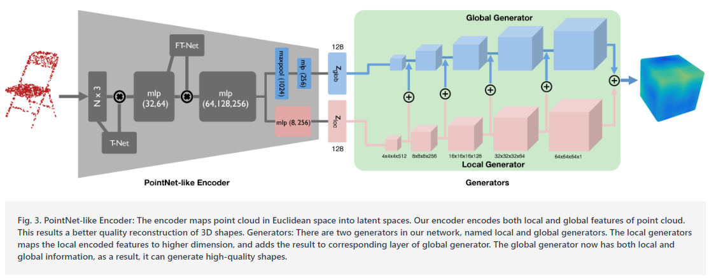
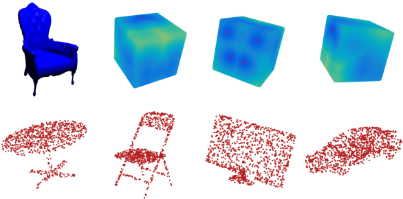
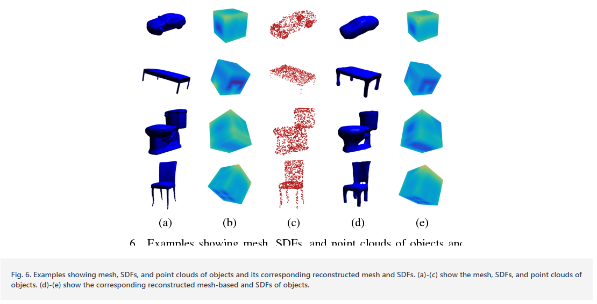
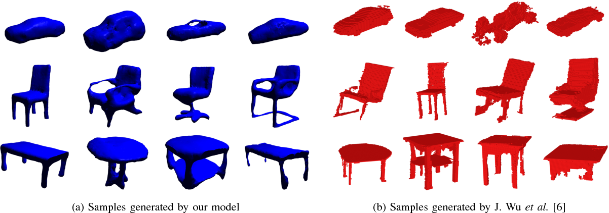

# Generating Mesh-based Shapes From Learned Latent Spaces of Point Clouds with VAE-GAN

元の論文の公開ページ : [IEEEのページ](https://ieeexplore.ieee.org/document/8546232)  
注意書き：論文がフリーではないため、おおざっぱにしか書きません。書く範囲は[1]に従って書きます。各図と表は[2]のものを引用しています。

## どんなもの?
点群からメッシュ表現を生成するVAE-GANタイプのモデルを提案した。

## 先行研究と比べてどこがすごいの?
点群から表面推定する研究はいくつかあるが、どれもオブジェクトごとにパラメーター調節が必要とされ、クラス間または内で一般化されていなかった。点群をメッシュへ変換するようなGANモデルは今までなかった。

## 技術や手法のキモはどこ? or 提案手法の詳細
### 構造
構造は図3の通り。分類タスク用のPointNetを基にしたエンコーダーを用いて点群を潜在表現にマッピングし、潜在表現からそれら点群に対応する3Dオブジェクトに復元する。復元される際の表現はsinged distance function(SDF)である。SDFは暗黙的な表面表現であり、具体的にはメッシュ面からの距離を表す[1]。図2の上段の椅子のSDFのカラーマップで言えば、ダークブルーがメッシュから近く、イエローがメッシュから遠い。

### PointNet-like Encoder
基本はPointNetと同じである。違う点は、multi layer perceptron(MLP)とfully connected層(FC層)がlocal featureをlocal latent spaceへエンコードするために追加されることである。また、図3の様にglobal featureとlocal featureを128次元の潜在空間へ落とし込むように設計されている。

### Local and Global Generators
global/local generatorの両方とも、$4 \times 4 \times 4$のカーネルサイズとストライド2を持つ3D deconvolutional層からなる、同じアーキテクチャである。local generatorの各層の出力をglobal generatorの対応する各層の出力に追加する。これにより、最終的に出力される3Dオブジェクトの表面がより詳細になる。global generatorの出力は[-1,1]の値を持つsigned distance functionの$64 \times 64 \times 64$行列である。

### Discriminator
生成器の逆演算(おそらく3D convolution)からなる弁別器である。最終的に[0,1]の値に絞り込む。

### Loss function
損失は[3]に従う。生成器が二つあるため損失が少し変わる。

## どうやって有効だと検証した?
生成したものは図6の通り。(a)~(c)はground truth、(d)、(e)は生成したものである。図7はほかの手法との比較である。

### その他
ベースラインとの比較なども行っている。

## 議論はある?
省略

## 次に読むべき論文は?
- なし

## 論文関連リンク
1. [千葉直也, 戸田幸宏. 三次元点群を取り扱うニューラルネットワークのサーベイ. (アクセス:2019/03/25)](https://www.slideshare.net/naoyachiba18/ss-120302579)
2. [Cherdsak Kingkan, Koichi Hashimoto. Generating Mesh-based Shapes From Learned Latent Spaces of Point Clouds with VAE-GAN - Semantic Scholar. (アクセス:2019/03/25)](https://www.semanticscholar.org/paper/Generating-Mesh-based-Shapes-From-Learned-Latent-of-Kingkan-Hashimoto/d522470ea99d90ce5e83854bc3e7adbe85960802)
3. [Jiajun Wu, Chengkai Zhang, Tianfan Xue, William T. Freeman, Joshua B. Tenenbaum. Learning a Probabilistic Latent Space of Object Shapes via 3D Generative-Adversarial Modeling. NIPS2016.](https://arxiv.org/abs/1610.07584)
4. [S. Osher, R. Fedkiw. Signed distance function. Springer, 2003, pp.17-22](https://link.springer.com/chapter/10.1007/0-387-22746-6_2)

## 会議
ICPR 2018

## 著者
Cherdsak Kingkan, Koichi Hashimoto.

## 投稿日付(yyyy/MM/dd)
2018/08/20

## コメント
なし

## key-words
Point_Cloud, GAN

## status
更新済