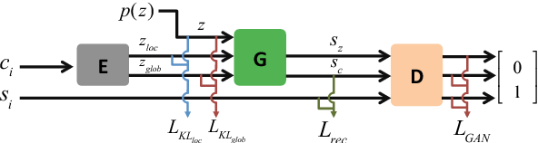

# Generating Mesh-based Shapes From Learned Latent Spaces of Point Clouds with VAE-GAN

元の論文の公開ページ : [IEEEのページ](https://ieeexplore.ieee.org/document/8546232)

## どんなもの?

## 先行研究と比べてどこがすごいの?

## 技術や手法のキモはどこ? or 提案手法の詳細

## どうやって有効だと検証した?

## 議論はある?

## 次に読むべき論文は?
-
-

### 論文関連リンク
1.
2.

### 会議
ICPR 2018

### 著者
Cherdsak Kingkan, Koichi Hashimoto.

### 投稿日付(yyyy/MM/dd)
2018/08/20

## コメント
なし

## key-words
Point_Cloud, GAN