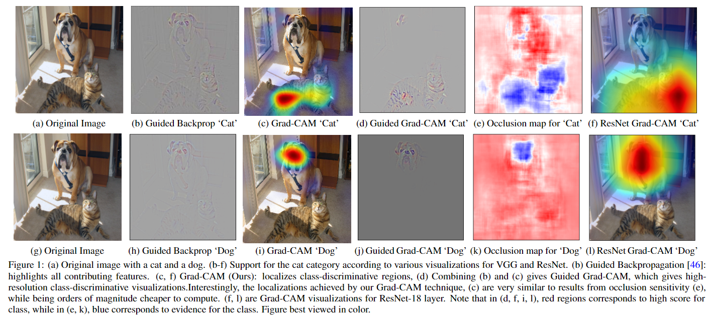
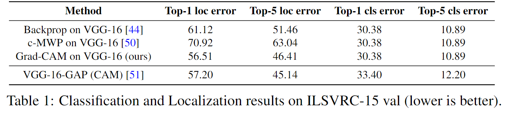

# Grad-CAM: Visual Explanations from Deep Networks via Gradient-based Localization

元の論文の公開ページ : [arxiv](https://arxiv.org/abs/1610.02391)
Github Issues : [#23](https://github.com/Obarads/obarads.github.io/issues/23)

## どんなもの?
犬、猫など概念を予測するためにCNNが画像のどの部分に注目しているか、それらの概念の勾配を用いてヒートマップで強調するGradient-weighted Class Activation Mapping(Grad-CAM)を提案した。

## 先行研究と比べてどこがすごいの?
シンプルさと性能はトレードオフな関係である。シンプルな構造になればなるほど解釈のしやすさ(透明性)がよくなる。論文関連リンク1で提案された、全結合層を含まない画像分類CNNの制限されたclassを使って判別位置を特定するClass Activation Mapping(CAM)があるが、これはモデルのシンプルさを上げる代わりにパフォーマンスを犠牲にしてモデル内の動きの透明性を高めている。著者らの提案はそれらのトレードオフを避けて、解釈性を上げる。また、このモデルは以下のような様々なCNNファミリーに適応できる。

- 全結合層を有するCNN(例:VGG)
- 構造化された出力に使用されるCNN(例:captioning)
- 強化学習やマルチモーダルな入力を有するタスクで使用されるCNN(例:VQA)

図1の様に、CAM(CAMは図1に無いが、表現はGrad-CAMと似ている)やGrad-CAMならそれ以外の方法よりどこに注目しているかわかりやすい視覚的な説明を行うことができる。また、図1のdやjの様に、一つの画像内に複数の有効な概念(分類でカテゴリ化されている対象)を含んでいたとしても、関心の決定(decision of interest、注目したい概念)に対応する画像の重要な位置が高解像度で視覚化される。

## 技術や手法のキモはどこ? or 提案手法の詳細
### 構造
提案手法は図2の通り。論文関連リンクの3と4は、より深い表現はより高いレベルの視覚構造を捉えると主張している。また、畳み込み特徴は全結合層で失われる空間情報を保持する。以上より、最後の畳み込み層が高レベルのセマンティックスと詳細な空間情報を保持していることを期待できる。Grad-CAMは最後の畳み込み層に流れ込む勾配情報を利用して、関心の決定のための各ニューロンの重要性を理解する。

具体的には、任意のクラスcに対して幅uと高さvのクラスを区別できる位置マップGrad-CAM $L_{\rm Grad-CAM}^c \in \mathbb{R}^{u \times v}$を取得するために、著者らは始めに、$\frac{\partial y^c}{\partial A^k}$のような畳み込み層の特徴マップ$A^k$に関する、クラス$c, y^c$(ソフマックス前)に対してスコアの勾配を計算する。逆流してきた勾配はニューロンの重要度を含む重み$\alpha_k^c$を得るためにglobal-average-poolされる、これを式(1)に示す。

$$
\alpha_k^c=\overbrace{\frac{1}{Z}\sum_i\sum_j}^{\rm global \ average \ pooling} \underbrace{\frac{\partial y^c}{\partial A_{ij}^k} }_{\rm gradients \ via \ backprop} \tag{1}
$$

この重み$\alpha_k^c$はAから深層ネットワークの下流のpartial linearizationを表している(?)。また、目的のクラス$c$に対する'重要度'の特徴マップ$k$を得る。

forward活性化マップの重みづけされた組み合わせを実行し、そして取得するためにReLUを使う。以上より式(2)のようになる。

$$
L_{\rm Grad-CAM}^c=\underbrace{ReLU(\sum_k\alpha_k^cA^k)}_{\rm linear \ combination} \tag{2}
$$

ここで、畳み込み特徴マップと同じサイズの荒いヒートマップになることに注意すること(VGGなどの場合は$14\times 14$になる、これはGuided Grad-CAMを作る動機になる)。  
関心のあるクラスのpositiveの影響力、つまり$y^c$を向上させるためにintensity(強さ)を上げる(強調する)必要があるピクセルを持つ特徴量だけに注目したいためReLUをマップの線形結合に適応する。逆に、Negativeなピクセルは画像内の他のカテゴリに属する可能性があるのでReLUで無視する。

### Grad-CAM as a generalization to CAM
Grad-CAMはCAMの一般化である。それに関連する内容を含んだ項。省略する。

### Guided Grad-CAM
Grad-CAMでCNNが注目している位置を大まかに示すことができるようになったものの、ヒートマップの解像度が低いため図１の(b)や(h)で示されているGuided Backpropagation(論文関連リンクの6)の手法の様にきめ細かい重要な部分を明確にすることができない。そこで、明確さを維持しつつもどこに注目しているか示すため、point-wiseの乗算を介してGrad-CAMの視覚化とGuided Backpropagationを合体する。具体的に言えば、$L_{\rm Grad-CAM}^c$はバイリニア補完を使い入力画像の解像度と同等になるようアップサンプリングされる。なお、Deconvolution(論文関連リンクの7)を使わなかった理由は、artifactが付随するからである(Guided backpropagationのほうが視覚的ノイズが少ないのもある)。

## どうやって有効だと検証した?
### Weakly-supervised Localization
画像分類の観点からGrad-CAMの位置特定能力を評価する。ImageNet localization challengeは、分類ラベルに加えて境界ボックスを提供するために競合するアプローチを必要としている。分類と同様に、上位1位と上位5位までの両方のカテゴリ予想に対して評価が行われる。方法は、
1. 画像が与えられたら、まずその画像のクラス予想を得る。
2. 予想されたクラスの各々に対してGrad-CAMのマップを生成する。
3. その後最大強度(映し出されたヒートマップの最大値?)の15%の閾値で二値化する。
4. これにより、連結されたピクセルのセグメントが作成され、単体の大きなセグメントの周りに境界ボックスが描かれる。

結果は表1の通り。

### その他
いろいろあるが省略

## 議論はある?
省略

## 次に読むべき論文は?
- 特になし

## 論文関連リンク
1. [B.Zhou,A.Khosla,L.A.,A.Oliva,andA.Torralba.LearningDeep Features for Discriminative Localization. InCVPR, 2016.](https://arxiv.org/abs/1512.04150)
2. [畳み込みネットワークの「基礎の基礎」を理解する　～ディープラーニング入門｜第2回](https://www.imagazine.co.jp/%E7%95%B3%E3%81%BF%E8%BE%BC%E3%81%BF%E3%83%8D%E3%83%83%E3%83%88%E3%83%AF%E3%83%BC%E3%82%AF%E3%81%AE%E3%80%8C%E5%9F%BA%E7%A4%8E%E3%81%AE%E5%9F%BA%E7%A4%8E%E3%80%8D%E3%82%92%E7%90%86%E8%A7%A3%E3%81%99/)
3. [Y. Bengio, A. Courville, and P. Vincent. Representation learning: A review and new perspectives. IEEE transactions on pattern analysis and machine intelligence, 35(8):1798–1828, 2013.](https://ieeexplore.ieee.org/document/6472238)
4. [A.MahendranandA.Vedaldi. Visualizingdeepconvolutionalneural networksusingnaturalpre-images.InternationalJournalofComputerVision, pages 1–23, 2016.](https://dl.acm.org/citation.cfm?id=2995953)
5. [Grad-CAM(GradCAM)の論文を流し読む](https://urusulambda.wordpress.com/2018/01/13/grad-cam%E3%81%AE%E8%AB%96%E6%96%87%E3%82%92%E6%B5%81%E3%81%97%E8%AA%AD%E3%82%80/)
6. [J. T. Springenberg, A. Dosovitskiy, T. Brox, and M. A. Ried-miller. Striving for Simplicity: The All Convolutional Net. CoRR, abs/1412.6806, 2014.](https://arxiv.org/abs/1412.6806)
7. [M. D. Zeiler and R. Fergus. Visualizing and understanding convolu-tional networks. InECCV, 2014.](https://cs.nyu.edu/~fergus/papers/zeilerECCV2014.pdf)

## 会議
ICCV 2017

## 著者
Ramprasaath R. Selvaraju, Michael Cogswell, Abhishek Das, Ramakrishna Vedantam, Devi Parikh and Dhruv Batra.

## 投稿日付(yyyy/MM/dd)
2016/10/7

## コメント
どちらかというと検証メインの論文。

## key-words
2D_Image, Analytics

## status
更新済