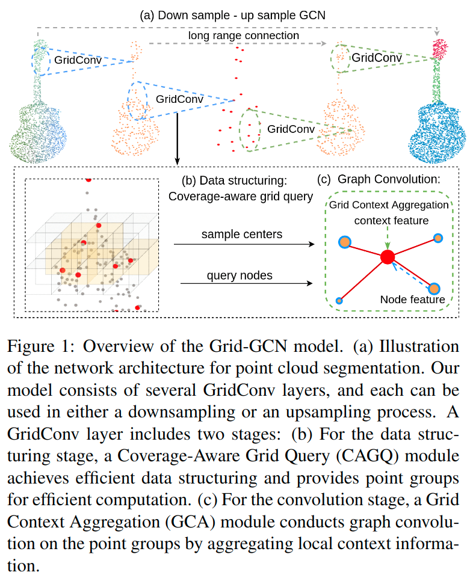

# Grid-GCN for Fast and Scalable Point Cloud Learning

元の論文の公開ページ : [arxiv.org](https://arxiv.org/abs/1912.02984)  
提案モデルの実装 : [2020/2/8:なし]()  
Github Issues :   

Note: 記事の見方や注意点については、[こちら](/)をご覧ください。

## どんなもの?
##### 高速でスケーラブル(拡張可能)な点群処理手法、Grid-GCNを提案した。
- Farthest Point Sampling(FPS)や近傍点探索などの点群構造化プロセスの新規提案である。
- Grid-CNNはCoverage-Aware Grid Query(CAGQ)と呼ばれる手法を取り込んでおり、この手法はFPSやボールクエリなどの点サンプリング手法よりも最大50倍早い。
- **81920個の点を含むScanNetデータを50fpsで処理した。**

## 先行研究と比べてどこがすごいの? or 関連事項
##### 省略

## 技術や手法のキモはどこ? or 提案手法の詳細
### 手法の概要
- 手法の概要図は図1の通り。提案モデルはGrid-GCNであり、このモデルの層であるGridConvがキモとなる。
  - ここではセグメンテーション用のGrid-GCNを説明している。
  - GridConvは2つのモジュールによって構成されている。

##### 1. 入力にGridConvによるダウンサンプリング処理を施す。
- GridConvは2つのモジュールによって構成されている。
  - これの詳細は工夫のCoverage-Aware Grid Query (CAGQ) moduleとGrid Context Aggregation (GCA) moduleにあり。

##### 2. ダウンサンプリングを施した入力にアップサンプリングを施す。
- セグメンテーションでは、最終的にラベルが割り振られる。
- アップサンプリングの詳細も工夫のCoverage-Aware Grid Query (CAGQ) moduleとGrid Context Aggregation (GCA) moduleにあり。

### 工夫
#### Coverage-Aware Grid Query (CAGQ) module
##### このモジュールは$N$個の点から$M$個の点グループをサンプリングする。各グループはK個のnode pointsとグループのcenterを持つ。
- 本モジュールの概要図は図2の通り。図2を見ながら以下を見るとわかりやすい。

##### はじめに、入力の空間をボクセル化する。
- このとき、ボクセルサイズを$(v_ x, v_ y, v_ z)$とする。
- 各点をボクセルインデックス$\operatorname{Vid}(u, v, w)=\operatorname{floor}(\frac{x}{v_ {x} }, \frac{y}{v_ {y} }, \frac{z}{v_ {z} })$へマッピングする。
  - ここでは、$n_ v$個まで各ボクセルに保存する。

##### 次に$M$個のcenter voxels $O_ {c} \subseteq O_ {v}$をサンプリングするとする。
- $O_ v$は空でないボクセル全てであるとする。
- 各center voxel $v_ i$に対して近傍ボクセルを$\pi(v_ i)$と、$\pi(v_ i)$内の保存された点をcontext pointsと定義する。
  - point-voxel間のインデックスはすでに前の段階で作成されているため、CAGQは高速で$v_ i$とcontext pointsの対応付けができる。
- その後、CAGQは各$v_ i$のcontext pointsから$K$個のnode pointsを選ぶ。
- そして、グループのcenterの位置として、グループ内のnode points重心が計算される。

##### この時点で、サンプリング関して2つの問題が残る。
- 問題は以下の通り。
  - (1) どうやってcenter voxels$O_ {c} \subseteq O_ {v}$をサンプリングするか。
  - (2) どうやって$\pi(v_ i)$中のcontext pointsから$K$個のnodeを選ぶか。

##### 最初の問題を解決するために、center voxels samplingフレームワークを提案する。
- このフレームワークは2つの手法を含んでいる。
- **Random Voxel Sampling (RVS)**: 空でない各ボクセルに対して同じ確率で選択する。これらのcenter voxels内で計算されたグループのcentersは、RPSによって入力点上で選択されたcentersよりも均等に分布する。[?]
- **Coverage-Aware Sampling (CAS)**: CASの目標は空でない[(ボクセルの部分の)]空間をできるだけカバーできるようにcenter voxels $O_ c$のセットを選択することである。[翻訳微妙]
  - 選ばれた各center voxelは最大$\lambda$個の空でない近傍ボクセルを覆う。
  - この問題の最適な解を見つけるため、組み合わせを全て試すことである。
  - それ故、greedy algorithmを使用して最適な解を見つける。

##### Coverage-Aware Samplingのgreedy algorithmについて
- はじめに、$O_ v$から$M$個のボクセルをincumbentsとしてランダムに選ぶ。
  - 選択されていない全てのボクセルから、毎回ランダムなincumbentにchallengeするためのボクセルを繰り返し選択する。
  - もし追加されたchallenger(and in the meantime removes the incumbent)がより良いカバレッジ(範囲)を与えてくれる場合、incumbentをchallengerに置き換える。
  - challenger $v_ C$とincumbent $v_ I$がある時、この方法は式(1)~(3)のように計算される。

$$
\delta(x)=\{\begin{array}{ll}1, & \text { if } x=0. \\ 0, & \text { otherwise }.\end{array} \tag{1}
$$

$$
H_{a d d}=\sum_{V \in \pi\left(V_{C}\right)} \delta\left(C_{V}\right)-\beta \cdot \frac{C_{V}}{\lambda} \tag{2}
$$

$$
H_{r m v}=\sum_{V \in \pi\left(V_{I}\right)} \delta\left(C_{V}-1\right) \tag{3}
$$

- ここで、
  - $\lambda$はボクセル近傍の量、
  - $C_ V$はボクセル$V$を覆うincumbentの数を示す。
  - $H_ {add}$は$V_ C$を追加した場合のカバレッジゲイン(coverage gain)を示す。
    - ただし、オーバーカバレッジにより罰則が与えられる。
  - $H_ {rmv}$は$V_ I$を排除したあとのカバレッジ損失を示す。
- もし$H_ {a d d}>H_ {r m v}$であるとき、incumbentはchallenger voxelと置き換えられる。
- もし、$\beta$を0とすると、交換するたびに空間のカバー範囲が改善される。

##### 2つ目の問題を解決するためにNode points queryingを使う。
- CAGQは、$\pi(v_ i)$中のcontext pointsから$K$個のnode pointsを選択するための戦略を提供する。
- **Cube Query**: context pointsから$$K個の点をランダムに選択する。PointNet++で使われているボールクエリと比較して、Cube Queryは点の密度がアンバランスであるとき、より多くのスペースをカバーするようにできる。
  - 図2より、ボールクエリは全ての生の点(グレー)から$K$個の点をサンプリングするため、3つの生の点を飲みを持つボクセルからnode pointsが選ばれることはない。
- **K-Nearest Neighbors**: 全ての点が探索範囲である従来のkNNと違い、CAGQのkNNはcontext points内のみ探索するだけでよく、クエリを大幅に高速化できる。
  - 補足資料で最適化された方法も提供する。

#### Grid Context Aggregation (GCA) module
##### 各点グループのために局所グラフを作成し、特徴をグループのcenterに集約する。
- CAGQによって提供された点のグループに対して、著者らはnode pointsからグループのcenterへ特徴を集約するGCAモジュールを使う。
- はじめに、local graph $G(V,E)$を作成する。
  - ここで、CAGQによって提供された$K$個のnode pointとグループのcenterからなる$V$があるとする。
- 次に、各node pointをグループのcenterへ接続する。
- GCAはnode pointの特徴$f_ i$を$\tilde{f}_ {i}$へ投影する。
- centerとnode間のエッジの関係に基づき、GCAは$\tilde{f}_ {i}$のcontribution[?]を計算し、centerの特徴$\tilde{f_ c}$としてこれら全ての特徴を集約する。
- 具体的には、GCAモジュールは式(4)(5)として表される。

$$
\widetilde{f}_{c, i}=e\left(\chi_{i}, f_{i}\right) * \mathcal{M}\left(f_{i}\right) \tag{4}
$$

$$
\tilde{f}_{c}=\mathcal{A}\left(\left\{\tilde{f}_{c, i}\right\}, i \in 1, \ldots, K\right) \tag{5}
$$

- ここで、
  - $\tilde{f}_ {c,i}$はnode空のcontribution、
  - $x_ i$はnodeのxyz座標である。
  - $\mathcal{M}$はMLP、
  - $e$はエッジのアテンション関数、
  - $\mathcal{A}$は集約関数である。
- 本提案では、アテンション関数$e$に新しい設計を施したものを使用する。
- 図4にそれの構造を載せる。

- **Coverage Weight**: 既存の研究は幾何学的関係の関数としてedge attentionをモデル化するためにcenterの$\mathcal{X}_ c$とnodeの$\mathcal{X}_ i$を使う。(図4b)
  - しかしながら、定式化は前の層からの各node pointのunderlying contribution[?]を無視する。
  - 直感的に、より多くの情報を持つnode pointに注意を払う必要がある。
    - このシナリオを図3に示す。
  - そのことを念頭におき、著者らはcoverage weightの概念を導入する。
    - これは、前の層のnodeへ集約された点の数として定義される。
  - この値はCAGQでかんたんに計算可能で、coverage weightはedge attentionを計算する際の重要な特性であると主張する。
    - 表6にablation studiesあり
- **Grid Context Pooling**: 意味的な関係性はedge attentionを計算する際の重要な側面がある。
  - 既存の研究では、意味的な関係性はgroup center's feature $f_ c$とnode point's features $f_ i$を使うことで符号化される。
  - [以降未読]

## どうやって有効だと検証した?
##### 省略

## 議論はある?
##### 省略

## 次に読むべき論文は?
##### なし

## 論文関連リンク
##### なし
1. [なし]()[1]

## 会議, 論文誌, etc.
##### まだ

## 著者
##### Qiangeng Xu, Xudong Sun, Cho-ying Wu, Panqu Wang, Ulrich Neumann

## 投稿日付(yyyy/MM/dd)
##### 2019/12/06

## コメント
##### なし

## key-words
##### CV, Paper, Point_Cloud, Classification, Semantic_Segmentation, 省略, 修正

## status
##### 修正

## read
##### A

## Citation
##### 未記入
