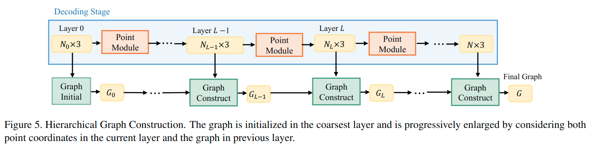
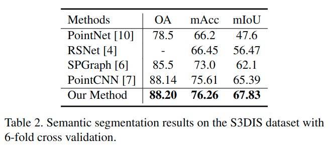
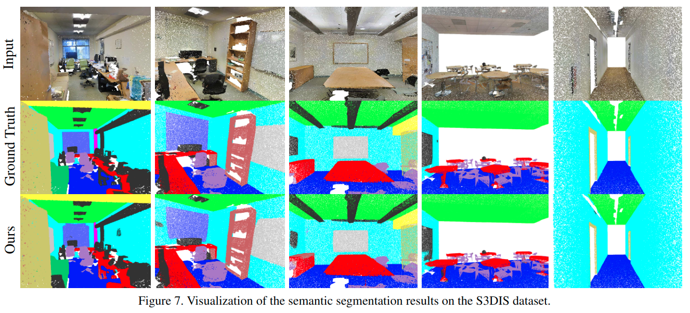
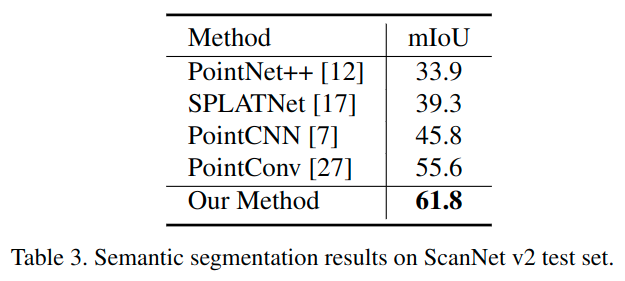
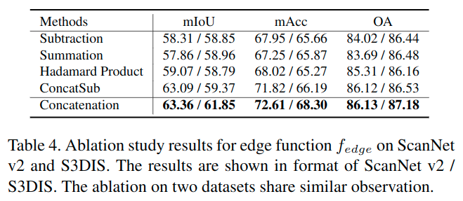

# Hierarchical Point-Edge Interaction Network for Point Cloud Semantic Segmentation

元の論文の公開ページ : [openaccess.thecvf.com](http://openaccess.thecvf.com/content_ICCV_2019/papers/Jiang_Hierarchical_Point-Edge_Interaction_Network_for_Point_Cloud_Semantic_Segmentation_ICCV_2019_paper.pdf)  
提案モデルの実装 : [2020/1/5:なし]()  
Github Issues :   

Note: 記事の見方や注意点については、[こちら](/)をご覧ください。
Note: 引用中の[*]は論文内の文献番号である。該当する論文は、論文関連リンクの各リストの末尾に基づいて調べられる。

## どんなもの?
##### 局所領域内の点間の意味関係を利用するために、点とcontextual neighborsの間にエッジを明示的に構築するモデルを提案した。
- decoding時に、点の情報を処理するPoint Branchとローカルコンテキスト情報を処理するEdge Branchを提案した。
  - ローカルコンテキスト情報は、点の近傍点から得られるエッジを扱ったもの。
- 損失も、Point branchとEdge branchのそれぞれから取得する。
  - Edge branchの損失は、二点間のセマンティックな一貫性を保つように学習される。
    - [セマンティックな一貫性は、2点間のセマンティックラベルの一致もしくは不一致から求める。]

##### 室内点群データセットを用いてベンチマークを行った。
- 使用したデータセットは以下の通り。
  - S3DIS
  - ScanNet

## 先行研究と比べてどこがすごいの? or 関連事項
##### 省略

## 技術や手法のキモはどこ? or 提案手法の詳細
### 手法の概要
- 手法の概要は図2の通り。

##### 1. PointNet++を模したEncoderを用いて点特徴量を取得する。
- 図を見ての通り、このとき特徴量のskip connectionも付属する。
- このPointNet++を模したネットワークはPoint Branchと呼ばれ、これはEncoding stageとDecoding stageによって構成されている。

##### 2. Encoding stageで得られた点の特徴量に基づいて、Edge BranchとPoint Branchによるセグメンテーション予測を行う。
- 詳細は工夫のEdge BranchとPoint Branchを参照。
- これらのBranchは、それぞれ別の損失を持っている。詳細は工夫の損失関数を参照。

### 工夫
#### Edge BranchとPoint Branch
##### 層の深度と点の数は比例する構造になっている。
- 層と点の関係は以下の通り。
- $N$個の点$\mathcal{P}=\{p_{1}, p_{2}, \ldots, p_{N}\}$を持つ点群が与えられる場合、有向グラフ$G=(V,E)$を構築する。
  - このとき、$V=\mathcal{P}$であり、$E$は点ごとにcontextual pointsを接続したエッジを示す。
- $G$はcoarse to fine的に、段階的[(層ごと)]に構築される。
- ここで、層$L$のグラフを$G_ L$と示す。
- $L$が大きいほど点の数が多い層となるため、層0が最も粗い層であり点が最も少ない。
- Edge branchでの処理の殆どは、Edge moduleによって行われる。

##### Edge Modiuleを用いて$L$層の点特徴からエッジ特徴を生成する。
- Edge Moduleの引数は$L$層の点特徴$\mathbb{F}_ {V_ L}$と($L-1$)層のエッジ特徴$\mathbb{H}_ {E_ {L-1}}$であり、$L$層のエッジ特徴を返す。
  - $G_ L=(V_ L, E_ L)$はグラフ
  - $N_ L$は点の数とする。
- 図3(a)に示す内容は、式(1)のように示される。

$$
\mathbb{H}_{E_{L}}=M_{\text {encoder}}\left(\mathbb{F}_{V_{L}}, M_{\text {upsample}}\left(\mathbb{H}_{E_{L-1}}\right)\right) \tag{1}
$$

- ここで
  - $M_ {encoder}$はedge encoder
  - $M_ {upsampling}$はedge upsamplingとする。
- このモジュールはグラフ$G_ {L-1}$のエッジ特徴をグラフ$G_ L$へマッピングする。

- 各エッジ$e_ {i,j}=(p_ i, p_ j)\in E_ L$に対して、$L$のエッジ特徴は式(2)のように示される。

$$
H_{i, j}^{L}=M_{\text {encoder}}\left(F_{i}^{L}, F_{j}^{L}, H_{i, j}^{L-1 \rightarrow L}\right) \tag{2}
$$

- ここで、
  - $F_i^L$と$F_ j^L$はそれぞれ$p_ i$と$p_ j$の点特徴
  - $H_{i, j}^{L-1 \rightarrow L}$は$L-1$層から$L$層へアップサンプリングされたエッジ特徴を指す。
- 図3(b)に示す内容は、式(3)(単体エッジのための$M_ {encoder}$)のように示される。

$$
H_{i, j}^{L}=f_{e x t}^{(1)}\left(\left[f_{e x t}^{(2)}\left(f_{e d g e}\left(F_{i}^{L}, F_{j}^{L}\right)\right), H_{i, j}^{L-1 \rightarrow L}\right]\right) 
$$

- ここで、
  - $[\cdot,\cdot]$は連結
  - $f_{e x t}: \mathbb{R}^{n} \rightarrow \mathbb{R}^{m}$は微分可能関数である。
  - 実装では、MLPを$f_ {ext}$として使う。
- また、エッジ関数$f_ {edge}$は接続した２つの点の特徴量を入力として、エッジの特徴量を出力する。これは式(4)のように示される。

$$
f_{e d g e}\left(F_{i}^{L}, F_{j}^{L}\right)=\left[\left(p_{j}-p_{i}\right), F_{j}^{L}, F_{i}^{L}\right] \tag{4}
$$

- ここでは、
  - $[\cdot,\cdot,\cdot]$は3要素の連結
  - $p_i,p_j$は3D点座標を示す。
  - 2点はの特徴は2点の情報を完全に保持しておくために連結される。
  - 二点間の相対座標を利用するため、$(p_i-p_j)$を与える。

##### Point Moduleでは、$L$層の$G_L$中の点$p_i$へ$p_i$に接続されているエッジのコンテキスト情報を含むように処理する。
- 点の情報を集約するため、maxpoolingを使用する。
- まずは、点$p_i$から始まるすべてのエッジを含む集合を$E_L(p_i)$として表し、対応するエッジ特徴の集合を式(5)に示す。

$$
\mathbb{H}_{E_{L}\left(p_{i}\right)}=\left\{H_{i, j}^{L} |\left(p_{i}, p_{j}\right) \in E_{L}\left(p_{i}\right)\right\} \tag{5}
$$

- このとき、図4に示すように点特徴$F_i^L$は式(6)で更新される。

$$
\left(F_{i}^{L}\right)_{n e w}=\left[F_{i}^{L}, \operatorname{Max} \operatorname{Pool}\left(\mathbb{H}_{E_{L}\left(p_{i}\right)}\right)\right] \tag{6}
$$

- ここで点へエッジ情報を組み込むのはmessage passing rangeを広げることでより遠くの局所領域特徴を汲み取ることができるようになるため。
  - [messageとは、"第1式では隣接ノードとエッジの特徴から注目ノードに向かう"[[1]より引用]もののことらしい。]
  - [message passing rangeとは、そのmessageの範囲のことだと思う(そのまんま)。]
- [互いのブランチの特徴量を利用することで、よりパワフルになり、最終的な予測が良くなる。]

##### グラフの構築は0層の初期化から始まる。初期化はkNNによって得られる。
- グラフは図5のように、層を経て段階的に頂点(点群の点)とエッジを増やすように設計される。そのため、$0$層でグラフを初期化する。
- 前の層のエッジを意識する"edge upsample"を設計することで、エッジに対して広範囲のmessage passingが可能になる。
- グラフはグラフは0層で初期化される。初期化は、$k_0$の近傍点を結ぶことで行われる。
- このグラフ$G_0=(V_0,E_0)$の初期化は式(7)で示される。
- $${\biggl\{} \begin{array}{l}
    V_{0}=\mathcal{P}_{0} \\
    E_{0}=\left\{\left(p_{i}, p_{j}\right) | p_{i} \in \mathcal{P}_{0}, p_{j} \in N_{k_{0}}\left(p_{i}\right)\right\}
    \end{array}
    \tag{7}$$
- このとき、
  - $\mathcal{P}_0$は0層での点集合
    - なお、この時点ではエンコーディング時にPointNet++で使われているFPSによるダウンサンプリングを受けているため、点の数は少ない。
    - $N_{k_0}(p_i)$は点$p_i$の$k_0$近傍点と自身の集合である。

##### 初期化されたグラフから、段階的にグラフが構築されていく。
- 先ほど初期化されたグラフは、層を経て段階的に頂点(点群の点)とエッジを増やされる。そのため、初期化($0$層の処理)の次は$L-1$と$L$層がそれぞれ点を頂点とした$V_{L-1}$と$V_L$を持つ場合を考える。
- グラフ$G_L$ははじめに$V_L$中の各点に対して$k_L$近傍を見つける。
- $G_{L}^{(0)}=(V_{L}, E_{L}^{(0)})$は各初期$L$層グラフを示す。
- 各エッジ$e_{i, j}=\left(p_{i}, p_{j}\right) \in E_{L}^{(0)}$では、$L-1$層の近傍エッジから成る集合を以下の式として考える。
- $$E_{n e}^{L-1}\left(e_{i, j}\right)=\left\{\left(p_{i}^{\prime}, p_{j}^{\prime}\right) | p_{i}^{\prime} \in N_{k}^{L-1}\left(p_{i}\right), p_{j}^{\prime} \in N_{k}^{L-1}\left(p_{j}\right)\right\}$$
- ここで、
  - $N_{k}^{L-1}\left(p_{i}\right) \subseteq V_{L-1}$は$L-1$層の$p_i^in V_{L}$の$k$近傍[点?]である。
  - もし$p_i\in V_ {L-1}$である場合、$N_k^{L-1}(p_i)$中に$p_i$が含まれる。
- 次に、$G_{L-1}$のエッジの集合である$E_{L-1}$に$E_{n e}^{L-1}(e_{i, j})$のエッジが存在するかどうかチェックする。
- もし、エッジ$e_{i,j}$が遠距離の二点を繋いでおり、$L-1$層でも対応する２つの領域間につながりがない場合、$L$層ではエッジとして考慮しない。
  - ["betewwn the two corresponding regions" ??? 翻訳あってるの...?]
- そのため、もし$E_{n e}^{L-1}(e_{i, j}) \cap E_{L-1}=\emptyset$である場合、エッジ$e_{i,j}$は$E^{0}_L$から削除される。
- したがって、最終的な$L$層でのグラフ$G_L=(V_L,E_L)$は下の式に沿ったエッジ集合を持つ。

$$
E_{L}=\bigcup_{p_{i} \in V_{L}} E_{L}\left(p_{i}\right)
$$

- ここで、$E_L(p_i)$($p_i$から始まるエッジ)は下のように示される。

$$
E_{L}\left(p_{i}\right)=\left\{\left(p_{i}, p_{j}\right) | p_{j} \in N_{k_{L}}\left(p_{i}\right), E_{n e}^{L-1}\left(e_{i, j}\right) \cap E_{L-1} \neq \emptyset\right\}
$$

- 極端なケースとして、少なくとも$e_{i,i}$が$E_L(p_i)$で予定されている。[(含まれることが予定されている。)]

##### Edge UpsamplingはPointNet++を参考にして設計した。
- PointNet++では、$L$層の$p_i$の点特徴は、式(8)のように$L-1$層の$k$近傍の特徴量を補間することで、$L-1$から伝播される。

$$
F_{i}^{L-1 \rightarrow L}=f_{i n t e r p}^{p}\left(\left\{F_{j}^{L-1} | p_{j} \in N_{k}^{L-1}\left(p_{i}\right)\right\}\right) \tag{8}
$$

- 本提案でも同様に、$L-1$層のエッジ特徴を$L$層へ伝播する(以下の通り、また図6参照)。

$$
H_{i, j}^{L-1 \rightarrow L}=f_{i n t e r p}^{e}\left(\left\{H_{i^{\prime}, j^{\prime}}^{L-1} |\left(p_{i^{\prime}}, p_{j^{\prime}}\right) \in E_{n e}^{L-1}\left(e_{i, j}\right) \cap E_{L-1}\right\}\right).
$$

- この補間の重みはend pointsの2つのペアのinverse distanceに基づく。
  - [end points? invers distance(距離の逆数?)?]
  - [Inverse Distance Weightingと関係ある?]
- 重みは式(9)のように定式化される。

$$
w_{i^{\prime}, j^{\prime} }=\frac{1}{\left(\left\|p_{i}-p_{i^{\prime} }\right\|^{t}+\epsilon\right) \cdot\left(\left\|p_{j}-p_{j^{\prime} }\right\|^{t}+\epsilon\right) } \tag{9}
$$

- ここで、
  - $p_{i^{\prime} }, p_{j^{\prime} } \in V_{L-1}, p_{i}, p_{j} \in V_{L}$は点の座標
  - $\epsilon=1 e-8$
  - $t$は2とする。
- この重みは式(10)のように正規化される。

$$
w_{i^\prime, j^\prime}^n=\frac{w_{i',j'} }{\sum_{(p_{i''},p_{j''} )\in E^{L-1}_{ne}(e_{i,j})\cap E_{L-1} } w_{i'',j''} } \tag{10}
$$

#### 損失関数
##### 損失はブランチごとに用意され、以下の損失関数で共同で最適化される。

$$
L=\lambda_{1} L_{\text {point} }+\lambda_{2} L_{\text {edge} } \tag{11}
$$

- ここで、
  - $\lambda$は調整用

##### Point Lossはsem.seg.のクロスエントロピー損失とする。
- point branchの出漁区に対して使用する。

##### Edge Lossはエッジの両端の点が同じカテゴリであるかどうかをラベルとしてバイナリクロスエントロピー損失を適応する。
- 最終層のグラフ$G$を用いて損失の計算を行う。
- エッジの両端の点が同じカテゴリであるかどうかで損失を取る。
- そのため、$e_{i,j}=(p_i,p_j)\in E$のラベルは式(12)で生成される。

$$
l_{i, j}^{e}=\biggl\{\begin{array}{ll}
1, & \text { if } l_{i}^{p}=l_{j}^{p} \\
0, & \text { if } l_{i}^{p} \neq l_{j}^{p}
\end{array} \tag{12}
$$

- ここで、
  - $l^p_i$と$l_j^p$はそれぞれ$p_i$と$p_j$のセマンティックラベルを示す。
- このエッジラベルを用いて、式(13)のようにバイナリクロスエントロピー損失を定義する。

$$
L_{e d g e}=-\frac{1}{|E|} \sum_{e_{i, j} \in E}\left(l_{i, j}^{e} \log \left(pred_{i, j}^{e}\right)+\alpha\left(1-l_{i, j}^{e}\right) \log \left(1-p r e d_{i, j}^{e}\right)\right) \tag{13}
$$

- ここで、
  - $pred^e_{i,j}$はエッジの予測
  - $\alpha$は2種類のエッジ、つまりintra-classエッジとinter-classエッジのバランスを示す。
- "The final edge feature for each edge can be deemed as a function on features of the two regions centered at the two-end points." 
- "Information from different layers are taken into account. More details are preserved by encoding at last." 
- "Hence, the edge loss guides the edge encoder to seek difference between the intra- and inter-class feature pairs, and implicitly serves as auxiliary supervision for point features." 
- "It increases the discrimination power among point features in different categories." 
- "Also, with the edge supervision, more exact contextual information is passed to points via edges to enhance point features. "

## どうやって有効だと検証した?
### 実装の詳細
- $N_{0}, N_{1}, N_{2}, N_{3}, N_{4}$の順で点の数が変わり、点の数はそれぞれ16, 64, 256, 1024, 4095である。
  - なお、$N_4=N$
- $k$の値は上の順で4, 6, 10, 14, 16となる。
  - "k is chosen as 3 for point and edge feature interpolation." ???
- ほかは論文を参照のこと。

### セマンティックセグメンテーション
#### S3DIS
##### S3DISに対する前提を明記する。
- 13カテゴリ使用。
- 部屋内から一区間($0.8m\times 0.8m$)をランダムサンプリングし、更に4096個の点をランダムサンプリングする。
- XYZ, RGB, 部屋内で正規化された座標の9Dベクトルを各点で示す。
  - [つまり利用する?]
- テストエリア内の点を評価に利用する。
- テストでは、二通りの設定が適応される"[20, 6, 7]"。
  - Area5をテストセットとして利用し、他を訓練用に利用する。
  - 6-fold cross validationを適応する。6つの領域のそれぞれを1回テストセットとして使用する。
    - [?]

##### 結果は表1,2の通り、PCCNやSPGraphなどと比較した。
- Area5に対する結果は表1の通り。

- 6-fold cross validationの結果は表2の通り。

- 視覚的結果は図7の通り。

#### ScanNet v2
##### 実験について
- ScanNet v2では、val setに対して予測を行った。
- [ここではほかは省略、結果のみを表記する。]

##### 結果は表3の通り、PointConvやPointCNNなどと比較した。
- 結果は表3の通り。

- 視覚的結果は図8の通り。

### その他
#### Ablation study
- [ここでは、この結果に関わる図と表だけ載せる、]

## 議論はある?
##### 遠距離および近距離のコンテキスト情報を集計したマルチレンジ対応のものを開発するだろう。

## 次に読むべき論文は?
##### なし

## 論文関連リンク
##### あり
1. [shionhonda, GNNまとめ(2): 様々なSpatial GCN, 2019.(アクセス:2020/05/31)](https://qiita.com/shionhonda/items/0d747b00fe6ddaff26e2)

## 会議, 論文誌, etc.
##### ICCV 2019

## 著者
##### Li Jiang, Hengshuang Zhao, Shu Liu, Xiaoyong Shen, Chi-Wing Fu, Jiaya Jia

## 投稿日付(yyyy/MM/dd)
##### 2019/09/23

## コメント
##### あり
- Rはよんでない

## key-words
##### Paper, CV, Point_Cloud, Semantic_Segmentation, 完了, Graph

## status
##### 完了

## read
##### A, I, C, M, E

## Citation
##### 未記入
