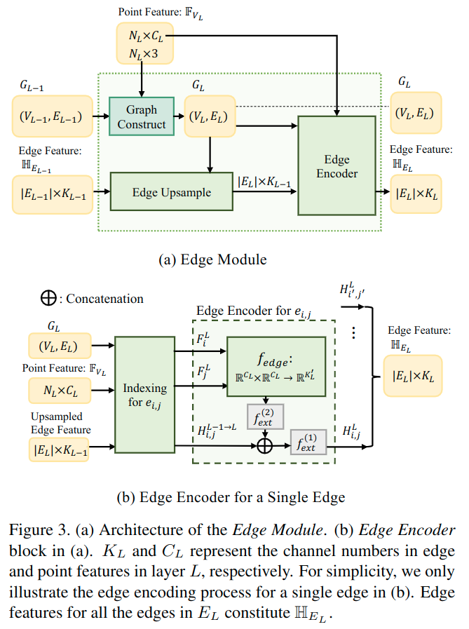

# Hierarchical Point-Edge Interaction Network for Point Cloud Semantic Segmentation

元の論文の公開ページ : [openaccess.thecvf.com](http://openaccess.thecvf.com/content_ICCV_2019/papers/Jiang_Hierarchical_Point-Edge_Interaction_Network_for_Point_Cloud_Semantic_Segmentation_ICCV_2019_paper.pdf)  
提案モデルの実装 : [2020/1/5:なし]()  
Github Issues :   

Note: 記事の見方や注意点については、[こちら](/)をご覧ください。
Note: 引用中の[*]は論文内の文献番号である。該当する論文は、論文関連リンクの各リストの末尾に基づいて調べられる。

## どんなもの?
##### 局所領域内の点間の意味関係を利用するために、点とcontextual neighborsの間にエッジを明示的に構築するモデルを提案した。
- decoding時に、点の情報を処理するPoint Branchとローカルコンテキスト情報を処理するEdge Branchを提案した。
  - ローカルコンテキスト情報は、点の近傍点から得られるエッジを扱ったもの。
- 損失も、Point branchとEdge branchのそれぞれから取得する。
  - Edge branchの損失は、二点間のセマンティックな一貫性を保つように学習される。
    - [セマンティックな一貫性は、2点間のセマンティックラベルの一致もしくは不一致から求める。]

##### 室内点群データセットを用いてベンチマークを行った。
- 使用したデータセットは以下の通り。
  - S3DIS
  - ScanNet

## 先行研究と比べてどこがすごいの? or 関連事項
##### 省略

## 技術や手法のキモはどこ? or 提案手法の詳細
### 手法の概要
- 手法の概要は図2の通り。

##### 1. PointNet++を模したEncoderを用いて点特徴量を取得する。
- 図を見ての通り、このとき特徴量のskip connectionも付属する。
- このPointNet++を模したネットワークはPoint Branchと呼ばれ、これはEncoding stageとDecoding stageによって構成されている。

##### 2. Encoding stageで得られた点の特徴量に基づいて、Edge BranchとPoint Branchによるセグメンテーション予測を行う。
- これらのBranchは、それぞれ別の損失を持っている。
- 詳細は工夫のEdge BranchとPoint Branchを参照。

### 工夫
#### Edge BranchとPoint Branch
##### 層の深度と点の数は比例する構造になっている。
- 層と点の関係は以下の通り。
- $N$個の点$\mathcal{P}=\{p_{1}, p_{2}, \ldots, p_{N}\}$を持つ点群が与えられる場合、有向グラフ$G=(V,E)$を構築する。
  - このとき、$V=\mathcal{P}$であり、$E$は点ごとにcontextual pointsを接続したエッジを示す。
- $G$はcoarse to fine的に、段階的[(層ごと)]に構築される。
- ここで、層$L$のグラフを$G_ L$と示す。
- $L$が大きいほど点の数が多い層となるため、層0が最も粗い層であり点が最も少ない。
- Edge branchでの処理の殆どは、Edge moduleによって行われる。

##### Edge Modiuleを用いて$L$層の点特徴からエッジ特徴を生成する。
- Edge Moduleの引数は$L$層の点特徴$\mathbb{F}_ {V_ L}$と($L-1$)層のエッジ特徴$\mathbb{H}_ {E_ {L-1}}$であり、$L$層のエッジ特徴を返す。
  - $G_ L=(V_ L, E_ L)$はグラフ
  - $N_ L$は点の数とする。
- 図3(a)に示す内容は、式(1)のように示される。

$$
\mathbb{H}_{E_{L}}=M_{\text {encoder}}\left(\mathbb{F}_{V_{L}}, M_{\text {upsample}}\left(\mathbb{H}_{E_{L-1}}\right)\right) \tag{1}
$$

- ここで
  - $M_ {encoder}$はedge encoder
  - $M_ {upsampling}$はedge upsamplingとする。
- このモジュールはグラフ$G_ {L-1}$のエッジ特徴をグラフ$G_ L$へマッピングする。

- 各エッジ$e_ {i,j}=(p_ i, p_ j)\in E_ L$に対して、$L$のエッジ特徴は式(2)のように示される。

$$
H_{i, j}^{L}=M_{\text {encoder}}\left(F_{i}^{L}, F_{j}^{L}, H_{i, j}^{L-1 \rightarrow L}\right) \tag{2}
$$

- ここで、
  - $F_i^L$と$F_ j^L$はそれぞれ$p_ i$と$p_ j$の点特徴
  - $H_{i, j}^{L-1 \rightarrow L}$は$L-1$層から$L$層へアップサンプリングされたエッジ特徴を指す。
- 図3(b)に示す内容は、式(3)(単体エッジのための$M_ {encoder}$)のように示される。

$$
H_{i, j}^{L}=f_{e x t}^{(1)}\left(\left[f_{e x t}^{(2)}\left(f_{e d g e}\left(F_{i}^{L}, F_{j}^{L}\right)\right), H_{i, j}^{L-1 \rightarrow L}\right]\right) 
$$

- ここで、
  - $[\cdot,\cdot]$は連結
  - $f_{e x t}: \mathbb{R}^{n} \rightarrow \mathbb{R}^{m}$は微分可能関数である。
  - 実装では、MLPを$f_ {ext}$として使う。
- また、エッジ関数$f_ {edge}$は接続した２つの点の特徴量を入力として、エッジの特徴量を出力する。これは式(4)のように示される。

$$
f_{e d g e}\left(F_{i}^{L}, F_{j}^{L}\right)=\left[\left(p_{j}-p_{i}\right), F_{j}^{L}, F_{i}^{L}\right] \tag{4}
$$

- ここでは、
  - $[\cdot,\cdot,\cdot]$は3要素の連結
  - $p_i,p_j$は3D点座標を示す。
  - 2点はの特徴は2点の情報を完全に保持しておくために連結される。
  - 二点間の相対座標を利用するため、$(p_i-p_j)$を与える。

##### Point Moduleでは、$L$層の$G_L$中の点$p_i$へ$p_i$に接続されているエッジのコンテキスト情報を含むように処理する。
- 点の情報を集約するため、maxpoolingを使用する。
- まずは、点$p_i$から始まるすべてのエッジを含む集合を$E_L(p_i)$として表し、対応するエッジ特徴の集合を式(5)に示す。

$$
\mathbb{H}_{E_{L}\left(p_{i}\right)}=\left\{H_{i, j}^{L} |\left(p_{i}, p_{j}\right) \in E_{L}\left(p_{i}\right)\right\} \tag{5}
$$

- このとき、図4に示すように点特徴$F_i^L$は式(6)で更新される。

$$
\left(F_{i}^{L}\right)_{n e w}=\left[F_{i}^{L}, \operatorname{Max} \operatorname{Pool}\left(\mathbb{H}_{E_{L}\left(p_{i}\right)}\right)\right] \tag{6}
$$

- ここで点へエッジ情報を組み込むのはmessage passing rangeを広げることでより遠くの局所領域特徴を汲み取ることができるようになるため。
  - [messageとは、"第1式では隣接ノードとエッジの特徴から注目ノードに向かう"[[1]より引用]もののことらしい。]
  - [message passing rangeとは、そのmessageの範囲のことだと思う(そのまんま)。]
- [互いのブランチの特徴量を利用することで、よりパワフルになり、最終的な予測が良くなる。]

##### グラフは0層で初期化された後、段階的に構築される。
- 図5に示すように、階層的にグラフ構築を行う。
- 前の層のエッジを意識する"edge upsample"を設計することで、エッジに対して広範囲のmessage passingが可能になる。
- グラフはグラフは0層で初期化される。初期化は、$k_0$の近傍点を結ぶことで行われる。
- このグラフ$G_0=(V_0,E_0)$の初期化は式(7)で示される。

$$
H_{i, j}^{L}=M_{e n c o d e r}\left(F_{i}^{L}, F_{j}^{L}, H_{i, j}^{L-1 \rightarrow L}\right) \tag{7}
$$

- このとき、
  - $\mathcal{P}_0$は0層での点集合
    - なお、この時点ではエンコーディング時にFPSによるダウンサンプリングを受けているため、点の数は少ない。
    - $N_{k_0}(p_i)$は点$p_i$の$k_0$近傍点と自身の集合である。

## どうやって有効だと検証した?
##### 省略

## 議論はある?
##### 遠距離および近距離のコンテキスト情報を集計したマルチレンジ対応のものを開発するだろう。

## 次に読むべき論文は?
##### なし

## 論文関連リンク
##### あり
1. [shionhonda, GNNまとめ(2): 様々なSpatial GCN, 2019.(アクセス:2020/05/31)](https://qiita.com/shionhonda/items/0d747b00fe6ddaff26e2)

## 会議, 論文誌, etc.
##### ICCV 2019

## 著者
##### Li Jiang, Hengshuang Zhao, Shu Liu, Xiaoyong Shen, Chi-Wing Fu, Jiaya Jia

## 投稿日付(yyyy/MM/dd)
##### 2019/09/23

## コメント
##### あり
- AとC、Iのcontributeをざっと確認

## key-words
##### Paper, CV, Point_Cloud, Semantic_Segmentation, 導入, Graph

## status
##### 導入

## read
##### A, I, C, M

## Citation
##### 未記入
