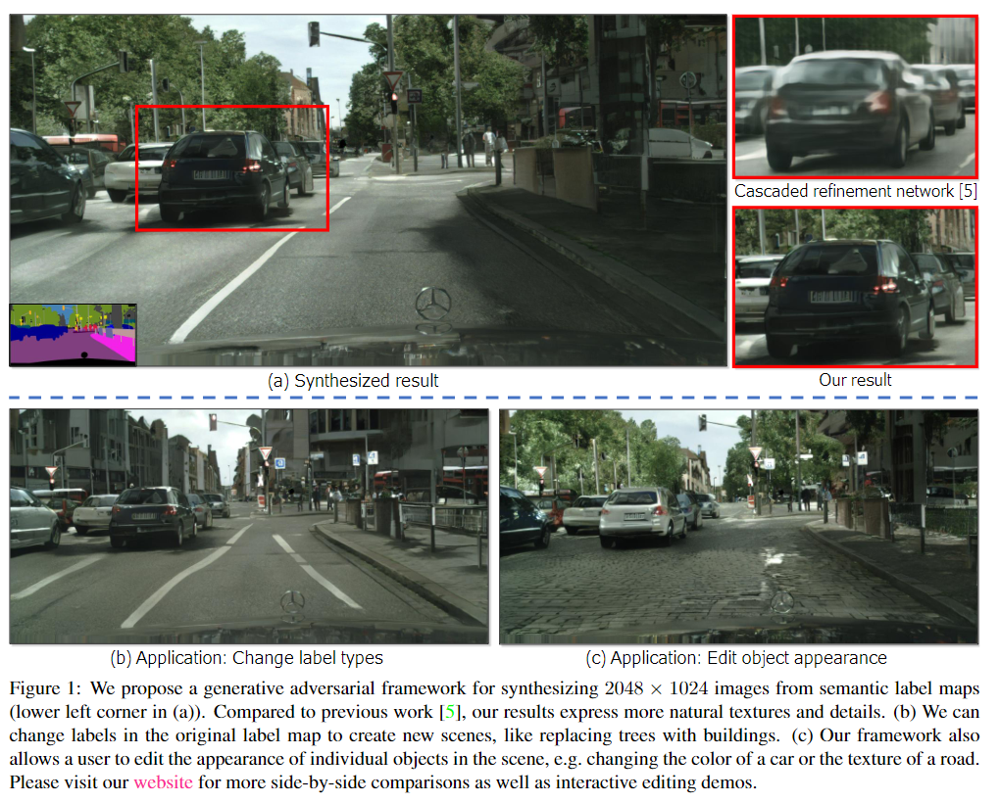
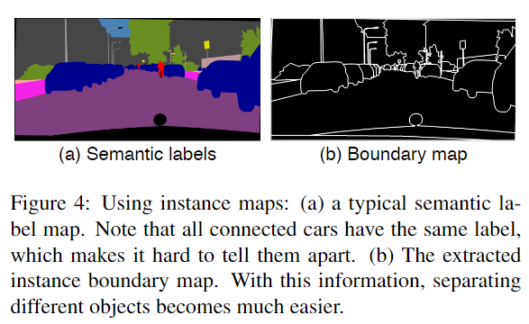
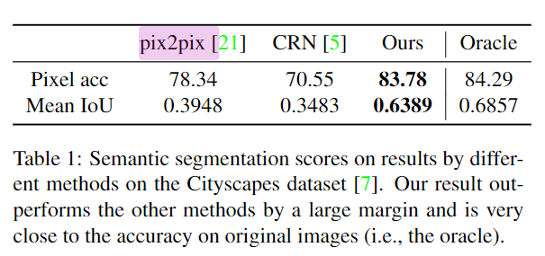
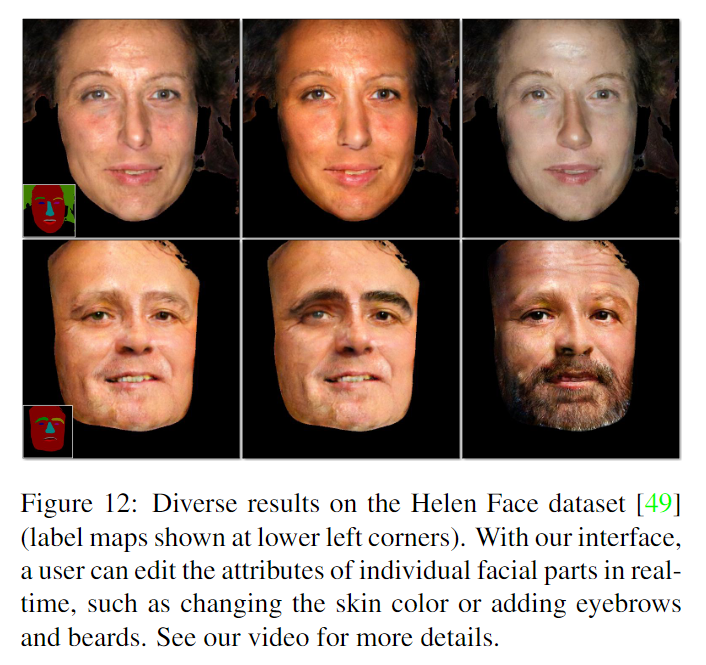

# High-Resolution Image Synthesis and Semantic Manipulation with Conditional GANs

元の論文の公開ページ : [arxiv](https://arxiv.org/abs/1711.11585)  
Github Issues : [#36](https://github.com/Obarads/obarads.github.io/issues/36)

## どんなもの?
GANを使った、セマンティックラベルマップから高解像度画像の生成を行う手法(論文中にはないがpix2pixHDといわれている)を提案した。また、生成する高解像度画像の編集方法も提案もしている。紹介ページは[5]にある。

## 先行研究と比べてどこがすごいの?
どんなもの?に示した内容ができるようになった。具体的には図1の様に画像がはっきりして画像内のオブジェクトのテクスチャを編集できるようになった。

## 技術や手法のキモはどこ? or 提案手法の詳細
モデルは図3の通り。global generator network $G_ 1$とlocal enhancer network $G_ 2$から構成されている。$G_ 1$と$G_ 2$では出力する画像のサイズが4倍(各次元2倍)違う。また、$G_ 2$の先にもう一つ$G_ 2$と同じ構造のものを取り付けることで解像度を上げられる。

### **global generator network ($G_ 1$)**
このアーキテクチャは[1]を元に作られており、[1]では最大$512 \times 512$サイズの画像のneural style transferを成功させている。  
$G_ 1$はconvolutional front-end $G_ 1^{(F)}$、residual blocksのセット $G_ 1^{(R)}$、transposed convolu-tional back-end $G_ 1^{(B)}$の3つのコンポーネントから構成されている。$G_ 1$は、$1024\times1024$の画像を入力し$1024\times 1024$の画像を出力するようになっている。

### **local enhancer network ($G_ 2, G_ 3$)**
このコンポーネントも$G_ 1$と同じ構造であり、convolutional front-end $G_ 2^{(F)}$、residual blocksのセット $G_ 2^{(R)}$、transposed convolu-tional back-end $G_ 2^{(B)}$の3つのコンポーネントから構成されている。ただし、図3に示すように$G_ 2^{(R)}$への入力は$G_ 1^{(B)}$と$G_ 2^{(F)}$の要素ごとの合計からなる。これにより、$G_ 1$で得たglobal featuresを$G_ 2$に統合できる。$G_ 3$とあるが、これは$G_ 2$と同じ構造のものを$G_ 2$の後ろにつけることで解像度を上げられる。

### **訓練**
$G_ 1 \to G_ 2 \to G_ 3$の順でそれぞれ訓練したのち、すべてのネットワークをfine-turningする。

### **弁別器と損失**
- **Multi-scale discriminators**  
  高解像度処理用の弁別器も多くのメモリ消費や、画像解像度と畳み込みカーネルの巨大化に伴う潜在的な過剰適合の可能性などの問題を持ち合わせている。  
  (解像度が大きいとカーネルもでかくなり、カーネルが細かい部分まで学習するようになる=カーネルが細かい部分まで一致していないと適切に処理できないような状態(過剰適合)の状態に陥る? 対策としてカーネルの数を増やす手があるが、それだとメモリが大変なことになる)  
  これに対応するため同一の構造を持つ3つのマルチスケール弁別器$D_ 1, D_ 2, D_ 3$を提案する。この弁別器の入力には生成された画像もしくは生成された画像に合わせてリサイズされた実画像がそれぞれ入力される。  
  解像度が低い入力の弁別器は画像全体の一貫性を保つために生成器を訓練し、解像度が高い入力の弁別器は生成器がより細かい部分まで生成できるように促す。また、生成器の数によって解像度を調節できるため、解像度を変えるたびにネットワークをすべて初期化して訓練する必要性がない。

  このネットワークの目的関数は式(3)のようになる。

  $$
  \min_ G \max_ {D_ 1,D_ 2,D_ 3} \sum_ {k=1,2,3}\mathcal{L}_ {\rm GAN}(G, D_ k) \tag{3}
  $$

- **Improved adversarial loss**  
  複数の生成器と弁別器で同じ風景を入力として扱うため、特徴マッチング損失を組み込む。具体的には、弁別器の複数の層から特徴を抽出し、実画像もしくは合成画像からこれらの中間表現を一致させることを学習する。特徴マッチング損失は式(4)の通り。

  $$
  \mathcal{L}_ {\rm FM}(G,D_ k)=\mathbb{E}_ {\rm (s,x)}\sum_ {i=1}^T\frac{1}{N_ i}[||D_ k^{(i)}{\rm (s,x)}-D_ k^{(i)}({\rm s},G({\rm s}))||_ 1] \tag{4}
  $$

  このとき、弁別器$D_ k$の$i$番目の層の特徴を$D_ k^{(i)}$、$T$は層の合計数、$N_i$は各層の要素数を示す。この特徴マッチングはperceptual損失([3]など)に関連しており、超解像[3]やstyle transfer[1]に有用とされている。VAE-GAN[4]でも同様のものが使われている。この損失を組み込んだ目的関数は式(5)のようになる。

  $$
  \min_ G((\max_ {D_ 1, D_ 2, D_ 3}\sum_ {k=1,2,3} \mathcal{L}_ {\rm GAN}(G,D_ k))+\lambda\sum_ {k=1,2,3} \mathcal{L}_ {\rm FM}(G,D_ k)) \tag{5}
  $$

  ここで、$\lambda$は二つの項のバランスをとるためのものである。注意として、$\mathcal{L}_ {\rm FM}$において、$D_ k$は特徴抽出器のとしてのみ動作し、損失$\mathcal{L}_ {\rm FM}$を最大化することはない。(?)

- **Using Instance Maps**  
  より自然な画像を生成するために、インスタンス情報を利用する。ただし、インスタンス情報はセマンティックラベルマップ(図4(a))に含まれない同オブジェクト同士が隣接した際の境界をはっきりさせるために使う。そのため、インスタンスデータをそのまま使わずに図4(b)のような境界線マップを使う。境界マップはセマンティックラベルマップと連結されて生成器に入力される。弁別器への入力も境界マップ、セマンティックラベルマップ、実画像/合成画像をチャンネルごと(channel-wise)に連結させたものを利用する。結果として、図5(b)の様な改善が確認された。

  

  

- **Learning an Instance-level Feature Embedding**  
  理想的な画像合成アルゴリズムは、一つのセマンティックラベルマップを使って、ユーザーが望む多様かつリアルな画像を生成できるはずである。しかし、既存研究では2つの理由でユーザーが望むような多様な画像を生成できるとはいえない。理由は以下の通り。

  - ユーザーは生成モデルがどんな種類の画像を生成するか直感的に制御できない。
  - 全体的な色やテクスチャへの変更を焦点にあてているため、オブジェクトレベルの制御はできない。

  そこで、上2つの制御をインスタンスレベルで可能にするために生成器への入力として追加の低次元特徴チャンネル(車の色などのテクスチャ、スタイルを符号化したチャンネル)を用意しする。この特徴を操作することで画像合成プロセスを柔軟に制御できる。さらに、特徴チャンネルは連続量であるため、さまざまな画像を生成できる。  
  低次元特徴チャンネルを生成するために、画像内の各インスタンスに対するground truth targetに対応する低次元特徴を見つけるようにencoder network $E$を学習する(?)。尚、この$E$は従来のencoder-decoder networkである。各インスタンス内で特徴が一貫していることを確認するために、オブジェクト毎に平均特徴を計算するために、エンコーダの出力にインスタンス毎のaverage pooling層を追加する。図6は、エンコードされた特徴の例を視覚化したものである。

  

  実際に生成器で使う際は、式(5)$のG_ ({\rm s})$を$G_ ({\rm s},E({\rm x}))$に置き換え、生成器と弁別器と共同で$E$を訓練する。訓練後、画像に含まれる全インスタンスのエンコードされた特徴を記録する。その後、セマンティックラベルの各カテゴリごとの特徴にK-meanクラスタを行う。推論時には、ランダムにクラスタの中心にある特徴を一つ選び、それをエンコードされた特徴として扱う。(この辺は[6]を参考に作成) 最終的に、これらの特徴はラベルマップと結合されて生成器へ入力される。ユーザーは、これらを使い各オブジェクトのベクトルを調節することができる。

## どうやって有効だと検証した?
### **Quantitative Comparisons**
生成した合成画像をセマンティックセグメンテーションモデルに入力し、ground truthラベルを予測させる。結果は表1の通り。

### **Interactive Object Editing**
図1の様に車の色を変えたり、図12の様に顔の特徴を編集できるようになった。ぜひ[5]のサイトを見ようとのこと。

## **その他**
他にもいろいろある。

## 議論はある?
なし

## 次に読むべき論文は?
- pix2pix

## 論文関連リンク
1. [J. Johnson, A. Alahi, and L. Fei-Fei. Perceptual losses for real-time style transfer and super-resolution. In European Conference on Computer Vision (ECCV), 2016.](https://arxiv.org/abs/1603.08155)
2. [A. Dosovitskiy and T. Brox. Generating images with perceptual similarity metrics based on deep networks. In Advances in Neural Information Processing Sys-tems (NIPS), 2016](https://papers.nips.cc/paper/6158-generating-images-with-perceptual-similarity-metrics-based-on-deep-networks)
3. [C. Ledig, L. Theis, F. Husz ́ ar, J. Caballero, A. Cun-ningham, A. Acosta, A. Aitken, A. Tejani, J. Totz, Z. Wang, et al. Photo-realistic single image super-resolution using a generative adversarial network. In IEEE Conference on Computer Vision and Pattern Recognition (CVPR), 2017.](https://arxiv.org/abs/1609.04802)
4. [A. B. L. Larsen, S. K. Sønderby, H. Larochelle, and O. Winther. Autoencoding beyond pixels using a learned similarity metric. InInternational Conference on Machine Learning (ICML), 2016.](https://arxiv.org/abs/1512.09300)
5. [本研究の紹介ページ](https://tcwang0509.github.io/pix2pixHD/)
6. [天崎 李. CVPR2018 pix2pixHD論文紹介 (CV勉強会@関東). (アクセス:2019/03/24)](https://www.slideshare.net/ssuser86aec4/cvpr2018-pix2pixhd-cv-103835371)

## 会議
CVPR 2018

## 著者
Ting-Chun Wang, Ming-Yu Liu, Jun-Yan Zhu, Andrew Tao, Jan Kautz, Bryan Catanzaro.

## 投稿日付(yyyy/MM/dd)
2017/11/30

## コメント
なし

## key-words
RGB_Image, GAN, Semantic_Segmentation, CV

## status
更新済