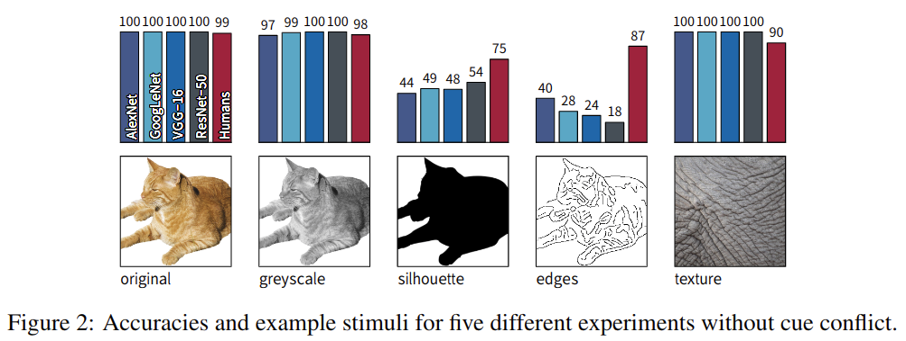
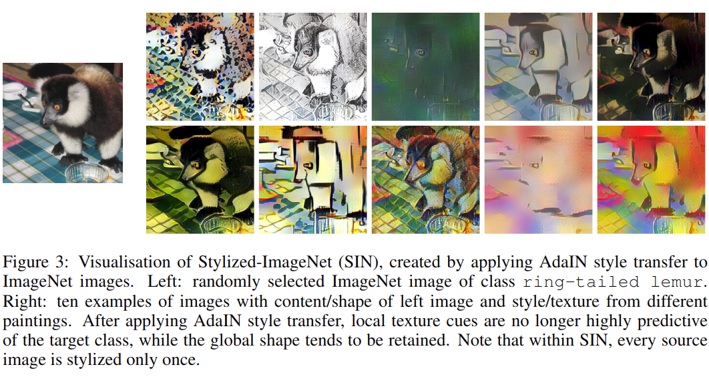
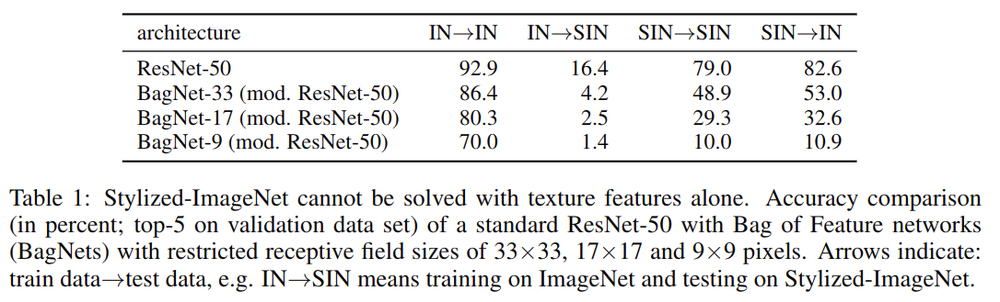
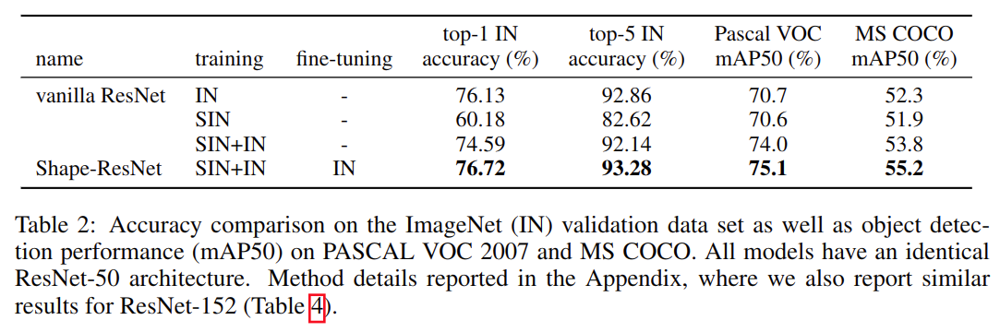

# ImageNet-trained CNNs are biased towards texture; increasing shape bias improves accuracy and robustness

元の論文の公開ページ : https://arxiv.org/abs/1811.12231  
Github Issues : [#66](https://github.com/Obarads/obarads.github.io/issues/66)

## どんなもの?
CNNは画像のオブジェクトの形状を記憶しそれに基づいて検出を行うというshape hypothesis(形状仮説,,論文内の呼称)に基づいていると考えられることが多い。しかし、ローカルテクスチャ(オブジェクト全体ではなく部分的な模様,パッチ?)がオブジェクトクラスに関する十分な情報を提供するらしく、ImageNetのオブジェクト認識はテクスチャ認識だけで実現できるという発見があった。これらの発見より、この論文ではtexture hypothesis(テクスチャ仮説,論文内の呼称)について検討する。論文では、形状仮説とテクスチャ仮説の矛盾を解決する実験を行う。

## 先行研究と比べてどこがすごいの?
省略

## 技術や手法のキモはどこ? or 提案手法の詳細
### PSYCHOPHYSICAL EXPERIMENTS
人の分類性能を正しく計測するため、人は計測時に決められた手順に従って分類を行った。計測に使われたカテゴリはairplane, bear, bicycle, bird, boat, bottle, car, cat, chair, clock, dog, elephant, keyboard, knife, oven and truckであり、データはImageNetの画像を利用する。これと同じ画像が標準的なImageNetで事前学習されたAlexNet、GoogLeNet、VGG-16、ResNet-50ら4つのCNNに与えられる。WordNetの階層を利用し、予測された1000個のImageNetクラスは16個のカテゴリーにマッピングされる(例:tabby cat -> cat)。  
結果として参加者97名と48560のpsychophysical trialsに基づいた結果が完成した。

### DATA SETS (PSYCHOPHYSICS)
実験は3つの対象実験と6つの主要な実験からなる。最初の5つの実験はシンプルなオブジェクト認識タスクである。これらの各実験には図2に示すような各データが使われる。

- **Original** : 合計160個の背景白のオブジェクトの自然なカラー画像
- **Greyscale** : skimage.color.rgb2grayを使ってOriginalの画像をグレイスケール化した画像
- **Silhouette** : Originalの画像のオブジェクトをシルエット化させた画像
- **Edges** : MATLABで実装されたCanny edge extractorを使ってOriginalの画像をedgeベースの表現に変換した画像
- **Texture** : 合計48個の自然なカラーテクスチャ画像、動物の皮や毛皮、人工物の表面等が含まれる

OriginalとTextureで選ばれた画像は、4つのCNNで正しく分類された画像である。これらの実験はテクスチャ仮説と形状仮説の観点を決定づける6つ目の実験の解釈を可能にするために行われる。

6つ目の実験は、図1のようなオブジェクトとテクスチャが合体した画像を分類するというものであり、これをキュー不一致実験(cue conflict experiment)と呼ぶ。尚、人にこの実験を行ってもらう際はテクスチャとオブジェクトのどちらかに注目して分類しろというような指示を与えない。そのため、正解も間違いも無く、その人の主観的な印象を記録する。CNNにもこのキュー不一致実験を行う。

- **Cue conflict** : 反復的なスタイル変換[1]を使って生成された画像を使う。使われる画像はOriginalの画像とTextureの画像である。合計で1280個の生成された画像を用意する。

### STYLIZED-IMAGENET
ImageNetから、ある画像にAdaINスタイル変換を適応してスタイルを変化させた画像で作った新しいデータセットを構築した。このデータセットをStylized-ImageNet(SIN)と呼ぶ。詳細は省略するが、データセット内の画像の一例は図3のとおりである。AdaINによってグローバルな形状は残る傾向があるが、ローカルテクスチャキューはターゲットクラス(図3で言えばワオキツネザル)を予測できるものではなくなった。

## どうやって有効だと検証した?
### TEXTURE VS SHAPE BIAS IN HUMANS AND IMAGENET-TRAINED CNNS
図2に結果を示す。OriginalとGreyscaleはCNNで正確な認識が可能なものの、Silhouetteでは人間の識別性能を大幅に下回った。Edgesでは更に顕著になり、人間はテクスチャ情報を持たない画像をうまく処理できていることを示した。これらより、CNNは訓練した画像(自然な画像)からEdges等のスケッチ画像への画像統計値の変化に対応できていないことがわかった。

そこで、さらなる理解を得るためにキュー不一致実験を行う。結果は図4の通り。人間は形状を元に分類しているのに対し、CNNはテクスチャを元に分類する傾向がある。

### OVERCOMING THE TEXTURE BIAS OF CNNS
前の実験より、CNNはテクスチャ情報に強く依存していることがわかった。このことより、ImageNetではグローバルな形状よりローカルテクスチャ特徴を分類&統合して処理するだけで十分である可能性がある。そこで、通常のResNet-50を用いてSINを評価する。INはImageNetを示す。SINを用いた評価では、INで学習されたモデルの精度が非常に低い。これはテクスチャの情報が全く役に立たななくなった影響である。逆にSINで学習されたモデルをINで評価したものはtop-5の精度に入るほど精度が良かった。

ローカルテクスチャ特徴がSINをまだ十分に解決できるかどうかBagNets[2]で評価する。BagNetsはResNet-50の構造を持ち合わせるが、最大受容野サイズが制限されている。これは、BagNetsが長期の空間関係を学習できないことを示す。表1に示すとおり、INでは高い精度を持つがSINではそれができなかった。これは、SINでは長期空間情報を統合するようにネットワークを強制するようなローカルテクスチャキューが削除されていることを示す。

図5にSINで訓練されたResNet-50の結果を示す。結果として形状バイアスがINで訓練したときの22%から81%に増加した。

### ROBUSTNESS AND ACCURACY OF SHAPE-BASED REPRESENTATIONS
形状バイアスを増やすことはCNNの堅牢性の向上につながるか実験した。SINとINを同時に学習したものと、SINとINで学習させてINでfine-tuningしたもの(Shape-ResNet)を使う。IN以外にもPascal VOC 2007で評価を行う。結果は表2の通り。PascalはFaster R-CNNへ転移学習を使用している。

堅牢性の確認のため、ノイズの追加やフィルタリング等を行ったデータで堅牢性を確認した。結果は図6のとおり。SINで訓練させたモデルの結果の中でLow-passフィルタリングのみが悪い結果を出しているが、これはSINで高周波信号の過剰表現と形状エッジへの依存が原因であるかもしれない。付録ではさらなる検証が行われている。

## 議論はある?
これらの結果はいくつかのやや離れた発見を説明するための提示となる。CNNsは人間のテクスチャ表現にあっており、人間の腹側皮質視覚路に沿った神経反応に対する予測力は、主に人間のようなテクスチャ表現によるものだと考えられる。CNNのテクスチャベースの生成、超解像、合成は良い結果を残しているが、形状ベースの変換は難しいようだ。CNNはごちゃごちゃした形状を認識できるものの、テクスチャ情報がかけるとオブジェクト認識がままならなくなる。また、著者らの仮説はまた、合成テクスチャ画像のデータベース上で訓練された画像セグメンテーションモデルが自然な画像もしくはビデオに変換できることを説明できるかもしれない。[3]が一般的に特定の歪みについて訓練されたネットワークがunseenな画像操作に対して堅牢性を手に入れられないことを示している。これはオブジェクト形状を捉えることの重要性を上げる。

## 次に読むべき論文は?
- なし

## 論文関連リンク
1. [Leon A Gatys, Alexander S Ecker, and Matthias Bethge. Image style transfer using convolutional neural networks. InProceedings of the IEEE Conference on Computer Vision and Pattern Recog-nition, pp. 2414–2423, 2016.](https://www.cv-foundation.org/openaccess/content_cvpr_2016/papers/Gatys_Image_Style_Transfer_CVPR_2016_paper.pdf)
2. [Wieland Brendel and Matthias Bethge. Approximating CNNs with bag-of-local-features models works surprisingly well on ImageNet. InInternational Conference on Learning Representations, 2019.](https://openreview.net/forum?id=SkfMWhAqYQ)
3. [Robert Geirhos, Carlos M. Medina Temme, Jonas Rauber, Heiko H Sch ̈ utt, Matthias Bethge, and Felix A Wichmann. Generalisation in humans and deep neural networks. arXiv preprint arXiv:1808.08750, 2018.](https://arxiv.org/abs/1808.08750)

## 会議
ICLR 2019

## 著者
Robert Geirhos, Patricia Rubisch, Claudio Michaelis, Matthias Bethge, Felix A. Wichmann, Wieland Brendel.

## 投稿日付(yyyy/MM/dd)
2018/11/29

## コメント
なし

## key-words
2D_Image, Analytics

## status
更新済