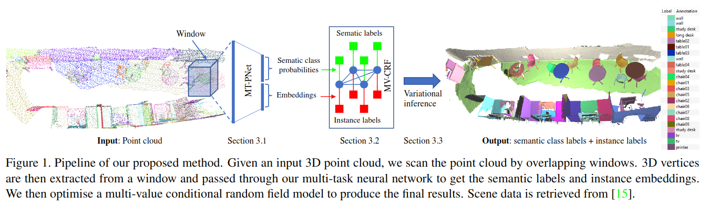
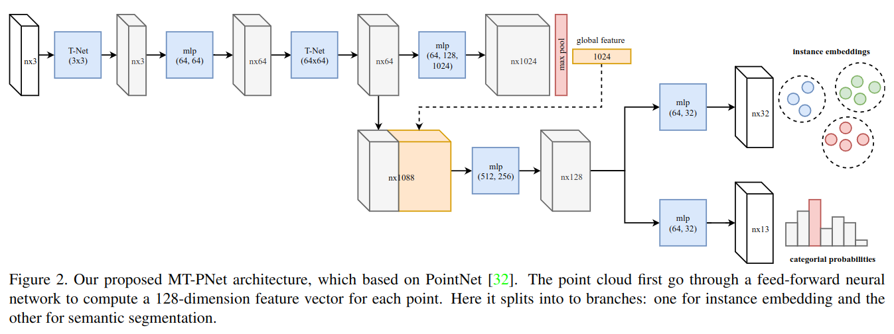

# JSIS3D: Joint Semantic-Instance Segmentation of 3D Point Clouds with Multi-Task Pointwise Networks and Multi-Value Conditional Random Fields

元の論文の公開ページ : [arxiv.org](https://arxiv.org/pdf/1904.00699.pdf)  
Github Issues :   

## どんなもの?
##### 点群に対してセマンティックとインスタンスセグメンテーションが行える新規のモデルを提案した。
- インスタンスな情報もセマンティックな情報も相互に依存しているため、それらを同時に学習することが望ましい。本研究はそのようなスタンスでモデルを提案する。
- Multi-task pointwise network (MT-PNet)は同時に2つのタスクを行う。タスクは以下の2つである。
    - 3D点のカテゴリが何に属するのかを予測するタスク。
    - 3D点を高次元特徴ベクトルへ埋め込み、そこにクラスタリングをかけることでオブジェクトのインスタンスを予測するタスク。[ここの「そこ」というのは、特徴空間上に存在するベクトルに対してという意味。]
- クラスラベルとオブジェクトインスタンスの同時最適化を統一されたフレームワークに定式化したmulti-value conditional random field (MV-CRF)モデルは、variational mean field technique[?]を使用して効率的に解くことができる。著者らの知る限り、我々が統合されたフレームワーク内でのセマンティック&インスタンスの同時最適化を初めて研究した。
##### 実験によって、提案された手法が各タスクにおいてSOTAな結果を出すことを示した。
- 提案された手法と同等の方法を比較するために様々なベンチマークデータセットを用いた。使ったデータセットはScanNetのデータセットとS3DIS。

## 先行研究と比べてどこがすごいの? or 関連事項
##### 省略

## 技術や手法のキモはどこ? or 提案手法の詳細
#### 手法の概要
- 提案手法の概要は図1の通り。提案手法の処理の概要は図1の下に載せる。

##### 1. はじめにwindowと呼ばれる点群を領域重複ありの塊に分割(切り抜く)し、それを高次元ベクトルへの埋め込みと点のカテゴリクラス予測のためにニューラルネットワークへ入力する。
- この２つのタスクをこなすために、multi-task pointwise network (MT-PNet)を提案し、導入する。具体的な内容は、工夫の項のMulti-Task Pointwise Network (MT-PNet)を参照。
  - MT-PNetは同じインスタンスに属する点同士を引き寄せ、そうでない点を可能な限り引き離す。また、クラスラベルの予測も行う。[ここで言う点はおそらく特徴量空間の点を指す。]
 
##### 2. 1で出力されたクラスラベルと埋め込みはmulti-value conditional random field (MV-CRF)モデルで利用される。
- 具体的な内容は工夫の項のMulti-Value Conditional Random Fields (MV-CRF)を参照。
- [ここに概要を書いとく。]

##### 3. 最終的に、2の出力であるvariational infereceを使用してセマンティック&インスタンスセグメンテーションを行う。
- [ここに概要を書いとく。]

### 工夫
#### Multi-Task Pointwise Network (MT-PNet)
##### MT-PNetは点群を入力とし、セマンティックラベルとインスタンスの埋め込みを出力する。
- このネットワークの概要は図2の通り。
- ネットワークは途中で2つのブランチに分かれており、インスタンスまたは埋め込みを出力するようになっている。

##### [ここ書いて]
- このネットワークの損失は式(1)のとおりである。  
    $$
    \mathcal{L}=\mathcal{L}_{prediction}+\mathcal{L}_{embedding} \tag{1}
    $$
- 予測損失$\mathcal{L}_ {prediction}$はクロスエントロピーによって定義される。埋め込み損失$\mathcal{L}_ {embeding}$には[1]から着想を得たdiscriminative functionを採用する。

#### Multi-Value Conditional Random Fields (MV-CRF)
##### [ここから先は理解不足]

## どうやって有効だと検証した?
##### 省略

## 議論はある?
##### 省略

## 次に読むべき論文は?
##### なし
- なし

## 論文関連リンク
##### あり
1. [Bert De Brabandere, Davy Neven, and Luc Van Gool. Semantic instance segmentation with a discriminative loss function. arXiv preprint arXiv:1708.02551, 2017.](https://arxiv.org/pdf/1708.02551.pdf)[8]

## 会議, 論文誌, etc.
##### CVPR 2019

## 著者
##### Quang-Hieu Pham, Duc Thanh Nguyen, Binh-Son Hua, Gemma Roig, Sai-Kit Yeung

## 投稿日付(yyyy/MM/dd)
##### 2019/04/01

## コメント
##### あり
- 「実験によって、提案された手法が各タスクにおいてSOTAな結果を出すことを示した。」の項に関して、Eの内容を詳しく見ていないので、どのタスクをこなしたか具体的にはわからない。

## key-words
##### CV, Paper, Point_Cloud, Instance_Segmentation, Semantic_Segmentation, 修正

## status
##### 修正

## read
##### A, I

## Citation
##### 未記入