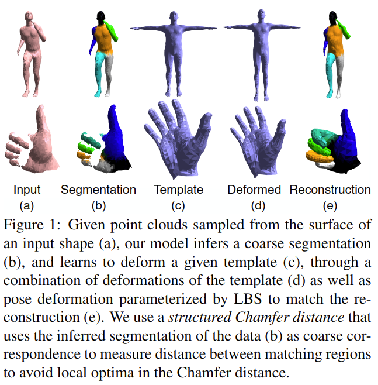
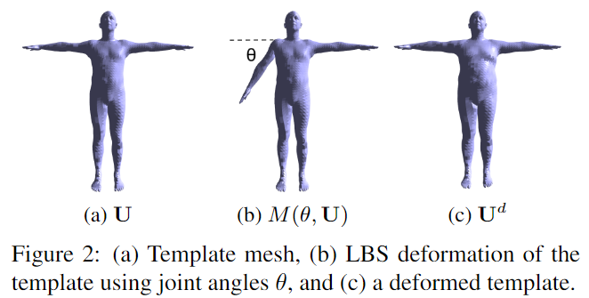
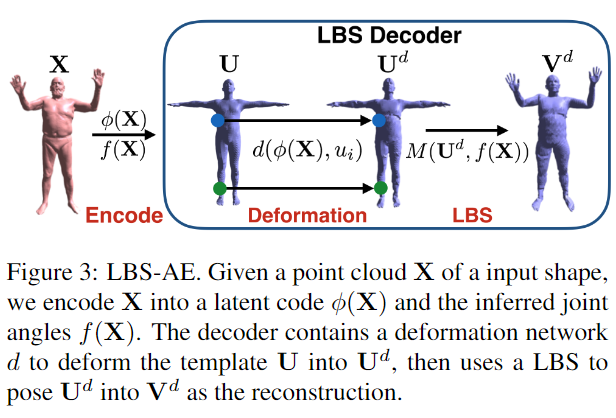

# LBS Autoencoder: Self-supervised Fitting of Articulated Meshes to Point Clouds

元の論文の公開ページ : [arxiv](https://arxiv.org/abs/1904.10037)
Github Issues : [#57](https://github.com/Obarads/obarads.github.io/issues/57)

## どんなもの?
LBS-AEと呼ばれる、関節付きのメッシュモデルを点群へフィッティングするためのself-supervisedなオートエンコーディングアルゴリズムを提案した。図1に示すように、点群(a)を受け取り、粗いセグメンテーション(b)や与えられたテンプレート(c)の学習、テンプレートの変形の組み合わせ(d)、LBSによってパラメータ化されたポーズを用いた再構築(e)などを行う。  
また、Chamfer distanceの代わりにStructured Chamfer Distance(SCD)を導入する。他には、初期状態からセグメンテーションを改良するためにSelf-supervisionを生成して訓練する。

なお、図2に示すように、変形には種類がある。ベースメッシュ(テンプレート)の頂点$\mathbf{U}$があるとき、$M(\theta, \mathbf{U})$はテンプレートのLBSに対する変形後の頂点、$\mathbf{U}^d$はテンプレートそのものに対する変形後の頂点を示す。

## 先行研究と比べてどこがすごいの?
このモデルは、FoldingNet等の事前情報を利用せずただ2D表面をターゲットオブジェクトに変形させるモデルとDyna[1]などの手や体などの特定のオブジェクト専用の変形モデルの中間に位置する。 このモデルは、オブジェクトクラスの関節テンプレートモデルが利用可能であるが、データセット中ではstatistics of its articulation(関節の情報とか?)やオブジェクトインスタンスの特定の形状(オブジェクトのカテゴリを1つに絞ること)を取り扱わない。

## 技術や手法のキモはどこ? or 提案手法の詳細
### 構造
LBS Autoencoder(LBS AE)の概観は図3の通り。入力点群$\mathbf{X}$が与えられたとき、$\mathbf{X}$をlatent code $\phi(\mathbf{X})$と推論された関節アングル$f(\mathbf{X})$へエンコードする。デコーダーはテンプレートの変形とLBSの変形が可能なdeformation networkを含む。

## どうやって有効だと検証した?

## 議論はある?

## 次に読むべき論文は?
- なし

## 論文関連リンク
1. [G. Pons-Moll, J. Romero, N. Mahmood, and M. J. Black. Dyna: A model of dynamic human shape in motion. TOG, 2015.](https://dl.acm.org/citation.cfm?id=2766993)

## 会議
CVPR 2019

## 著者
Chun-Liang Li, Tomas Simon, Jason Saragih, Barnabás Póczos, Yaser Sheikh.

## 投稿日付(yyyy/MM/dd)
2019/04/22

## コメント
なし

## key-words
Point_Cloud, Self-Supervised_Learning, AutoEncoder, Mesh, CV, Paper, 導入, 旧版

## status
導入

## read
A