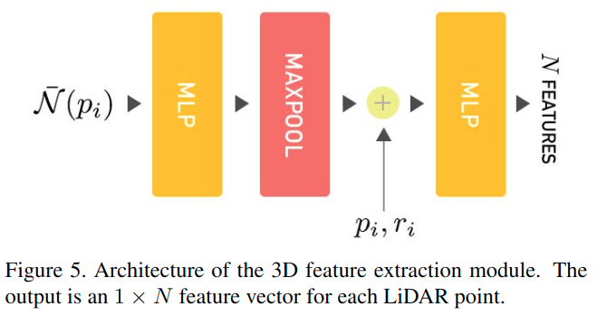

# LU-Net: An Efficient Network for 3D LiDAR Point Cloud Semantic Segmentation Based on End-to-End-Learned 3D Features and U-Net

元の論文の公開ページ : [arxiv.org](https://arxiv.org/abs/1908.11656)  
提案モデルの実装 : [pbias/lunet](https://github.com/pbias/lunet)  
Github Issues :   

Note: 記事の見方や注意点については、[こちら](/)をご覧ください。

## どんなもの?
##### 点群の特徴を2Dへ落とし込み画像処理問題としてセマンティックセグメンテーションを行う、LU-Net(LiDAR U-Net)を提案した。
- LU-NEetは3DLiDAR点群のセマンティックセグメンテーション用end-to-endモデルである。
- LU-Netは2D range-images中の3D局所特徴を埋め込められる3D特徴抽出モジュールを使用する。
  - [このrange-imagesとは、depth画像と同じ。以下、range-imageを距離画像と呼ぶ。]
- また、本提案は単体GPUで24FPSの処理速度を出すことができる。

## 先行研究と比べてどこがすごいの? or 関連事項
##### 省略

## 技術や手法のキモはどこ? or 提案手法の詳細
### 手法の概要
##### 1. LiDARセンサーから得られた距離画像を入力として扱う。
- 近年のLiDARであるなら、密な2D画像を提供してくれる。
- もし2D画像を生成するためのデータがない(ビーム番号など)がない場合は、LiDARの点群からtange-imageを生成する必要がある。
- 3D LiDARセンサーによって得られる点群は、数本の走査線によるサンプリングパターンと、サンプル間に準均一な角度を有しているものとする。
- 具体的には、2つの位置間隔は$(\Delta \theta, \Delta \phi)$刻みであり、2つの角度と深度$(\theta, \phi, d)$によって各点は定義される。
- LiDAR点群$P$の各点$p_ i$は、解像度$H \times W=\operatorname{Card}(P)$の2D距離画像$u$の$x=\lfloor\frac{\theta}{\Delta \theta}\rfloor, y=\lfloor\frac{\phi}{\Delta \phi}\rfloor$として、座標($x,y$)に写像される。
  - ここで、各チャンネルは測定された点のモダリティを示す。
  - 距離画像は図3に示される。
- 距離画像は完璧であるなら完全に密な2D画像として扱えるが、ノイズなどの影響でデータが一部欠損していることがほとんどである(つまり、距離情報がないということ)。
- そのような場合、欠損した部分に空のピクセル(0)を入れる。
  - これが適切であるかはfeture work。

##### 2. High-level 3D feature extraction moduleを導入したネットワーク(LU-Net)でセマンティックセグメンテーションを行う。
- このネットワークの全体像は図6の通り。
- 工夫のHigh-level 3D feature extraction moduleにて説明する。
- 訓練中の損失はfocal lossを使用する。

### 工夫
#### High-level 3D feature extraction module
##### 対象のアプリケーションに適合する意味のある特徴を直接的に学習できるモジュールを提案した。
- 基本的に$xyz$座標、反射率$r$、spherical depth($d$)[深度]の5チャンネルが距離画像のネットワークの入力として使われてきた。
- しかしながら、[1]の分析より、反射率と深度の2チャンネルをU-Netに供給することでSOTAな結果が得られることを示している。
- **アプリケーションごとに、適切な特徴量を選択するという調査は非常に時間がかかる。**
- **そこで、この論文では対象のアプリケーションに適合する意味のある特徴を直接的に学習できるモジュールを提案する。**
  - ここでは、アプリケーションとしてセマンティックセグメンテーションを選択する。
  - Moreover, processing geo-spatial information using 2D convolutional layers can cause issues in terms of data nor-malization as LiDAR sensors sampling typically decreases when acquiring farther points. 

##### 具体的には、各点について$N$個の意味のある3D特徴を学習し、$N$個のチャンネルで距離画像を出力できるHigh-level 3D feature extraction moduleを提案する。
- このモジュールは[2]のLocal Point Embedderに触発されている。
- ただし、このモジュールは距離画像から近傍点を作成する。更に、このモジュールの出力は距離画像である。
- 近傍点は図4のように距離画像の周りから取る。
- 近傍点と中央点の相対値を測り、それを[2]同様にMLPへ入力し処理する。その後の処理は図5の通り。
  - 尚、maxpoolingされたあとは$p_ i$と$r_ i$に連結される。
  - また、畳込みは$1/times1$の畳み込み層である。

## どうやって有効だと検証した?
##### 省略

## 議論はある?
##### 省略

## 次に読むべき論文は?
##### なし

## 論文関連リンク
##### あり
1. [P. Biasutti, A. Bugeau, J-F. Aujol, and A. Br ́ edif. RIU-Net: Embarrassingly simple semantic segmentation of 3D LiDAR point cloud. arXiv Preprint, 2019.](https://arxiv.org/abs/1905.08748)[2]

## 会議, 論文誌, etc.
##### ICCV 2019 WS

## 著者
##### Pierre Biasutti, Vincent Lepetit, Jean-François Aujol, Mathieu Brédif, Aurélie Bugeau

## 投稿日付(yyyy/MM/dd)
##### 2019/08/30

## コメント
##### なし

## key-words
##### Paper, CV, Point_Cloud, Semantic_Segmentation, 省略, Implemented

## status
##### 省略

## read
##### A, I, M

## Citation
##### 未記入
