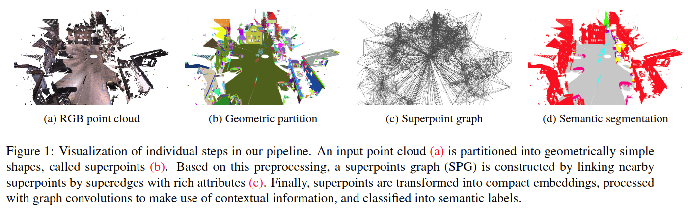
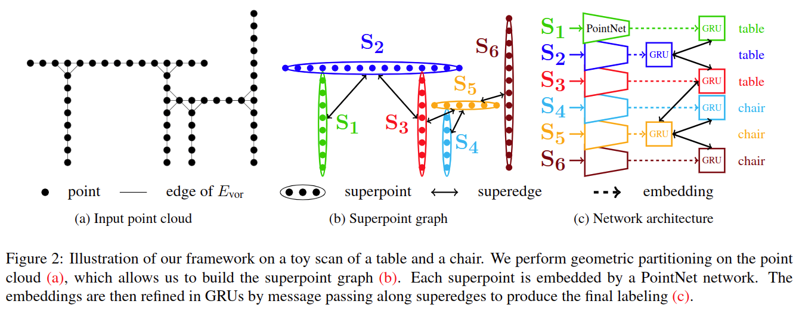
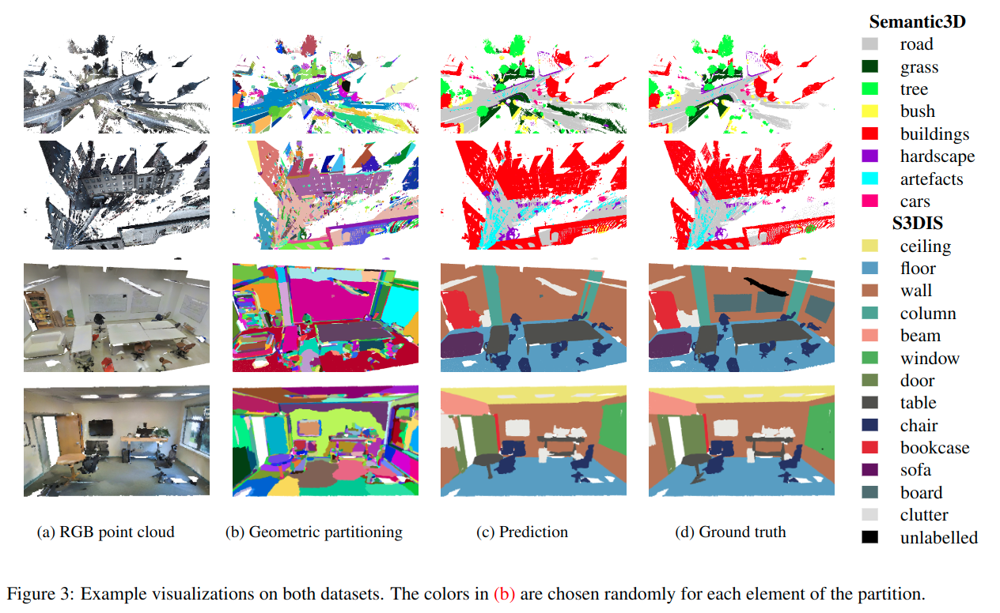
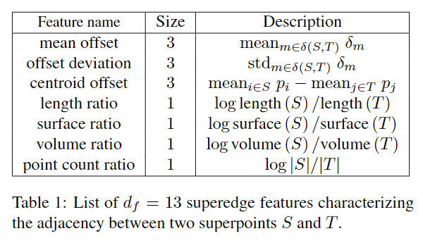
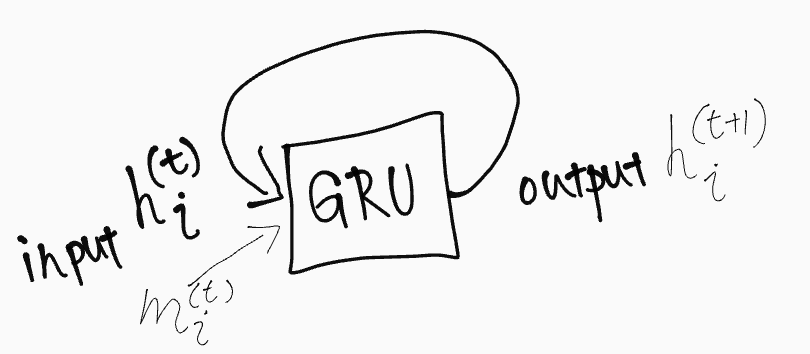

# Large-scale Point Cloud Semantic Segmentation with Superpoint Graphs

元の論文の公開ページ : [arxiv](https://arxiv.org/abs/1711.09869)  
Github Issues : [#129](https://github.com/Obarads/obarads.github.io/issues/129)

## どんなもの?
##### 3次元シーン点群を幾何学的に均一な要素に分割することで得られるスーパーポイントグラフ(superpoint graph, SPG)によって、効率的に3D点群を組織化できると主張した。
- 画像セグメンテーションにおけるスーパーポイント手法[1]と同様の意図を持って、著者らはスーパーポイントで作られた、相互のつながりを持つシンプルな形状の一群として大規模3D点群の表現することを提案する。
- 図1に示すように、superpoint graph(SPG)と呼ばれる属性付き有向グラフによって構造を取得することができる。ノードはシンプルな形状を示し、一方でエッジは隣接関係を示す。

##### SPGは識別の簡易化、隣接オブジェクト間の関係性保持、サイズの削減が可能である。これにより、点群の長距離間の相互作用をモデル化できる。
- 識別しやすくするために、個々の点やボクセルを分類するのではなくオブジェクトパーツ全体を考慮する。[このオブジェクトパーツはparts segmentationタスクのことを指しているわけではない。このオブジェクトパーツ全体を考慮するというのは、まずはオブジェクトをパーツ単位で区切ってそこからそのパーツがどのクラスに属するのかと言うようなことを指している(はず)。]
- 隣接オブジェクト間の関係を詳細に示すことで、文脈的な分類を可能とする。要は、天井が上にあってその下に椅子があるとき、椅子の下に床があるみたいな分類が可能になるということを言っている。
- SPGのサイズは点の合計数ではなくシンプルな構造の数によって定義される。これは通常、数桁分小さくなる。

##### SPGを処理するためのアーキテクチャと有用性を示す実験を行った。
- 著者らの貢献は以下の通り。
    - 3D点群内のオブジェクトパーツ間の文脈的関係性を符号化したエッジ特徴による表現を使った新規スーパーポイントのグラフ手法を導入した。
    - 上記の表現によって、細かい表現を大きく損なわずに大規模点群を深層学習に適応できる。
    - Semantic3DとS3DISでSOTAを達成。

これ見ればいいですね...-> [2018/12/28 LiDARで取得した道路上点群に対するsemantic segmentation by Takuya Minagawa](https://www.slideshare.net/takmin/20181228-lidarsemantic-segmentation)

## 先行研究と比べてどこがすごいの?
##### 細かい情報を保持でき、なおかつ大規模な点群を処理できる手法がいままでなかった。
- 複雑で密な3次元シーン点群には100万程の点が含まれていることも多いが、点群深層学習アーキテクチャ(PointNetなど)は一度に処理できる点の数に制限がある。
- ボクセルや2Dへの反映によってそれらの3D点群を処理する方法もあるが、ボクセルへの変換による情報の損失(点群では存在した細かい情報の損失など)がある、2D処理を行うための表面再構成が必要になるなど問題がある。
- 本提案では、提案の中に含まれているパイプラインが幾何学的な複雑さに従って適応的に点群を分割するため、それらを両立した処理が行える。

## 技術や手法のキモはどこ? or 提案手法の詳細
##### 著者らは、SPGでセマンティックセグメンテーション問題をスケールの異なる3つの明確な問題に分割する。この問題は順番に処理される。
- 図2に示すように、順に問題は処理される。
    1. **幾何学的に同質な分割**: 最初のステップでは、点群をスーパーポイントと呼ばれる幾何学的にシンプルでありながら有意義な形状へ分割することである。この教師なしのステップでは、点群全体を入力として受け取るため、計算的に非常に効率的な方法を取らなければいけない。SPGはこの分割から簡単に計算される。
    2. **Superpointによる埋め込み**: SPGのノードは点群の一部分であり、この一部分は幾何学的にシンプルなprimitive[(原始的,単純なもの)]に相当する。この時、ノードは意味的に同質だと仮定する。これらのprimitiveは小規模の点群を最大数百個(実装は個数違う?)の点にダウンサンプリングすることによって確実に表すことができる。小さくなったことでPointNetによる点群の埋め込みを可能にする。
    3. **文脈的な分割**: スーパーポイントのグラフは元の点群上のあらゆるグラフよりも桁違いに小さくなる。このグラフを使って、深層学習モデルはノードを分類していくこととなる。
- この2,3番目の問題は、End-to-Endで学習可能な形になっている。

### Geometric Partition with a Global Energy
##### 最初に、入力点群をシンプルな形状に分割する。ただし、オブジェクト単位よりもさらに細かい形に分割する。
- 図3のようにオブジェクトよりも分けられた形へと分割することを目標とする。
- この分割によってできたクラスタは単純ではあるが、幾何学に沿った分割を行うため、意味的に分割されたもの(セマンティック、インスタンス的な分割)に近いクラスタを得ることが期待できる。なお、ここではクラスラベルを使用しない。
- また、この分割は局所的な幾何学的複雑さに適応できる。つまり、分割によって壁などの単純なものからネジなどの部品単位のものまで様々なクラスタが得られることを期待できる。

##### 具体的には、global energy model[3]と$\ell_ 0$-cut pursuit algorithm[4]に基づいてスーパーポイント(superpoint, SP)を効率的に算出する。
- 各点について、局所近傍の形状の特性を示す$d_ g$個の幾何学特徴$f_ i\in \mathbb{R}^{d_ g}$の集合を計算する。そのために、ここでは[2]で提案された3次元値(linearity, planarity, scattering, および[3]で導入されたverticality feature)を使用する。また、点群全体で正規化された座標値$p_ i$の$z$座標として定義される各点$i\in C$の高さも計算する。
- [3]によって提案されたglobal energyは点群の10最近傍グラフ$G_ {nn}=(C,E_ {mn})$に関連して定義される(これはSGPではない[、SGPを作る前の段階の処理])。
- **幾何学的に均一な分割は次の最適化問題(式1)のthe constant connected components of the solutionとして定義される。[[3]のPotts segmentation energyに基づいている。]**
- $$\underset{g \in \mathbb{R}^{d g}}{\arg \min } \sum_{i \in C}\left\|g_{i}-f_{i}\right\|^{2}+\mu \sum_{(i, j) \in E_{\mathrm{nn}}} w_{i, j}\left[g_{i}-g_{j} \neq 0\right] \tag{1}$$
    - ここで$[\cdot]$はアイバーソンの記法を示す。
    - edge weight $w\in \mathbb{R}^{|E|}_ {+}$はedgeの長さに関して線形的に減少するようになっている。
    - 係数$\mu$はthe regularization strengthであり、分割の粗さを決定する。
- **noncontinuous[?]とnonconvex[12]を持つは大きな点群について、正確に解決することはできない。**
- **しかしながら、[4]で導入された$\ell_ 0$-cut pursuit algorithmは少しのgraph-cut iterartionsを用いて近似解を素早く見つけられる。**
    - $\alpha$-expansion[6]のような他の最適化手法と対象的に、$\ell$-cut pursuit algorithmは分割サイズの選択を行わなくていいという利点がある。
- **式1の解であるthe constant connected components $\mathcal{S}=\\{S_ 1,\cdots,S_ k\\}$は幾何学的な要素を定義し、これをスーパーポイント(i.e. superpoints, set of points)として扱う。**

### Superpoint Graph Construction
##### SPGは、スーパーポイントとそのスーパーポイント間の隣接関係(スーパーエッジ)を保有している。
- SPGは点群を構造化した表現であり、oriented attributed graph $\mathcal{G}=(\mathcal{S}, \mathcal{E}, F)$として定義される。
    - このグラフのノードはスーパーポイント(superpoints) $\mathcal{S}$、エッジ $\mathcal{E}$はsuperpoints間の隣接(スーパーエッジ(superedges)とここでは呼ぶ)と示される。
    - このスーパーエッジは$d_ f$個の特徴の集合によって注釈付けられる: $F \in \mathbb{R}^{\mathcal{E} \times d_ {f}}$はsuperpoint間の隣接関係を特徴づける[?]。
- $G_ {\mathrm{vor}}=\left(C, E_ {\mathrm{vor}}\right)$を[6]によって定義されたthe symmetric Voronoi adjacency graph of the complete input point cloudとして定義する。
- もし、少なくとも$E_ {vor}$中に最低一つのエッジがあり、一端が$S$、もう一端が$T$である場合、superpointsである$S$と$T$は隣接する:  
    $$
    \mathcal{E}=\left\{(S, T) \in \mathcal{S}^{2} | \exists(i, j) \in E_{\mathrm{vor}} \cap(S \times T)\right\} \tag{2}
    $$
- Important spatial features associated with a superedge $(S,T)$は２つのスーパーポイントに繋がっている$E_ {vor}$中のエッジに対するthe set of offsets $δ(S, T)$から得られる[相対値?]:  
    $$
    \delta(S, T)=\left\{\left(p_{i}-p_{j}\right) |(i, j) \in E_{\mathrm{vor}} \cap(S \times T)\right\} \tag{3}
    $$

##### スーパーエッジの特徴は隣接スーパーポイントのサイズと形状を比較することで算出できる。
- スーパーエッジの特徴を算出するためにいくつかの要素を計算する。要素は以下の通り。
    - スーパーポイント$S$中の点の数$|S|$
    - shape features length $(S)=\lambda_ 1$
    - surface $(S)=\lambda_ 1\lambda_ 2$
    - volume $(S)=\lambda_ 1 \lambda_ 2 \lambda_ 3$
    - これらは、値の減少順にならべた各スーパーポイントに含まれる点の位置の共分散の固有値$\lambda_ 1, \lambda_ 2, \lambda_ 3$からなる[?]。
- 表1では、この論文で扱われているスーパーエッジ特徴の違いをリストにしている。なお、edgeの特徴の対称性がなくなった場合、SPGは有向グラフになる。

[handcrafted特徴を使用]

### Superpoint Embeding
#### ここ以降はまだやってない
##### 全てのsuperpoint $S_ i$に対応する記述子を計算する。
この記述子は、[superpointから]固定次元長$d_ z$のベクトル$z_ i$への埋め込みである。なお、この埋め込みはsuperpointごとに分離されている。信頼できる分類を行うためのcontextual informationはグラフ畳み込みによって次の段階でのみ提供される。

最近の深層学習手法はこの目的[(埋め込み抽出)]のためにいくつかの提案がなされている。PointNetは点群におけるその代表である。著者らの場合、入力形状は幾何学的に単純なオブジェクトであり、少量の点(サブサンプリングなど)とコンパクトなPointNetで確実に表現、埋め込みできる(GPUなどの計算資源を節約できる)。ただし、点が少量($n_ {minp}=40$未満)のsuperpointがある場合は全体の性能が落ちるため、そのスーパーポイントの埋め込みは0にしてコンテキスト情報のみで分類を行う。

[in order for ~は仕様について書いてある]

### Contextual Segmentation
ここでは最後の仕上げを行う。このpipelineは埋め込み$z_ i$とSPGによる局所領域に従って各superpoint $S_ i$を分類する。ここのアーキテクチャはGated Graph Neural Networks[7]やECC[8]からのアイデアに基づいており、superpointはsuperedgesの情報に従って埋め込みを洗練させていく。

具体的には、
- Gated Recurrent Unit(GRU)[9]内のhidden state$\mathbf{h}_ {i}^{(t)}$(tはイテレーション数, $t=1\ldots T$, Tはseveral)をrefineしていく。  
    
- $\mathbf{h_ i^1}$は$i$番目のsuperpoint $S_ i$の埋め込み$z_ i$によって初期化される。
- $\mathbf{h_ i^{(t+1)}}$(新たなhidden state)はincoming message $\mathbf{m}_ i^{(t)}$と$\mathbf{h}_ i^{(t)}$をGRUに入力することで得られる。
- incoming message $\mathbf{m}_ i^{(t)}$ to superpoint $i$は隣接するsuperpoint $j$の$h_ j^{(t)}$の加重和として計算されている。
- actual weighting for a superedge $(j,i)$は、表1に挙げられるようにits attrubutes $F_ {ji}$に依存する。
- 具体的には、attributesからMLP $\Theta$によって計算され、Filter Generating Networkと呼ばれている.

上記の内容を公式で示すと、

$$
\begin{array}{l}
{\mathbf{h}_{i}^{(t+1)}=\left(1-\mathbf{u}_{i}^{(t)}\right) \odot \mathbf{q}_{i}^{(t)}+\mathbf{u}_{i}^{(t)} \odot \mathbf{h}_{i}^{(t)}} \\ 
{\mathbf{q}_{i}^{(t)}=\tanh \left(\mathbf{x}_{1, i}^{(t)}+\mathbf{r}_{i}^{(t)} \odot \mathbf{h}_{1, i}^{(t)}\right)} \\ 
{\mathbf{u}_{i}^{(t)}=\sigma\left(\mathbf{x}_{2, i}^{(t)}+\mathbf{h}_{2, i}^{(t)}\right), \quad \mathbf{r}_{i}^{(t)}=\sigma\left(\mathbf{x}_{3, i}^{(t)}+\mathbf{h}_{3, i}^{(t)}\right)}
\end{array} \tag{4}
$$

$$
\begin{array}{l}{\left(\mathbf{h}_{1, i}^{(t)}, \mathbf{h}_{2, i}^{(t)}, \mathbf{h}_{3, i}^{(t)}\right)^{T}=\rho\left(W_{h} \mathbf{h}_{i}^{(t)}+b_{h}\right)} \\ 
{\left(\mathbf{x}_{1, i}^{(t)}, \mathbf{x}_{2, i}^{(t)}, \mathbf{x}_{3, i}^{(t)}\right)^{T}=\rho\left(W_{x} \mathbf{x}_{i}^{(t)}+b_{x}\right)}\end{array} \tag{5}
$$

$$
\mathbf{x}_{i}^{(t)}=\sigma\left(W_{g} \mathbf{h}_{i}^{(t)}+b_{g}\right) \odot \mathbf{m}_{i}^{(t)} \tag{6}
$$

$$
\mathbf{m}_{i}^{(t)}=\operatorname{mean}_{j |(j, i) \in \mathcal{E}} \Theta\left(F_{j i,}, .; W_{e}\right) \odot \mathbf{h}_{j}^{(t)} \tag{7}
$$

$$
\mathbf{h}_{i}^{(1)}=\mathbf{z}_{i}, \quad \mathbf{y}_{i}=W_{o}\left(\mathbf{h}_{i}^{(1)}, \ldots, \mathbf{h}_{i}^{(T+1)}\right)^{T} \tag{8}
$$

となる。

この公式において、

- $\odot$はelement-wise multiplicatioである。
- $\sigma(\cdot)$はシグモイド関数である。
- $W.とb.$はすべてのGRU同士で共有されている学習パラメータである。
- 式4は標準のGRUのルール[9]であり、
    - update gate $\mathbf{u}_ i^{(t)}$と、
    - reset gate $\mathbf{r}_ i^{(t)}$を持つ。
- 式5で、学習の安定化のためにLayer Normalization[11]を$\rho(\mathbf{a}):=(\mathbf{a}-\operatorname{mean}(\mathbf{a})) /(\operatorname{std}(\mathbf{a})+\epsilon)$として定義し、
    - これをlinearly transformed input $\mathbf{x}_ i^{(t)}$とtransformed hidden state $\mathbf{h}_ i^{(t)}$にそれぞれ適応する。
    - このとき、$\epsilon$は小さな定数である。
- 式6~8は拡張であり、論文のInput Gating以降の内容を参考にすること。[ここでは省略]

## どうやって有効だと検証した?
省略

## 議論はある?
省略

## 次に読むべき論文は?
- なし

## 論文関連リンク
1. [R. Achanta, A. Shaji, K. Smith, A. Lucchi, P. Fua, and S. S ̈ usstrunk. SLIC superpixels compared to state-of-the-art superpixel methods. IEEE Transactions on Pattern Analysis and Machine Intelligence, 34(11):2274–2282, 2012.](https://ieeexplore.ieee.org/document/6205760)[1]
2. [J. Demantk, C. Mallet, N. David, and B. Vallet. Dimension-ality based scale selection in 3D lidar point clouds. Inter-national Archives of the Photogrammetry, Remote Sensing and Spatial Information Sciences, XXXVIII-5/W12:97–102, 2011.](http://recherche.ign.fr/labos/matis/pdf/articles_conf/2011/laserscanning2011_demantke_final.pdf)[9]
3. [S. Guinard and L. Landrieu.Weakly supervised segmentation-aided classification of urban scenes from 3d LiDAR point clouds. InISPRS 2017, 2017.](https://www.int-arch-photogramm-remote-sens-spatial-inf-sci.net/XLII-1-W1/151/2017/isprs-archives-XLII-1-W1-151-2017.pdf)[13]
4. [L. Landrieu and G. Obozinski. Cut pursuit: Fast algorithms to learn piecewise constant functions on general weighted graphs. SIAM Journal on Imaging Sciences, 10(4):1724– 1766, 2017.](https://hal.archives-ouvertes.fr/hal-01306779v4/document)[24]
5. [Y. Boykov, O. Veksler, and R. Zabih. Fast approximate en-ergy minimization via graph cuts.IEEE Transactions on Pat-tern Analysis and Machine Intelligence, 23(11):1222–1239, 2001.](http://www.cs.cornell.edu/~rdz/Papers/BVZ-PAMI01.pdf)[6]
6. [J. W. Jaromczyk and G. T. Toussaint. Relative neighbor-hood graphs and their relatives. Proceedings of the IEEE, 80(9):1502–1517, 1992.](https://pdfs.semanticscholar.org/778e/013907b0edc3e2e6bb40446af3837307f72b.pdf)[19]
7. [Y. Li, D. Tarlow, M. Brockschmidt, and R. S. Zemel. Gated graph sequence neural networks. InICLR, 2016.](https://arxiv.org/abs/1511.05493)[28]
8. [M. Simonovsky and N. Komodakis. Dynamic edge-conditioned filters in convolutional neural networks on graphs. InCVPR, 2017.](https://arxiv.org/abs/1704.02901)[43]
9. [K. Cho, B. van Merri ̈ enboer, C  ̧ . G ̈ ulc  ̧ehre, D. Bahdanau, F. Bougares, H. Schwenk, and Y. Bengio. Learning phrase representations using RNN encoder–decoder for statistical machine translation. InEMNLP, 2014.](https://arxiv.org/abs/1406.1078)[8]
10. [Takuya Minagawa, 2018/12/28 LiDARで取得した道路上点群に対するsemantic segmentation, 2019.](https://www.slideshare.net/takmin/20181228-lidarsemantic-segmentation)
11. [L. J. Ba, R. Kiros, and G. E. Hinton. Layer normalization. CoRR, abs/1607.06450, 2016.](https://arxiv.org/abs/1607.06450)[4]
12. [Issam Laradji, Non-convex optimization](https://www.cs.ubc.ca/labs/lci/mlrg/slides/non_convex_optimization.pdf)

## 会議
CVPR 2018

## 著者
Loic Landrieu, Martin Simonovsky

## 投稿日付(yyyy/MM/dd)
2017/11/27

## コメント
なし

## key-words
Point_Cloud, Graph, Semantic_Segmentation, Oversegmentation, CV, Paper, 修正, Superpoint

## status
修正

## read
A, I, R

## Citation
