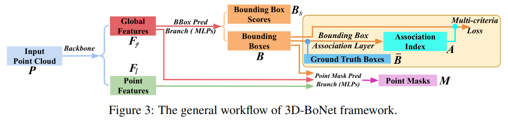

# Learning Object Bounding Boxes for 3D Instance Segmentation on Point Clouds

元の論文の公開ページ : [arxiv.org](https://arxiv.org/abs/1906.01140v2)  
提案モデルの実装 : [Yang7879/3D-BoNet](https://github.com/Yang7879/3D-BoNet)  
Github Issues :   

## どんなもの?
3D点群のためのインスタンスセグメンテーションのためのフレームワーク、3D-BoNetを提案した。
- 提案手法では、各インスタンスごとに3Dバウンディングボックスの回帰と点レベルのマスクの予測を同時に行う(シングルステージのモデル, 同種としてYOLOなど)。
- また、アンカーなし(提案フリー)、End-to-Endで訓練可能である。
- さらに、事後処理ステップを必要としない。後処理ステップとしてはnon-maximum suppression, feature sampling, clustering or votingなど。これらが必要ないのでより効率的にモデルを運用できる。
- 貢献は以下の通り。
    - 新規の3Dインスタンスセグメンテーションモデルを提案した。このフレームワークはシングルステージ、アンカーフリー、end-to-endな訓練を可能とする。また、事後処理を必要としない。
    - box prediction branchを教師あり学習させるためのmulti-criteria損失関数を提案する。
    - ベースラインよりも優れた性能を実証する。

## 先行研究と比べてどこがすごいの? or 関連事項
事後処理を必要とせず、また、高いobjectnessを持ったインスタンスのセグメンテーションを行うことができる。[もう少し明確に違いを書き足したい。]

## 技術や手法のキモはどこ? or 提案手法の詳細
著者らが提案するモデル、3D-BoNetは2つのブランチから構成される。この2つのブランチは点群からthe backbone networkによって抽出された特徴量を使用している。
- The bounding box prediction branchはglobal featuresを入力として受け取り、バウンディングボックスとそのスコアを直接回帰する。
    - 学習のためにground truthバウンディングボックスを利用する。
- The point mask prediction branchは各インスンスタンスに対してポイントレベルのバイナリーマスクを予測するため、入力にlocalとglobal featuresを使用する。
- 本提案モデルの全体像は図3のとおりである。  
    

### Bounding Box Prediction
[こちらではThe bounding box prediction branchに関する説明を行う。このブランチは、図3で言えば図の上部にあるGlobal FeaturesからMulti-criteria Lossまでの機構&計算を指す。]

#### Bounding Box Encoding
著者らは値の最大最小を用いてバウンディングボックスを表現する。これは以下のように示される。

$$
\left\{\left[x_{\min }\ y_{\min }\ z_{\min }\right],\left[x_{\max }\ y_{\max }\ z_{\max }\right]\right\}
$$

#### Neural Layers
この予測[ブランチ]レイヤーの全体像は図4のとおりである。このネットワークでは、global featuresを入力として、各インスタンスのバウンディングボックスの位置である$H\times 2\times 3$次元の出力とバウンディングボックスのスコアである$H$次元の出力を行う。

- ボックス位置の予測はBounding Box Encodingの項が示すように6次元($2\times 3$)であり、最大$H$個($H$は固定長)のインスタンスの位置を予測できるようになっている。そのため、predicted boxesの最終的な出力は$H\times 2\times 3$となる。
- ボックススコアはsigmoid関数によって出力される$H$次元の出力である。スコアが高いほど、ボックスにインスタンスが風組まれている可能性が高くなる。

#### Bounding Box Association Layer

## どうやって有効だと検証した?

## 議論はある?

## 次に読むべき論文は?
- なし

## 論文関連リンク
1. なし

## 会議, 論文誌, etc.
NeurlPS 2019

## 著者
Bo Yang, Jianan Wang, Ronald Clark, Qingyong Hu, Sen Wang, Andrew Markham, Niki Trigoni

## 投稿日付(yyyy/MM/dd)
2019/09/05

## コメント
なし

## key-words
Paper, CV, Point_Cloud, Instance_Segmentation, Detection, Implemented, 修正, 旧版

## status
修正

## read
A, I

## Citation
