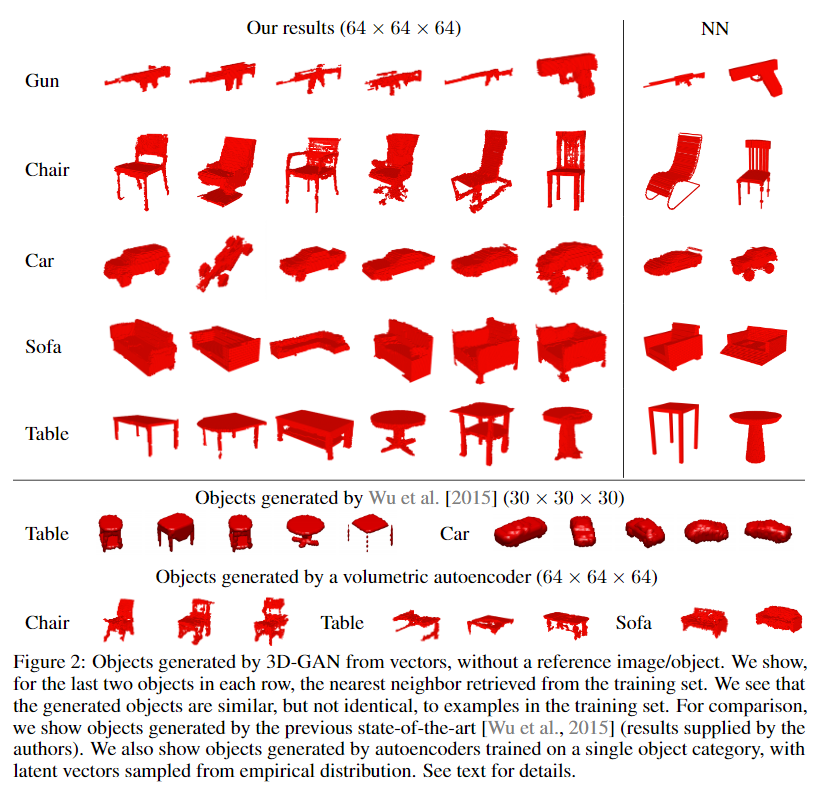
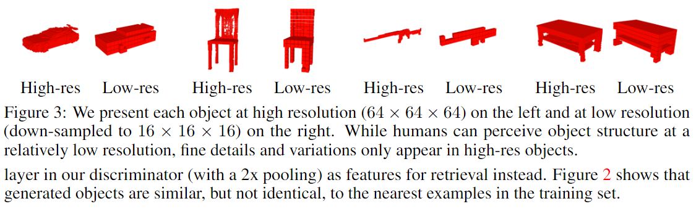
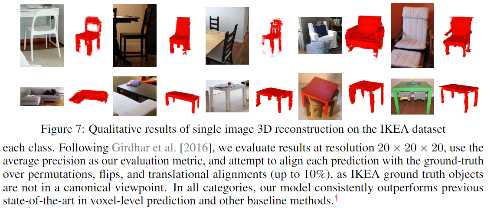

# Learning a Probabilistic Latent Space of Object Shapes via 3D Generative-Adversarial Modeling

元の論文の公開ページ : [arxiv](https://arxiv.org/abs/1610.07584)  
Github Issues : [#28](https://github.com/Obarads/obarads.github.io/issues/28)

## どんなもの?
GANを使った3Dオブジェクト生成と2D画像から3Dオブジェクトへの変換が可能な3D-GANと3D-VAE-GANを提案した。

## 先行研究と比べてどこがすごいの?
既存の研究では、3Dの生成はデータセット内のパーツ同士の合成によるオブジェクト生成が主だった。著者らは、そのような明示的にパーツを借りず、教師データも必要もせずに3Dオブジェクトを生成できる3DのためのGANを提案した。

## 技術や手法のキモはどこ? or 提案手法の詳細
### 構造
提案した3D生成モデルを3D-GANと呼ぶ。基本的な構造は通常のGANと変わりない。生成器の構造は図1の通り。この3D-GANの生成器$G$は確率的潜在空間からランダムにサンプリングされた200次元の潜在ベクトル$z$を$64\times 64\times 64$の3Dボクセル空間へオブジェクトを写像する。損失関数も式(1)のとおり普通である($D$は弁別器、$x$は入力)。

$$
L_{3D-GAN} = \log D(x)+\log (1-D(G(z))) \tag{1}
$$

### 3D-VAE-GAN
生成器$G$をVAEに換装し、VAEの入力に画像を用いる。VAE-GAN(論文関連リンクの1)同様に損失関数は3つの項からなる。損失関数は式(2)の通り。

$$
L=L_{3D-GAN}+\alpha_1 L_{\bf KL}+\alpha_2 L_{\rm recon} \tag{2}
$$
$$
L_{\bf KL} = D_{KL}(q(z|y)||p(z)) \tag{4}
$$
$$
L_{\rm recon} = ||G(E(y))-x||_2 \tag{5}
$$

$y$は$x$に対応する2D画像、$q(z|y)$は潜在表現zの変分分布。p(z)は事前分布であり、KLダイバージェンスは変分分布を事前分布に近づける。

## どうやって有効だと検証した?
### 3D Object Generation
生成されたオブジェクトは図2の通り。ShapeNeの手法やvolumetric autoencoder(論文関連リンクの2、比較に使えるように調節を加えている)と比較している。また、図3で高解像度ボクセルと低解像度ボクセルの比較を載せている。

### 3D Object Classification
弁別器と線形SVMを使った分類評価を行った。結果は表1の通り。

### Single Image 3D Reconstruction
画像から3Dオブジェクト生成を行う評価を行った。実験にはIKEAデータセットが、比較には論文関連リンクの2の手法が使われる。結果は表2と図7にある。

### その他
オブジェクトの引き算足し算とかいろいろ行っている。

## 議論はある?
なし

## 次に読むべき論文は?
- [Jiajun Wu, Yifan Wang, Tianfan Xue, Xingyuan Sun, William T Freeman and Joshua B Tenenbaum. MarrNet: 3D Shape Reconstruction via 2.5D Sketches. NIPS 2017.](https://arxiv.org/abs/1711.03129)

## 論文関連リンク
1. [Anders Boesen Lindbo Larsen, Søren Kaae Sønderby, and Ole Winther. Autoencoding beyond pixels using a learned similarity metric. In ICML, 2016.](https://arxiv.org/pdf/1512.09300.pdf)
2. [Rohit Girdhar, David F Fouhey, Mikel Rodriguez, and Abhinav Gupta. Learning a predictable and generative vector representation for objects. In ECCV, 2016.](https://arxiv.org/abs/1603.08637)

## 会議
NIPS 2016

## 著者
Jiajun Wu, Chengkai Zhang, Tianfan Xue, William T. Freeman and Joshua B. Tenenbaum.

## 投稿日付(yyyy/MM/dd)
2016/10/24

## コメント
なし

## key-words
Voxel, GAN

## status
更新済