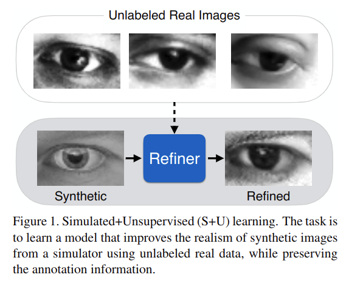
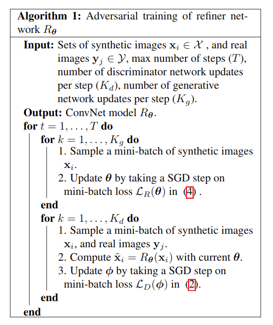
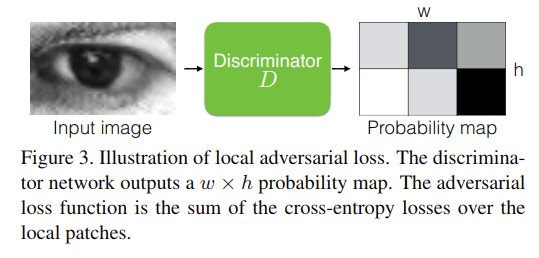
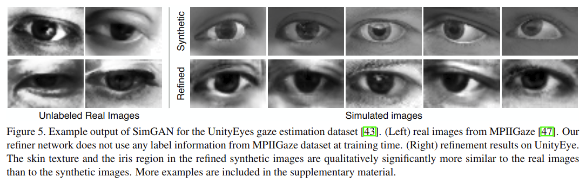
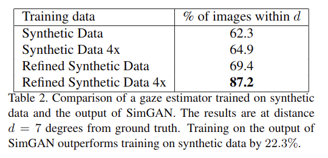

# Learning from Simulated and Unsupervised Images through Adversarial Training

元の論文の公開ページ : https://arxiv.org/abs/1612.07828

## どんなもの?
GANを使って合成画像(シミュレーター内の画像など)を現実の画像に近づけるモデルであるSimGANを提案した。

## 先行研究と比べてどこがすごいの?
シミュレーターによって生成された画像にはアノテーションがついてくるという利点があるが、これらの画像で訓練されたモデルを現実で使うと、合成写真と現実の写真の写り具合の差によりモデルは良い結果を残すことができない。この問題の解決策として現実の描写に近いシミュレーターを作るという提案があるが、手間がかかる上に望むほど改善しない可能性がある。そこでこの論文ではSimulated+Unsupervied(S+U) learningという、ラベル付されていない現実のデータを使ってシミュレーターの合成画像の現実感を改善する目標を持つ学習手法を提案しこれを解決する。図1がS+U learningを図で表したものである。

## 技術や手法のキモはどこ? or 提案手法の詳細
S+U learningの目標はラベル付されていない現実の画像$y_i \in \mathcal{Y}$の集合を使い、関数パラメータが$\theta$でありなおかつ合成画像$x$を洗練する精製器(refiner)$R_\theta(x)$を学習することである。このとき、洗練された画像(refined image)は$\tilde x$によって示され、$\tilde x := R_\theta(x)$である。このS+U learningで必要とされる点は、洗練された画像$\tilde x$が注釈情報を持ちながら外観が実際の画像のように見えることである。

最終的に式(1)を使って、２つの損失を最小化させながら$\theta$を学習することである。

$$
\mathcal{L}_R(\theta)=\sum_i \ell_{real}(\theta;x_i,\mathcal{Y}) + \lambda \ell_{reg}(\theta;x_i) \tag{1}
$$

ここで、$x_i$は$i^{th}$番目の合成訓練画像である。式(1)の一項目である$\ell_{real}$は現実感を合成画像へ加えるため、二項目である$\ell_{reg}$は注釈情報を維持するためにある。以下にこの$\theta$を最適化するためのアルゴリズムを紹介する。

### Adversarial Loss with Self-Regularization
合成画像に現実感を加えるため、合成画像と現実の画像の分布の差を埋める必要がある。理想的な精製器は現実の画像と洗練された画像の分類を不可能にすることであり敵対性弁別ネットワーク$D_\phi$を使う理由に成る。このとき、$\phi$は弁別ネットワークのパラメータである。GANと同じように、精製器ネットワーク$R$は$D$を騙すことを目標とする。この目標を達成するため、式(2)を最小化する。

$$
\mathcal{L}_D(\phi)=-\sum_i\log(D_\phi(\tilde x_i))-\sum_j\log(1-D_\phi(y_j)) \tag{2}
$$

この式は2クラス分類のためのcross-entropy誤差と同等である。$D_\phi(・)$は入力が合成画像である確率、$1-D_\phi(・)$は現実の画像である確率である。著者は最終層で入力されたものが洗練された画像である確率を出力するConvNetとして$D_\phi$を実装する。ネットワークをトレーニングするため、それぞれのミニバッチはサンプリングされた現実の画像$y_j$'sと洗練された合成画像$\tilde x_i$'sから成る。cross-entropy損失層のための目標ラベルが0のとき$y_j$であり、1のとき$\tilde x_i$である。ミニバッチに対する$\phi$はSGDで更新されていく。

著者の実装で、式(1)の現実感の損失関数$\ell_{real}$はトレーニングされた弁別器$D$を用いて式(3)の様になる。

$$
\ell_{real}(\theta;x_i,\mathcal{Y})=-\log(1-D_\phi(R_\theta(x_i))) \tag{3}
$$

損失関数を最小化することで、精製器は弁別器が洗練された画像の分類に失敗するようにさせる。現実感のある画像を生成するのに加えて、精製器ネットワークはシミュレーターの注釈情報を維持しなければならない。そのため、著者らは合成と洗練された画像の特徴変換間のピクセル単位の違いを最小化するself-regularization損失を使うことを提案する。そうである時、$\ell_{reg}=||\psi(\tilde x)-x||_1$とし、$\psi$は画像空間から特徴空間へマッピングすることであり、$||・||_1$はL1ノルムである。特徴変換は恒等写像$(\phi(x)=x)$、image derivatives(画像導関数?)、色チャンネルの平均(訳が違うかも)や学習された変換(例えば畳込みニューラルネットワークなど)に成り得る。この論文では、特に明記しない限り特徴変換としての恒等写像として使う。したがって、実装内で使われる式(1)の精製器全体の損失関数は式(4)になる。

$$
\mathcal{L}_R(\theta)=-\sum_i\log(1-D_\phi(R_\theta(x_i)))+\lambda||\psi(R_\theta(x_i))-\psi(x_i)||_1 \tag{4}
$$

実装では$R_\theta$をstridingもしくはpoolingなしの全結合(FC)ニューラルネットワークとして扱う。これはFCエンコーダーのように全体的に画像内容を修正するというより、合成画像をピクセルレベルで修正するものである。結果として、全体的な構造と注釈情報を保持できる。精製器と弁別器のパラメーターは$\mathcal{L}_R(\theta)$と$\mathcal{L}_D(\phi)$を交互に最小化することによって学習される。$R_\theta$のパラメーターを更新している間、$\phi$は固定され、$D_\phi$を更新している間は、$\theta$を固定する。このプロセスをアルゴリズム1に要約する。

### Local Adeversarial Loss
精製器でもう一つの必要とされる点は、artifactの発生なしに現実の画像個性を生成することを学習するべきことである。単一の強い弁別器ネットワークを訓練した時、精製器ネットワークは現在の弁別器ネットワークを騙すために特定の画像特徴を過度に強調する傾向があり、これはartifactsを引き起こす。重要な点は、洗練された画像からサンプリングされたどの局所パッチも実画像パッチと同様の統計量を持つべきであるということである。従って、globalな弁別器ネットワークを定義するというより、全てのlocal画像のパッチを個別に分類する弁別器ネットワークとして定義できる。この分割は受容野、つまり弁別器ネットワークの容量を制限するだけでなく、弁別器ネットワークを学習するために画像ごとに多くのサンプルを提供する。精製器ネットワークは画像ごとの複数のrealism lossの値を持つことによって改善されていく。

著者らの実装では、偽のクラスに属するパッチの$w\times h$次元確率マップを出力するFCネットワークである弁別器$D$を設計しており、ここで$w\times h$は画像中のlocalパッチの数である。精製器ネットワークを訓練している間、著者らは$w\times h$個のlocalパッチ上のcross-entropy損失の値を合計する。これを図3に説明する。

### Updating Discriminator using a History of Refined Images
敵対トレーニングの他の問題点として弁別器ネットワークが最新の洗練された画像にしか注目しないというものがある。この記憶の欠損は、

1. 敵対トレーニングの逸脱
2. 弁別器が忘れたartifactを精製器ネットワークがまた引き起こすこと

を起こす。精製器ネットワークによって生成された洗練された画像を弁別器はいつでも偽と分類しなければならないため、洗練された画像の履歴を使った弁別器を提案した。イゼのネットワークによって生成された洗練された画像のバッファを持つためにアルゴリズム1を少し修正する。アルゴリズム1で使われているミニバッチサイズをb、バッファサイズをBとする。それぞれの分別器の反復トレーニングにおいて、最新の精製器ネットワークからb/2個の画像をサンプリングし、パラメータ$\phi$を更新するためのバッファから追加でb/2個の画像をサンプリングすることによって、弁別器損失関数を計算する。バッファサイズBは固定されたままにする。それぞれの反復訓練後、新しく生成された洗練された画像とバッファ内でb/2個のサンプルをランダムに入れ替える。これらを図4に示す。

なお、このアプローチとは対象的に論文関連リンクの1ではトレーニングを安定化させるためにモデルの移動平均を使用した。ただし、これらのアプローチは一緒に使用できることに注意すること。

## どうやって有効だと検証した?
MPIIGazeデータセットによる視線推定とデプス画像のNYU hand poseデータセットによる手のポーズ推定を用いて評価した。全ての実験においてResNet blockを導入した全畳込み精製器ネットワークを使用している。目の質感は図5の様になっている。

生成した画像と何もしていない合成画像をそれぞれCNNに学習させ、視線推定タスクを行わせた結果は表2の通りであり、SimGANによって改善されている。

他にもself-regularizationの検証、人による洗練された画像のチューリングテスト、表2の手のポーズ推定版などがある。

## 議論はある?
将来的に、ノイズ分布をモデリングして、各合成画像に対して複数の洗練された画像を生成し、単体画像ではなく洗練されたビデオについて研究する。

## 次に読むべき論文は?
- (多分)[Shuang Ma, Jianlong Fu, Chang Wen Chen and Tao Mei. DA-GAN: Instance-level Image Translation by Deep Attention Generative Adversarial Networks (with Supplementary Materials). 2018](https://arxiv.org/abs/1802.06454)

## 論文関連リンク
1. [T. Salimans, I. Goodfellow, W. Zaremba, V. Che-ung, A. Radford, and X. Chen. Improved techniques for training gans. arXiv preprint arXiv:1606.03498, 2016.](https://arxiv.org/abs/1606.03498)

## 会議
CVPR 2017

## 著者
Ashish Shrivastava, Tomas Pfister, Oncel Tuzel, Josh Susskind, Wenda Wang and Russ Webb.

## 投稿日付(yyyy/MM/dd)
2016/12/22

## コメント
なし

## key-words
GAN, Simulation, 2D_Image

## status
更新済