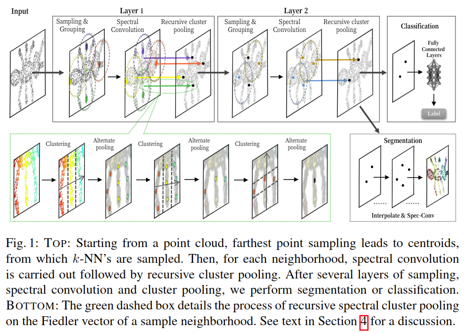
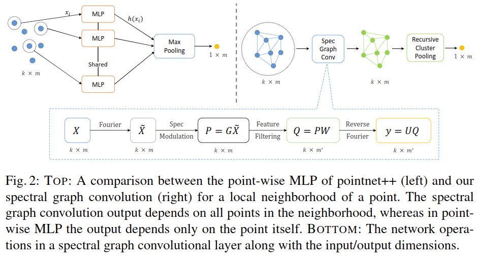

# Local Spectral Graph Convolution for Point Set Feature Learning

元の論文の公開ページ : [arxiv](https://arxiv.org/abs/1803.05827)  
Github Issues : [#84](https://github.com/Obarads/obarads.github.io/issues/84)

## どんなもの?
pointnet++のフレームワークで新規のsepctral graph CNNを利用しながら、従来とは異なるプーリング手法を利用することを提案した。貢献は以下の通り。

- **点群へのspectral graph convolution適応** : 各点の近傍の構造情報を取り込むための点群特徴学習における局所spectral graph convolutionの使用。
- **新規の局所spectral graph convolution層** : 局所spectral graph convolution層の実装ではオフライン計算(事前処理)を必要とせず、end-to-endで訓練可能なモデルを提供する。また、実行時にグラフを動的に構築してその場でラプラシアンとプール階層を計算する。
- **効率的なグラフプーリング戦略** : 新規で効率できなグラフプーリング戦略を使用し、スペクトル座標を再帰的にクラスタリングすることでグラフノード上の特徴を集約する。

## 先行研究と比べてどこがすごいの?
pointnet++の特徴学習において、$k$-NN内の点$x_ i$の特徴はMLP $h(x_ i), i\in 1,2,\ldots ,k$によって実現される。しかし、$h$は$k$-NN内の点関係も計算する関数ではないため、局所構造情報を考慮できない。本論文では、$k$-NN内の全点からの特徴を共同で学習することで点の位相的情報を取り込むカーネルを提案する。
また、最大プーリングは図1の有りの足の様に、近傍の互いに素な点集合からの情報を保存しない。この制限に対応するための再帰スペクトルクラスタリングとプーリングモジュールを用いた手法を導入する。この特徴集約手法は式(2)で表すことができる。

$$
f\left(x_{1}, x_{2}, \ldots, x_{k}\right)=\oplus\left(h_{1}, h_{2}, \ldots, h_{k}\right) \tag{2}
$$

## 技術や手法のキモはどこ? or 提案手法の詳細
図2にpointnet++と本提案手法の概要図を示す。以下にこれらの構造について説明する。

### Graph Convolution
本提案手法の畳み込み演算は式(4)の様に示すことができる。

$$
\tilde{h}=\tilde{X} \odot \tilde{g} \tag{4}
$$

$\odot$はアダマール積、$\tilde{X}$は点集合特徴のグラフフーリエ変換、$\tilde{g}$はグラフフーリエ領域のフィルタ、$\tilde{h}$はフィルタリングされた出力を示す。以下にこれらの詳細を説明する。

#### Graph Formulation of a Local Neighborhood

## どうやって有効だと検証した?

## 議論はある?

## 次に読むべき論文は?
- なし

## 論文関連リンク
1. なし

## 会議
ECCV 2018

## 著者
Chu Wang, Babak Samari, Kaleem Siddiqi.

## 投稿日付(yyyy/MM/dd)
2018/03/15

## コメント
なし

## key-words
Point_Cloud, Graph, CV

## status
未完

## read
A, I, M

## Citation
