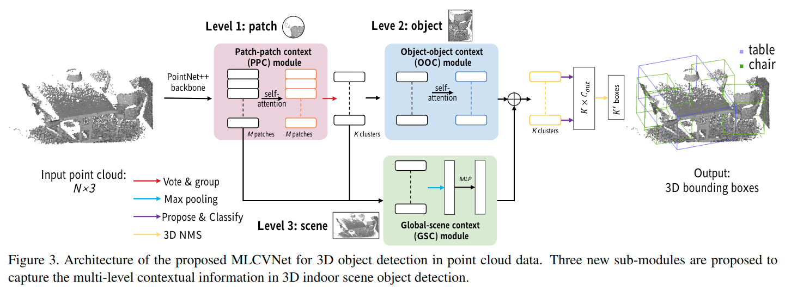

# MLCVNet: Multi-Level Context VoteNet for 3D Object Detection

元の論文の公開ページ : [arxiv.org](https://arxiv.org/abs/2004.05679)  
提案モデルの実装 : [NUAAXQ/MLCVNet](https://github.com/NUAAXQ/MLCVNet)  
Github Issues :   

Note: 記事の見方や注意点については、[こちら](/)をご覧ください。  
Note: 引用中の[*]は論文内の文献番号である。該当する論文は、論文関連リンクの各リストの末尾に基づいて調べられる。

## どんなもの?
##### VoteNetをベースにした3Dオブジェクト検出モデル、MLVCNetを提案した。
- こちらのモデルはVoteNetにself-attentionとmulti-scale feature fusionを導入する。
  - これらを導入することで、既存の手法では考慮されなかったコンテキスト情報を使用する。
    - このコンテキスト情報というのは、シーン内の3D物体の関係性を示した情報。
- contributionsは以下の通り。
  - "We propose the first 3D object detection network that exploits multi-level contextual information at patch, object and global scene levels."
  - "We design three sub-modules, including two self-attention modules and a multi-scale feature fusion module, to capture the contextual information at multiple levels in 3D object detection. The new modules nicely fit in the state-of-the-art VoteNet framework. Ablation study demonstrates the effectiveness of these modules in improving detection accuracy."
  - "Extensive experiments demonstrate the benefits of multi-level contextual information. The proposed network outperforms state-of-the-art methods on both SUN RGB-D and ScanNetV2 datasets."

##### バウンディングボックスを利用した3D物体検出ベンチマークを使用して実験した。
- ベンチマークデータセットは以下の通り。 
  - SUN EGB-D
  - ScanNet
- [比較する検出モデルで比較的新しいのはVoteNetのみ?]

## 先行研究と比べてどこがすごいの? or 関連事項
##### 省略

## 技術や手法のキモはどこ? or 提案手法の詳細
##### 手法の概要
- 提案モデルの全体像は図3の通り。

## どうやって有効だと検証した?
##### 省略

## 議論はある?
##### シーンタイプを予測するためにGSCモジュールのglobal featureを使用する。
- "Contextual information analysis in 3D object detection still offers huge space for exploration." 
- "For example, to enhance the global scene context constraint, one possible way is to use the global feature in the GSC module to predict scene types as an auxiliary learning task, which can explicitly supervise the global feature representation."

##### 別の文脈符号化としては、[1]のようなメカニズムが考えられる。
- "Another direction would be a more effective mechanism to encode the contextual information as in [8]."

## 次に読むべき論文は?
##### なし

## 論文関連リンク
##### あり
1. [Han Hu, Jiayuan Gu, Zheng Zhang, Jifeng Dai, and Yichen Wei. Relation networks for object detection. In Proceed-ings of the IEEEConference on Computer Vision and Pattern Recognition, pages 3588–3597, 2018.](https://arxiv.org/abs/1711.11575)[8]

## 会議, 論文誌, etc.
##### CVPR 2020

## 著者
##### Qian Xie, Yu-Kun Lai, Jing Wu, Zhoutao Wang, Yiming Zhang, Kai Xu, Jun Wang

## 投稿日付(yyyy/MM/dd)
##### 2020/04/12

## コメント
##### あり
- Iはcontributionのみ
- Eはデータセットと表の確認のみ

## key-words
##### CV, Paper, Point_Cloud, Detection, 導入, Implemented

## status
##### 導入

## read
##### A, I, C, E

## Citation
##### 未記入
