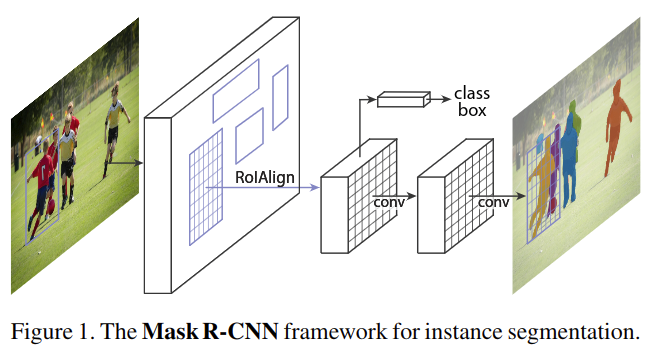

# Mask R-CNN

元の論文の公開ページ : [arxiv](https://arxiv.org/abs/1703.06870)  
Github Issues : 

## どんなもの?
Faster R-CNNを拡張して、バウンディングボックス内の対象オブジェクトにマスクを付属し、結果としてインスタンス&セマンティックセグメンテーションを行えるようにしたMask R-CNNを提案した。

## 先行研究と比べてどこがすごいの?

## 技術や手法のキモはどこ? or 提案手法の詳細
Mask R-CNNは最初の段階にRPN(RoIを出力)を使用し、次の段階でバウンディングボックスとクラスを予測すると同時に各RoIに対するバイナリマスクを出力する。Mask R-CNNの概要図は図1の通り。  

マスクブランチ(処理の分岐、他にはクラスとボックスブランチがある)は各RoIに対して$K \ m^2$次元の出力を行う。この時、Kはクラス数、$m\times m$は解像度を指す。  
本提案の損失は以下のようになる。

$$
L=L_{c l s}+L_{b o x}+L_{m a s k}
$$

$L_ {cls}$と$L_ {box}$は[1]に従う。$L_ {mask}$はピクセル単位の損失を必要とするため、平均バイナリクロスエントロピー損失として扱う。なお、ground-truthが$k$番目のクラスに関連するRoIである場合、$L_ {mask}$は$k$番目のマスクのみを扱う(他のマスクは損失に関与しない)。通常、セマンティックセグメンテーションではピクセル単位でソフトマックスと多項式クロスエントロピー損失を扱う。その場合、他のクラスとマスクが競合するが、本提案ではピクセル単位でシグモイドと2値損失を使うため、競合しない。これがインスタンスセグメンテーションに良好な結果をもたらす。(なんで?)

### Mask Representation
省略

### RoIAlign
RoIPool[1]はRoIから小さな特徴マップ(例:$7\times 7$)を抽出するためのスタンダードな演算である。しかしながら、RoIとそれに対するRoI Pool時にわずかながらズレが起こるため「丸め込む」動作を行う([2]が非常にわかりやすい、RoIPoolのプーリングの前の処理を論文ではQuantizationと呼んでいる)。この動作は、ピクセル単位で領域を切り分けなければならないセグメンテーションタスクで問題となる。

そこで、著者らはRoIAlignと呼ばれる新たな層を提案する。図3に沿ってRoIAlignを説明する。RoIは実線で表され、今回は($2\times2=$)4つのbinに分割し、更に各bin内の規則的な位置に4つのサンプリング点を置く。その後、特徴マップ上の近傍グリッド点(図では矢印の根本の様に示されているが、実際は近傍4ピクセル[2])からBilinear interpolationを用いて各サンプリング点の値を計算する(ここの手順は改良の余地有り?[2])。これにより、丸め込む動作を行わずともRoIに沿ったプーリングを行うことができる。

## どうやって有効だと検証した?
省略

## 議論はある?
省略

## 次に読むべき論文は?
- なし

## 論文関連リンク
1. [R. Girshick. Fast R-CNN. InICCV, 2015.](https://arxiv.org/abs/1504.08083?context=cs.CV)
2. [yu4u, 最新の物体検出手法Mask R-CNNのRoI AlignとFast(er) R-CNNのRoI Poolingの違いを正しく理解する - Qiita, 2017.](https://qiita.com/yu4u/items/5cbe9db166a5d72f9eb8)

## 会議
ICCV 2017

## 著者
Kaiming He, Georgia Gkioxari, Piotr Dollar, Ross Girshick.

## 投稿日付(yyyy/MM/dd)
2017/03/20

## コメント
これを読む前にR-CNN、Fast R-CNN、Faster R-CNNを読むこと。

## key-words
2D_Image, Detection, Semantic_Segmentation, Instance_Segmentation

## status
省略

## read
A, M

## Citation
