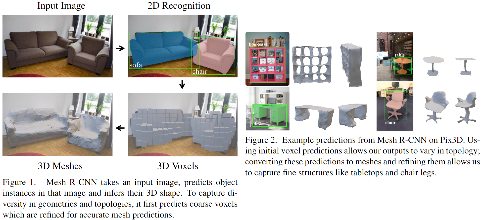
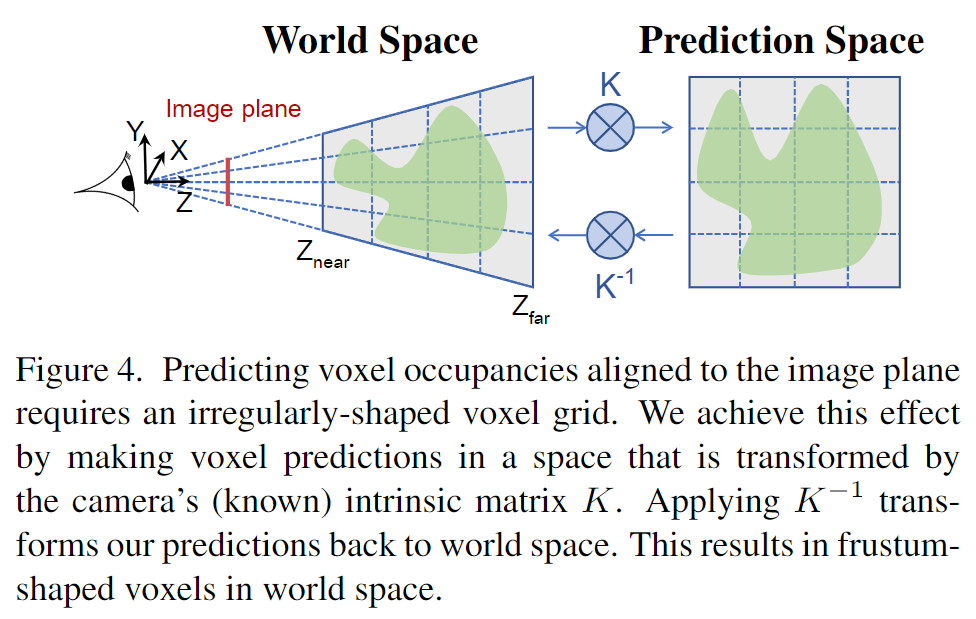
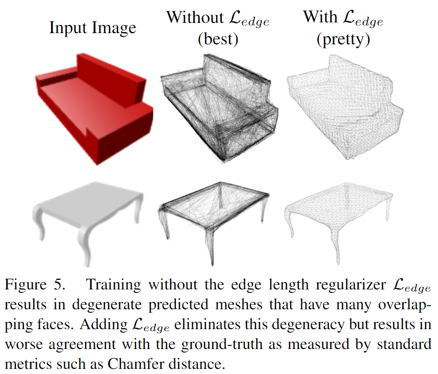
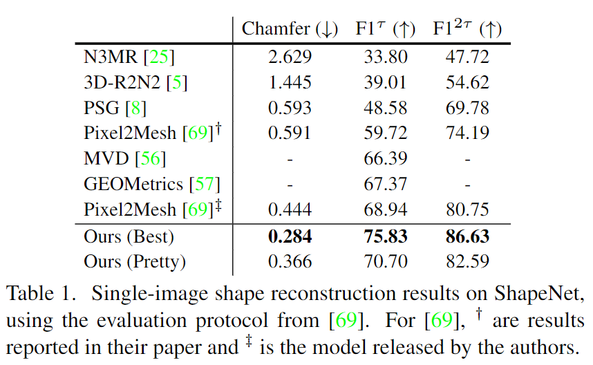

# Mesh R-CNN

元の論文の公開ページ : [arxiv](https://arxiv.org/abs/1906.02739)  
Github Issues : 

## どんなもの?
入力としてRGB画像を受け取り、そこからオブジェクトの検知を行ったのちにオブジェクトを3D表現に変換するMesh R-CNNを提案した。Mesh R-CNNの流れと出力結果は図1,2の通りである。検出自体はMask R-CNNに任せ、3D表現の生成はMask R-CNN内のVoxel Branch(分岐)から行っていく。

## 先行研究と比べてどこがすごいの?
2D画像からの3Dオブジェクト推定の進歩が著しいが、これらには以下の問題がある。

- (実?)世界の3D構造を無視して、2Dで予測を行う(?)。
- 単体オブジェクトのみに注目、または合成オブジェクトを利用したベンチマークを行うことに集中している。

本提案では、これらの二つの問題に対して進歩を出す。

検索したメッシュテンプレートもしくは固定形状のメッシュから変形する手法があるが、これらはその最初のメッシュによって表現が制限されてしまう。著者らは、ボクセル予測とメッシュ変形の統合※による柔軟な表現を出力するモデルを提案している。

[※ ボクセルによるオブジェクトの原型予測と、それに基づくメッシュ変形を行う。]

## 技術や手法のキモはどこ? or 提案手法の詳細
### 構造
Mesh R-CNNの全体的な構造は図3の通り。メッシュの予測器はVoxel Branch、Cubify、Mesh Refinement Branchで構成される。

#### Voxel Branch
fully-convolutional NetworkにRoIAlignからの入力特徴マップを適応することで$G\times G \times G$の3D体積表現を生成する。画像平面に沿ったボクセル占有率を予測するため、既知のカメラ内部値$K$を使ってグリッドを変換する(図4)。

[※　$K$をどの様に使うのかわからなかった]

#### Cubify
Voxel Branchから生成された体積表現をより繊細な3D表現に変換するため、ボクセルからメッシュへ変換するこのCubifyを使用する。

#### Mesh Refinement Branch
このブランチはメッシュの頂点の位置を改善するものである。Pixel2Mesh[3]と同様に、以下の3つの演算を一つのステージとして、このステージを繰り返しメッシュに対して施す。このネットワークの各層では、各頂点の3D座標値$v_i$と特徴ベクトル$f_ i$が保持される。

1. **vertex alignment** : メッシュの各頂点に対する画像特徴ベクトルを生成する。カメラの内部行列を利用して各頂点を画像平面に投影する。特徴マップが与えられたとき、投影された頂点位置でbilinearly interpolated画像特徴を計算する。結果として、このVertAlign(vertex alignment)は各頂点に対する初期特徴ベクトルを出力する。このベクトルは前のステージからの頂点特徴と連結される。

2. **graph convolution** : メッシュの辺にしたがって情報を伝播する。入力として頂点特徴$\\{f_ i\\}$があるとき、更新された特徴$f_ {i}^{\prime}=\operatorname{Re} \mathrm{L} \mathrm{U}\left(W_ {0} f_ {i}+\sum_ {j \in \mathcal{N}(i)} W_ {1} f_ {j}\right)$を計算する。この時、$\mathcal{N}(i)$はメッシュ中の$i$番目の頂点近傍を与え、$W_ 0$と$W_ 1$は学習された重み行列である。mesh refinement branchの各ステージは局所メッシュ領域上の情報を集めるためにいくつかのグラフ畳み込み層を使う。

3. **vertex refinement** : 頂点位置の更新を行う。$W_ {vert}$が学習された重み行列であるとき、更新された頂点位置は$v_ {i}^{\prime}=v_{i}+\tanh \(W_ {v e r t}\[f_ {i} ; v_ {i}\]\)$である。メッシュジオメトリが更新されても、topologyは保持されたままにする。mesh refinement branchの各ステージはvertex refinementをもって終わり、生成される中間メッシュは次のステージでさらに改良される。

### 損失
#### Voxel Loss
voxel branchは予測されたボクセル占有率と実際のボクセル占有率間の2値クロスエントロピーを最小化することで訓練される。

#### Mesh Loss
traiangle mesh上で自然に動作するような損失を定義することは難しいため、代わりに有限個の点を使用して損失を定義する。表面を密にサンプリングすることで、点群でメッシュを表現する。これにより、点群損失が形状損失に近似するようになる。

[1]と同様、メッシュの表面から一様に点（およびそれらの法線ベクトル）をサンプリングするために、微分可能メッシュサンプリング演算を使用する。この目的のために、我々は効率的なbatched samplerを実装する(詳細はAppendix Bを参照)。著者らは点群$P^i$と$P^{gt}$を予測されたメッシュとground truthメッシュからそれぞれ得る。

法線ベクトルを持つ二つの点群$P,Q$が与えられたとき、$\Lambda_ {P, Q}=\\{\(p, \arg \min _ {q}\|p-q\|\) : p \in P\\}$は、$q$が$Q$中の$p$の近傍であるような、ペア($p,q$)の集合である。$P,Q$間のchamfer distanceは式(1)のようになる。

$$
\mathcal{L}_{\mathrm{cham}}(P, Q)=|P|^{-1} \sum_{(p, q) \in \Lambda_{P, Q}}\|p-q\|^{2}+|Q|^{-1} \sum_{(q, p) \in \Lambda_{Q, P}}\|q-p\|^{2} \tag{1}
$$

そして(絶対)法線距離は式(2)のようになる。

$$
\mathcal{L}_{\mathrm{norm}}(P, Q)=-|P|^{-1} \sum_{(p, q) \in \Lambda_{P, Q}}\left|u_{p} \cdot u_{q}\right|-|Q|^{-1} \sum_{(q, p) \in \Lambda_{Q, P}}\left|u_{q} \cdot u_{p}\right| \tag{2}
$$

ただし、これらの罰則化のみではメッシュが悪化する(図5)。そこで追加でshape regularizersを追加する(以下の式)。

$$
\mathcal{L}_{\mathrm{edge}}(V, E)=\frac{1}{|E|} \sum_{\left(v, v^{\prime}\right) \in E}\left\|v-v^{\prime}\right\|^{2}
$$

ここで、$E \subseteq V \times V$は予測されたメッシュのエッジを示す。代わりとして、ラプラシアン損失[2]も平滑化を促す。

最終的な$i$番目のステージの損失は$\mathcal{L}_ {\mathrm{edge}}(V, E)=\frac{1}{|E|} \sum_ {\(v, v^{\prime}\) \in E}\\|v-v^{\prime}\\|^{2}$の合計値となる。mesh refinement branchは全ステージの損失の平均を損失とする。

## どうやって有効だと検証した?
ShapeNetを使った評価は表1の通り。評価基準は[3]のものを利用している。

また、フルでShapeNet test setを使った結果は表2の左の通り。また、穴の開いたメッシュからなるテストサブセットを使った定量的評価は表2の右、視覚的評価は図6の通り。

### その他
Pix3D(実世界の画像を使用)等の評価、切除実験もあり。また、深度予測にも言及している。

## 議論はある?

## 次に読むべき論文は?
- なし

## 論文関連リンク
1. [E. J. Smith, S. Fujimoto, A. Romero, and D. Meger. GE-OMetrics: Exploiting geometric structure for graph-encoded objects. InICML, 2019.](http://proceedings.mlr.press/v97/alet19a/alet19a.pdf)
2. [M. Desbrun, M. Meyer, P. Schr ̈ oder, and A. H. Barr. Im-plicit fairing of irregular meshes using diffusion and curva-ture flow. InSIGGRAPH, 1999.](http://w.multires.caltech.edu/pubs/ImplicitFairing.pdf)
3. [N. Wang, Y. Zhang, Z. Li, Y. Fu, W. Liu, and Y.-G. Jiang. Pixel2Mesh: Generating 3D mesh models from single RGB images. InECCV, 2018.](https://arxiv.org/abs/1804.01654)

## 会議
不明

## 著者
Georgia Gkioxari, Jitendra Malik, Justin Johnson

## 投稿日付(yyyy/MM/dd)
2019/06/06

## コメント
なし

## key-words
Mesh, Voxel, Detection, 3D_Estimation, Reconstruction,CV, Paper

## status
修正

## read
A, I, M

## Citation
