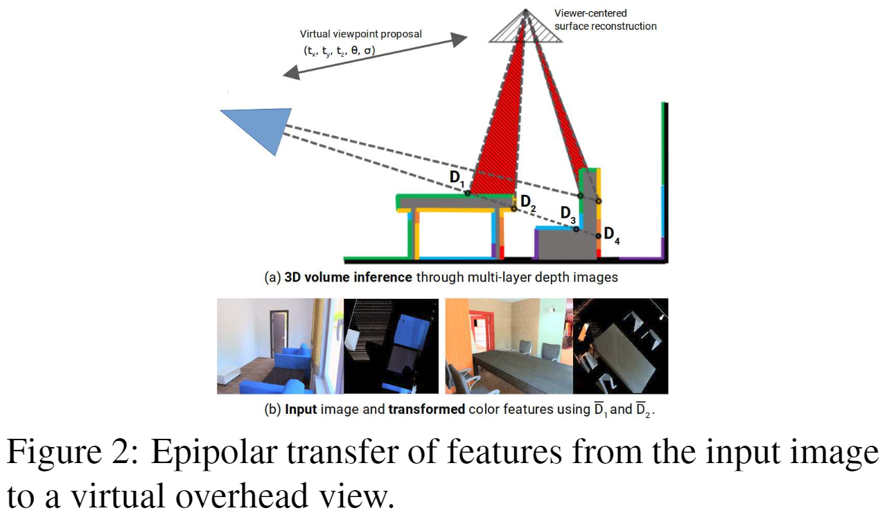
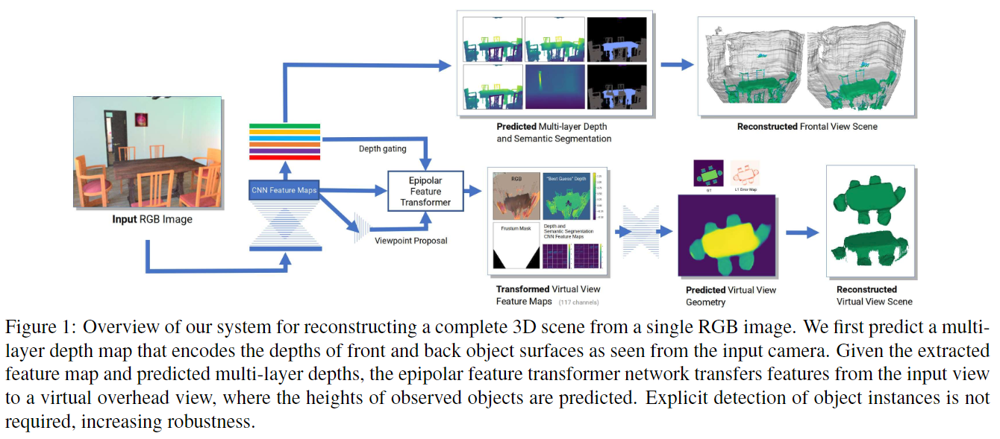

# Multi-layer Depth and Epipolar Feature Transformers for 3D Scene Reconstruction

元の論文の公開ページ : [arxiv](https://arxiv.org/abs/1902.06729)  
Github Issues : 

## どんなもの?
単体RGB画像から3Dシーンを再構築するタスクに取り組んだ論文。このタスクでは、見える&見えない箇所も推測することを必要とする。

## 先行研究と比べてどこがすごいの?

## 技術や手法のキモはどこ? or 提案手法の詳細

## どうやって有効だと検証した?

## 議論はある?

## 次に読むべき論文は?
- なし

## 論文関連リンク
1. なし

## 会議
CVPR WS 2019

## 著者
Daeyun Shin, Zhile Ren, Erik B. Sudderth, Charless C. Fowlkes

## 投稿日付(yyyy/MM/dd)
2019/02/18

## コメント
なし

## key-words
RGB_Image, Reconstruction, 3D_Estimation, CV, Paper, 修正

## status
修正

## read
A, I, M

## Citation
