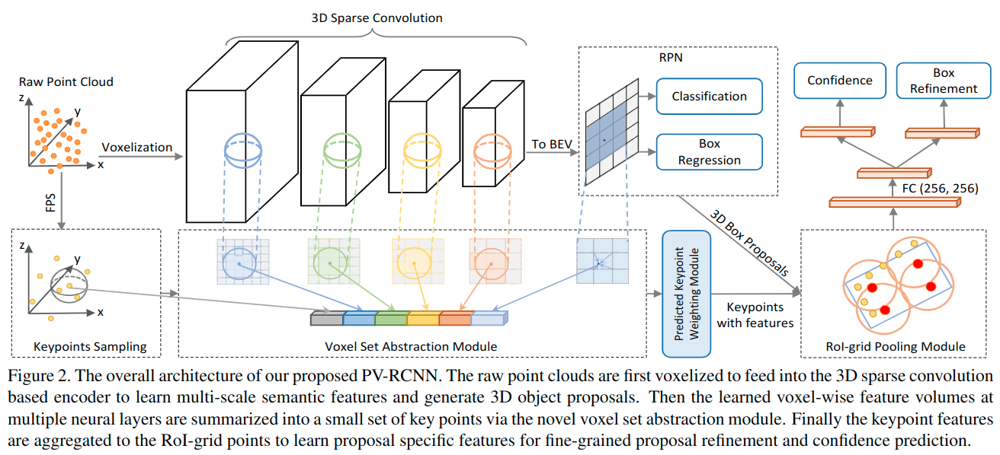

# PV-RCNN: Point-Voxel Feature Set Abstraction for 3D Object Detection

元の論文の公開ページ : [arxiv.org](https://arxiv.org/abs/1912.13192)  
提案モデルの実装 : [非公式:jhultman/vision3d](https://github.com/jhultman/vision3d)  
Github Issues :   

Note: 記事の見方や注意点については、[こちら](/)をご覧ください。  
Note: 引用中の[*]は論文内の文献番号である。該当する論文は、論文関連リンクの各リストの末尾に基づいて調べられる。

## どんなもの?
##### 点とボクセルベースの特徴を併合して利用する3D物体検出モデル、PV-RCNNを提案した。
- 2ステージのフレームワークとなっており、また本提案ではsparse convを用いたボクセル処理による適切な提案生成とPointNetに基づく詳細なコンテキスト情報の会得を行う。
  - [これは、ボクセルベース手法(点も利用はしている)によって提案を行い、その提案の微調整を点ベース手法によって行うというものか。]
- また、ボクセル畳み込みで必要とされるメモリなどを削減するための工夫を提案した。
- 上記の処理を行うために以下のモジュールを提案した。
  - Voxel Set Abstraction Module: 3DCNN特徴ボリュームからキーポイント表現へマルチスケールな特徴をエンコードする。拡張として、点と2D俯瞰特徴を利用したものも提案した。
  - RoI-grid Pooling Module: 上記のキーポイントなどの特徴表現をプーリングするモジュール。

##### 車上からの点群オブジェクト検出を用いてベンチマークを行った。
- データセットはKITTIとWaymo Open Datasetを使った。
- 訓練は、
  - "For the KITTI dataset, we train the entire network with the batch size 24, learning rate 0.01 for 80 epochs on 8 GTX 1080 Ti GPUs, which takes around 5 hours."
  - "For the Waymo Open Dataset, we train the entire network with batch size 64, learning rate 0.01 for 50 epochs on 32 GTX 1080 Ti GPUs, which takes around 25 hours."

## 先行研究と比べてどこがすごいの? or 関連事項
##### 省略

## 技術や手法のキモはどこ? or 提案手法の詳細
### 手法の概要
- 概要図は図2の通り。

##### 指摘
- 既存の検出器では以下の問題点が挙げられる。
  - (1) "These feature volumes are generally of low spatial resolution as they are downsampled by up to 8 times, which hinders accurate localization of objects in the input scene."
    - These feature volumeは3DCNNもしくは2DCNNによって生成されたもの。
  - (2) "Even if one can upsample to obtain feature volumes/maps of larger spatial sizes, they are generally still quite sparse."
    - "The commonly used trilinear or bilin-ear interpolation in the RoIPooling/RoIAlign operations can only extract features from very small neighborhoods (i.e., 4 and 8 nearest neighbors for bilinear and trilinear interpolation respectively). The conventional pooling approaches would therefore obtain features with mostly zeros and waste much computation and memory for stage-2 refinement."
      - [結局のところ、従来の補完による解像度向上によって得られる表現には無駄が多いと言っている。]
- この問題点を解決するには、マルチスケールな特徴ボリュームをRoI gridsに直接集約することであるが、これでは多くのメモリを占有してしまう。
  - 例えば、KITTIデータセットから4倍のダウンサンプリングで18000ボクセルを得たとき、$3\times 3 \times 3$グリッド内の提案を100個得る場合、$2700 \times 18000$サイズの処理を行うのはしきい値などを用いても効率的でない。
- **”To tackle this issue, we propose a two-step approach to first encode voxels at different neural layers of the entire scene into a small number of keypoints and then aggregate keypoint features to RoI grids for box proposal refinement.”**

## どうやって有効だと検証した?
##### 省略

## 議論はある?
##### 省略

## 次に読むべき論文は?
##### なし

## 論文関連リンク
##### あり
1. [kawanokana, PV-RCNN: Point-Voxel Feature Set Abstraction for 3D Object Detection | Deep Learning JP. 2020. Accessed: 2020-04-26](https://deeplearning.jp/pv-rcnn-point-voxel-feature-set-abstraction-for-3d-object-detection/)

## 会議, 論文誌, etc.
##### なし

## 著者
##### Shaoshuai Shi, Chaoxu Guo, Li Jiang, Zhe Wang, Jianping Shi, Xiaogang Wang, Hongsheng Li

## 投稿日付(yyyy/MM/dd)
##### 2019/12/31

## コメント
##### なし

## key-words
##### CV, Paper, Detection, Point_Cloud, Voxel, 省略, Implemented

## status
##### 省略

## read
##### なし

## Citation
##### 未記入
