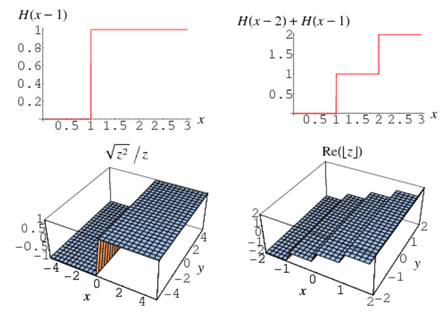

# Constant Function

Github Issues :   

## 概要
### Constant Function
#### [2]より意訳
パラメータを変えても変化しない関数$f(x)=c$。一次元定数関数の関数グラフは真っ直ぐな線である。

### Piecewise Constant Function
#### [1]より意訳
可能な限りの無限数の低次元境界[?]によって分割された領域が局所的に一定であるとき、その関数は区分的に一定(piecewise constant)であると言う。
- The Heaviside step function, rectangle functionとsquare waveは一次元のpiecewise constant関数の例として挙げられる。
- $\sqrt{z^{2}} / z $と$ R[\lfloor z\rfloor]$ for z a complex number, $R[z]$ the real part, $\lfloor x\rfloor$ the floor functionは2次元の例として挙げられる。
- The nearest integer functionもpiecewise constantである。

## 説明 or メモ

## 論文関連リンク
1. [Wolffram MathWorld, Piecewise Constant Function. (アクセス:2019/11/22)](http://mathworld.wolfram.com/PiecewiseConstantFunction.html)
2. [Wolffram MathWorld, Constant Function. (アクセス:2019/11/23)](http://mathworld.wolfram.com/ConstantFunction.html)

## 投稿日付(yyyy/MM/dd)
2019/11/22

## コメント
なし

## key-words
Memo

## status
更新済

## read

## Citation
