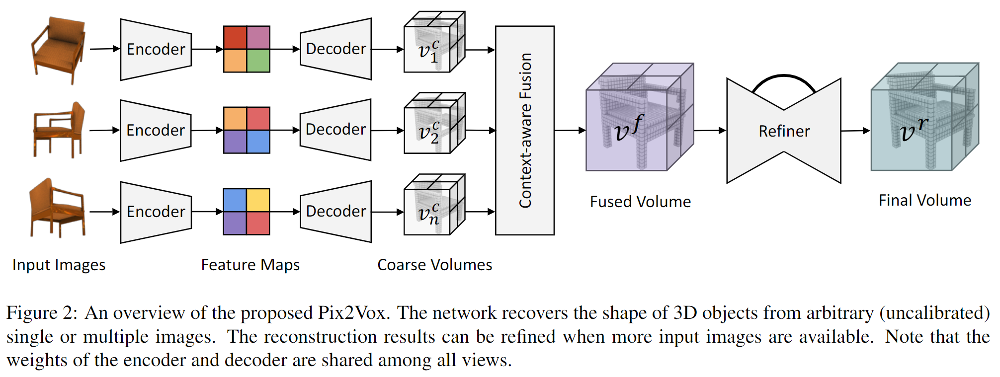
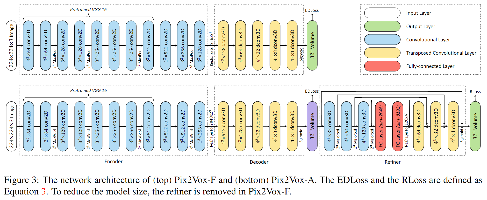

# Pix2Vox: Context-aware 3D Reconstruction from Single and Multi-view Images

元の論文の公開ページ : [arxiv](https://arxiv.org/abs/1901.11153)  
Github Issues : [#139](https://github.com/Obarads/obarads.github.io/issues/139)

## どんなもの?
一視点もしくは多視点の画像を用いて3Dボクセルを出力する新規フレームワーク、Pix2Voxを提案した。

## 先行研究と比べてどこがすごいの?
多視点3D復元で、マッチングプロセスやRNN、maxpoolingが多視点から得た特徴を有効に統合することを妨げているため、それらを解決する方法を提案した。

## 技術や手法のキモはどこ? or 提案手法の詳細
### Network Architecture
Pix2Voxの概観は図2の通り。図3に示すように、Pix2VoxにはRefinerなしのPix2Vox-FとありのPix2Vox-Aが用意されている。Refinerは生成されたボクセルの修正を行う。

#### Context-aware Fusion
異なる視点から生成された体積再構築物(精度が荒いため、Coarse Volumesと呼ぶ)の高品質な部分を適応的に選び出すContext-aware Fusionモジュールを提案した。概観は図5の通り。選ばれた再構築物は3D体積オブジェクトの全体を生成するために融合される。選択はContext-aware Fusionモジュールによって生成されたスコアマップ(図4)に従う。

## どうやって有効だと検証した?

## 議論はある?

## 次に読むべき論文は?
- なし

## 論文関連リンク
1. なし

## 会議
ICCV 2019

## 著者
Haozhe Xie, Hongxun Yao, Xiaoshuai Sun, Shangchen Zhou, Shengping Zhang

## 投稿日付(yyyy/MM/dd)
2019/01/31

## コメント
"However, OGN representations are complex and consume more computational resources due to the complexity of octree representations."とあるが、octree系はメモリ消費に対して有利なだけで表現などの計算では計算資源がそれなりに食われる...のか?
あと、貢献を編集しよう。

## key-words
RGB_Image, Voxel, 3D_Estimation, Reconstruction, Encoder-Decoder, CV

## status
省略

## read
A, I, R

## Citation
