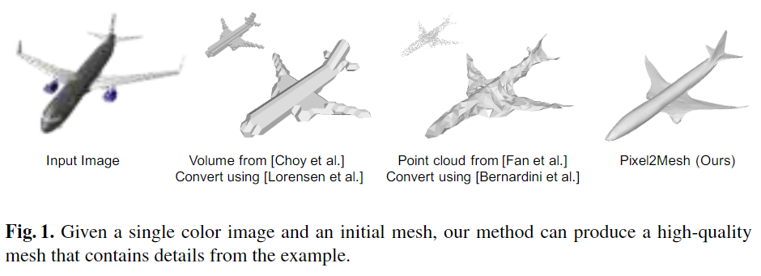
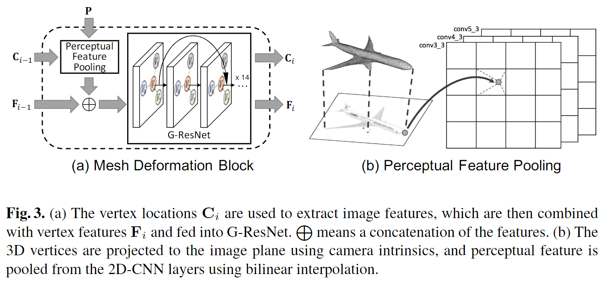

# Pixel2Mesh: Generating 3D Mesh Models from Single RGB Images

元の論文の公開ページ : [arxiv](https://arxiv.org/abs/1804.01654)  
Github Issues : [#136](https://github.com/Obarads/obarads.github.io/issues/136)

## どんなもの?
単体カラー画像から3Dメッシュを抽出するアルゴリズムを提案した。合成というよりかは、メッシュを平均的な形状から目的の形状へ変換することを学習するモデルである。これには、以下の3点のメリットがある。

1. 深層学習はstructured output(グラフ等※)よりも残差の予測(空間変形等)の方に向いているため。
2. 一連の変形はまとめて計算可能で、形状を徐々にかつ詳細に洗練できる。また、質と学習モデルの複雑さを制御できる。
3. (メッシュを変形させる方法であるため)初期メッシュに任意の事前知識をエンコードすることが可能である。

本論文では、楕円体のメッシュが与えられ、そのメッシュに画像から取得した特徴量とメッシュ自身の特徴量を統合させ、そのメッシュの形状と解像度を更新していく。

[※ 1のグラフに関しては、おそらく「直接グラフを出力すること」みたいな意味である。まとめて~はまあ計算しやすい的な意味でいいだろう]

## 先行研究と比べてどこがすごいの?
図1に示すように、既存手法よりも滑らかな表現を出力することができる。

## 技術や手法のキモはどこ? or 提案手法の詳細
### 構造
提案手法の構造は図2の通り。構造の部品の説明を以下に記す。本提案では、メッシュを非正規のグラフ構造として取り扱い、グラフ畳み込みを用いることでメッシュの形状特徴を取得できる。

#### Mesh deformation block
このアーキテクチャの設計の概要は図3(a)の通り。画像からのpool特徴$(\mathbf{P})$と最新のメッシュ形状の頂点位置$(\mathbf{C}_ {i-1})$をもとにPerceptual Feature Poolingで処理を行い、その出力を入力グラフの頂点に取り付けられた3D形状特徴$(\mathbf{F}_ {i-1})$に結合させたのちに一連のグラフベースのResNet(G-ResNet)に入力する。G-ResNetの出力は、それぞれ新規位置$(\mathbf{C}_ {i})$と新規特徴$(\mathbf{F}_ {i})$になる。

- **Perceptual feature pooling layer** : pool特徴$(\mathbf{P})$は画像をVGG-16アーキテクチャに入力して得られたconvX_3(X=3,4,5)の出力を結合した1280次元特徴である。$\mathbf{C}_ {i-1}$は、図3(b)に示すような、カメラ内在値を使って3D頂点座標を2Dに射影したのちにbilinear補間を使ってその特徴をpoolした128次元の3D特徴に加工される。最終的なPerceptual feature pooling layerの出力は先ほどの2つの特徴を結合した1408次元の特徴となる。なお、一段目のPerceptual feature pooling layer内で結合される3D特徴は3次元(座標)のみである
- **G-ResNet** : 14層のグラフ残差畳み込み層とshortcut connectionsを備えたネットワークである。ここでは、先ほどの1408次元の特徴を入力として扱う。出力がMesh deformation blockの出力となる。

[※　補間の「その特徴」は、多分頂点のこと]

#### Graph unpooling layer
ここでは、グラフの頂点数を増やす。単純な増やし方としては、三角形の中心に新たな頂点を設置してその頂点と三角形の頂点を接続するというやり方があるが、図4(b)のface-basedに示すようにこれはアンバランスになるため、図4(a)の様な、辺の中間に新たな頂点を設置する方法をとる。この手法は図4(b)のEdge-basedの様に均一なアップサンプリングをもたらす。

#### Losses
損失には以下の4つを利用する。これらの損失は中間メッシュと最終メッシュの両方で同じ重みで適応される。説明省略。

1. メッシュの頂点位置を制約するためのChamfer loss
2. 表面法線の制約を強制するためのnormal loss
3. 変形している間の近接頂点間の相対位置を維持するためのラプラシアン正則化
4. 外れ値防止のための辺の長さの正則化

## どうやって有効だと検証した?

## 議論はある?

## 次に読むべき論文は?
- なし

## 論文関連リンク
1. なし

## 会議
ECCV 2018

## 著者
Nanyang Wang, Yinda Zhang, Zhuwen Li, Yanwei Fu, Wei Liu, Yu-Gang Jiang

## 投稿日付(yyyy/MM/dd)
2018/04/05

## コメント
なし

## key-words
RGB_Image, Mesh, 3D_Estimation, Reconstruction, Supervised_Learning

## status
省略

## read
A, I, M

## Citation
