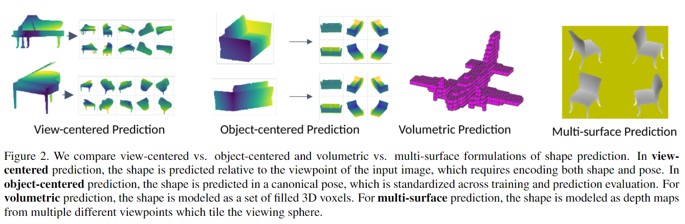

# Pixels, voxels, and views: A study of shape representations for single view 3D object shape prediction

元の論文の公開ページ : [arxiv](https://arxiv.org/abs/1804.06032)  
Github Issues : 

## どんなもの?
この論文では、2D画像から3Dオブジェクトの形状を予測を行う(図1)。その過程で、この論文では二つの課題について取り組む(二つの課題は図2にも記載)。

1. 様々な視点から取得した複数の2.5D表面として表現するのか、形状を体積的に表現するのか、どちらの表現がよいのだろうか。
2. オブジェクト中心座標系と視点中心座標系を用いた方法では、形状予測にどのような差が生まれるのか。

これらの問題に対して、encoder-decoderネットワークアーキテクチャを利用して調査を行う。調査では、体積と表面表現の比較を行うためにデコーダーを交換する、視覚中心とオブジェクト中心を比較するために座標系を交換することを行う。また、RGB画像と震度画像からの予測の評価を行う。

貢献は以下の通り。

- 視覚中心座標系内のオブジェクトの表面予測を行う新しい手法を導入する。著者らのネットワークは入力画像に関する複数の視点の深度マップとシルエットの予測を学習し、表面を計算するために点群にマージされる(翻訳ミス?要確認)。
- 著者らは3D形状予測において表面もしくは体積表現のどちらが効果的か比較する。比較で、最終評価が体積ベースであるか表面ベースであるかにかかわらず(?)、未知のオブジェクトカテゴリーにおける表面ベース表現の利点を示す。
- オブジェクト中心座標系もしくは視覚中心座標系における予測の影響を調査し、ネットワークが視覚中心座標系で予測を学習する場合に新規形状をより一般化することに向いていること、そして座標系の選択がネットワークエンコーダーによって学習された埋め込みを著しく変化させることを示す。

## 先行研究と比べてどこがすごいの?
(形状予測において)形状表現や座標枠の選択など、重要な設計上の選択に関する体系的な評価がなかった。著者らはそれらに取り組む。

## 技術や手法のキモはどこ? or 提案手法の詳細

## どうやって有効だと検証した?

## 議論はある?

## 次に読むべき論文は?
- なし

## 論文関連リンク
1. なし

## 会議
CVPR 2018

## 著者
Daeyun Shin, Charless C. Fowlkes, Derek Hoiem

## 投稿日付(yyyy/MM/dd)
2018/04/17

## コメント
なし

## key-words
RGB_Image

## status
導入

## read
A, I

## Citation
