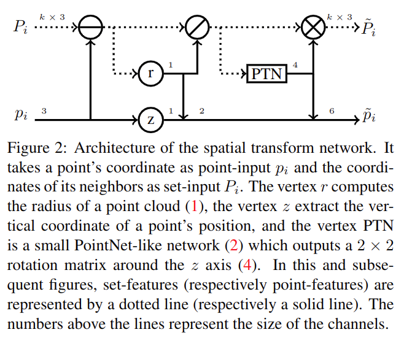
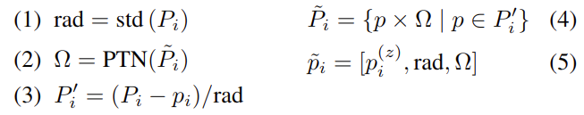
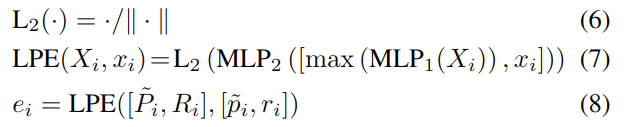

# Point Cloud Oversegmentation with Graph-Structured Deep Metric Learning 

元の論文の公開ページ : [arxiv](https://arxiv.org/abs/1904.02113)  
Github Issues : [#90](https://github.com/Obarads/obarads.github.io/issues/90)

注意: 現在このページは元論文の参考文献番号を参照している。

## どんなもの?
3D点群をスーパーポイントにoversegmentationするための新規教師あり学習フレームワークを提案した。著者らは点群オーバーセグメンテーションを、入力3D点群上で定義され、隣接グラフによって構造化された深層メトリック学習問題として定式化することを提案する。また、これら(オブジェクト)の境界面で高コントラスト(差異)を持ち、均一にオブジェクトに3D点を埋め込むことを学習するための損失関数、 graph-structured contrastive lossを導入する(?)。最終目標は意味論的なスーパーポイントを与えることでセマンティックセグメンテーション手法のアシストをすることである。

貢献は以下の通り。

- 著者らは3D点群オーバーセグメンテーションのための教師あり学習フレームワークの最初の提案者となる。
- オブジェクトの境界で高コントラストを持つ点の埋め込みを生成するcross-partition weighting strategyを組み合わせることができるgraph-structured contrastive lossを導入する。
- PointNet[41]に触発されて作成した軽量なアーキテクチャである局所点埋め込み器を導入する。これは、3D点の局所幾何学性もしくは放射性(測光的?)をコンパクトに埋め込む。
- 著者らはよく知られ、なおかつ全く異なるデータセットを二つ使い、点群オーバーセグメンテーションのSOTAを大幅に改善する。
- superpoint graph semantic segmentation手法を組み合わせるとき、著者らのアプローチはタスクのSOTAを向上させる。

## 先行研究と比べてどこがすごいの?
分析の前処理として点群をスーパーポイントと呼ばれる点の集合に分割する手法が提案されており[32, 44, 40, 7, 56]、これらは広く関心が持たれている。しかしながらこれらの教師なし手法は、幾何学的もしくは放射的(測光的?)に均質な分割は意味的にも均質であるという仮説に基づいている。この仮説は、これらの手法を用いた分析の質に影響をもたらす。本研究では、セマンティックセグメンテーションを促進するための意味的なスーパーポイントを導く、教師ありフレームワークを考案する。

スーパーピクセルとDNNは長い間使われてきたが、DNNの一種であるCNNがスーパーピクセルのオーバーセグメンテーションに使われたのはつい最近である。[37]はオーバーセグメンテーションメトリックを模倣する損失関数を導入しており、これはグラフベースクラスタリング手法と相性が良い。[28]は、SLIC[1]の微分可能版を提案しており、これは空間的クラスタリング手法のEnd-to-Endな訓練を可能にしている。どちらの手法も有望な結果を残しており、hand-craftedな特徴に依存する手法に対して顕著な改善を示している。この研究は、3Dにこれらのアイデアに基づく(ここまでは1章の導入までの内容を参照)。

3D点群のオーバーセグメンテーションにおいて、いくつかの提案がなされているが、これらはいずれもhand-crafted geometric and/or colorimetricな特徴に依存している(2章のOversegmentation of 3D Point Cloudsを参照)。また、スーパーポイントを生成するための深層学習ベースの埋め込みを利用した教師あり3D点群オーバーセグメンテーション手法はまだ開発されていない(2章のDeep Learning for 3D Point Clouds)。また、著者らは埋め込みを分類問題ではなくグラフ分割問題を介したオーバーセグメンテーションに関連付ける(2章のMetric Learning)。

## 技術や手法のキモはどこ? or 提案手法の詳細
著者らの目的は、スーパーポイントベースのセマンティックセグメンテーションアルゴリズムのための、高品質な3D点群オーバーセグメンテーションを生成することである。これを言い換えると以下の3つ特性につながる。

- **object-purity(オブジェクトの純粋さ)**: 特にこれらが意味的な違いを持つとき、スーパーポイントはオブジェクト同士で重複するべきではない。
- **border recall(境界の再現)**: スーパーポイント間の境界は、オブジェクト間の境界と一致しなければいけない。
- **regularity(規則的)**: 形状とスーパーポイントの輪郭はシンプルでなくてはいけない。

以下に、1)局所点埋め込み器と、2)グラフもしくはクラスタベースのオーバーセグメンテーションアルゴリズムを使った埋め込みから点群オーバーセグメンテーションを計算する方法を説明する。

各点$i$を含む点群$C$を処理すると考える。この各点は座標情報$p_ i\in\mathbb{R}^3$と$d$次元の放射計測情報$r_ i\in\mathbb{R}^d$(色、LiDARならレーザーの強度、無い場合は使わない)を含む。また各点$i$は入力点中の$k$近傍$N_ i$の座標情報と放射計測情報から成る集合特徴$P_ {i}=\\{p_ {j} | j \in N_ {i}\\}$と$R_ {i}=\\{r_ {j} | j \in N_ {i}\\}$にそれぞれ関連している。集合特徴$X$へ適応する任意の演算子や関数$f(X)=\\{f(x) | x \in X\\}$は全ての要素に適応される。

### Local Point Embedding
著者らの目的は、各点特徴の局所近傍の幾何学情報と放射計測情報をコンパクトな$m$次元の埋め込み$e_ i$を関連付けることである。埋め込みは訓練中に崩壊しないように$m$単位球$\mathbb{S}_ m$に制約され[52]、そして互いの距離を正規化する。この目的のため、Local Point Embedder(LPE)というPointNetからインスパイアされた計量のネットワークを導入する。以下に各部品について説明する。

#### Spatial Transform

このネットワークは図2の通り。ある点座標$p_ i$とその局所$k$近傍$P_ i$を入力として受け付け、$p_ i$を中心として標準化された近傍位置$\tilde{P}_ i$、$\tilde{P}_ i$に沿った幾何学的点特徴$\tilde{p}_ i$(elevation $p_ i^{(z)}$,近傍半径,original orientation(4つの値で示される回転行列)を含む)を出力する。標準化を施すことで、点の位置が正規化されたり回転されたりしてもoriginal orientation,高さ,元の近傍範囲の共変性を維持できる。

この出力はLPEで使われ、出力は下記の式(1,2,3,4,5)で表される。図2中の番号は値の数、丸の中の記号は減算等の演算子を示す。

#### Local Point Embedder
構造は図3の通り。中身はPointNetを真似たものとなっている。$\mathrm{MLP}_ {2}$で得られたベクトルは式(7)を介して処理され、最終的に単位球上で正規化される。埋め込み$e_ i$は式(8)のLPEを介して$C$の$i$点に対応して計算される。

### Graph-Based Point Cloud Oversegmentation
#### The Generalized Minimal Partition Problem

## どうやって有効だと検証した?

## 議論はある?

## 次に読むべき論文は?
- なし

## 論文関連リンク
1. なし

## 会議
CVPR 2019

## 著者
Loic Landrieu, Mohamed Boussaha.

## 投稿日付(yyyy/MM/dd)
2019/04/03

## コメント
なし

## key-words
Supervised_Learning, Point_Cloud, Semantic_Segmentation

## status
未完

## read
A, I, R