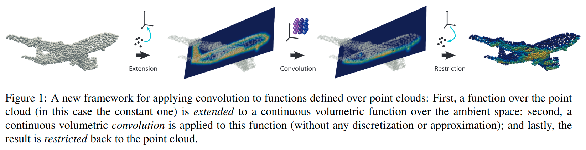

# Point Convolutional Neural Networks by Extension Operators

元の論文の公開ページ : [arxiv.org](https://arxiv.org/abs/1803.10091)  
提案モデルの実装 : [matanatz/pcnn](https://github.com/matanatz/pcnn)  
Github Issues :   

Note: 記事の見方や注意点については、[こちら](/)をご覧ください。

## どんなもの?
##### CNNを点群処理向けに一般化した畳み込み手法、Point Cloud Convo-lutional Neural Networks(PCNN)を提案した。
- [[1]より引用、"点群表現とRBFカーネル表現の相互変換を行い、RBFカーネル表現上で畳み込みを行う。"]

## 先行研究と比べてどこがすごいの? or 関連事項
##### 省略

## 技術や手法のキモはどこ? or 提案手法の詳細
### 手法の概要
#### 目標
##### 点群$X$に対するCNNを定義する。
- 点群$X$の畳込みを定義する著者らのアプローチは、
  - 点群の関数を体積の関数(volumetric function)へ拡張し($\mathcal{E}_ X$)、
  - これらの関数で標準的なユークリッドの畳込みを実行し($O$)、
  - それらを点群に戻しサンプリングする($\mathcal{R}_ X$)。
- これらの一連の処理を点群畳み込み演算子$O_ X$として、式(1)のように表される。また、視覚的には図1のようになる。

$$
O_ X=\mathcal{R}_ X \circ O \circ \mathcal{E}_ X
$$

- 本提案では、以下の条件(特性)を満たすような点群畳み込み演算子$O_ X$を定義することを目標とする。
  - 効率的である(Efficiency) : $O_ X$は計算効率が良い。
  - 不変性を持つ(Invariance) : $O_ X$は点の並びに影響されない、つまり$O_ X$は同変(equivariant)である。
  - 堅牢である(Robustness) : 
    - $X$が$S$からサンプリングと仮定され、$f \in C(S,\mathbb{R})$を定義する。[なお、$C(S,\mathbb{R})$は体積の関数$\psi: S \rightarrow \mathbb{R}$である。]
    - $S$からサンプリングされる時、$\mathcal{E}_ X \circ \mathcal{R}_{X}[f] \in C(\mathbb{R}^{3}, \mathbb{R})$は$f$へ近似し、$S$から離れてゼロへ減衰する[??]。
    - 具体的には、$\mathbb{E}_ X[1]$は$S$のvolumetric indicator functionに近似する。
      - ここで、$1\in \mathbb{R}^{I\times 1}$は全て1のベクトルである。
      - $\nabla \mathcal{E}_ {X}[\mathbf{1}]$は$S$上のmean curvature normal field[(法線?)]に近似する。
    - 特に、もし$X$と$X^{*} \subset S$が$S$の異なるサンプルである場合、$O_{X} \approx O_ {X}$となるような近似特性を持つ。
  - 並進不変を持つ(Translation invariance) : $O_ X$は並進不変(Translation invariance)である。これはstationary kernel (i.e., 場所に依存しない)によって定義される。

##### 表記法について
- 著者らはtensor(i.e., 多次元行列)を使う。
  - 例: $a \in \mathbb{R}^{I \times I \times J \times L \times M}$
- 特定の要素(entry)のインデックスは対応する小文字を使用して示される。
  - 例: $a_ {i i^{\prime} j l m}$, $1 \leq i, i^{\prime} \leq I, 1 \leq j \leq J$.
- 点群は$X=\\{x_ i\\}_ {i=1}^I\in\mathcal{R}^{I\times 3}$である。
  - ここで、tensorの合計$c=\sum_ {i j l} a_ {i i^{\prime} j l m} b_ {i j l}$, $b \in \mathbb{R}^{I \times J \times L}$のとき、$c$の次元はfree indices[?]によって定義される。
    - この場合、$c=c_ {i^{\prime} m} \in \mathbb{R}^{I \times M}$

### 工夫
#### Extension operator $\mathcal{E}_ X$
- Extension operatorは式(2)で定義される。

$$
\mathcal{E}_ X:\mathbb{R}^{I\times J} \to C(\mathbb{R}^3,\mathbb{R}^J) \tag{2}
$$

- ここで、
  - $\mathbb{R}^{I \times J}$は関数の一群$f:X\to\mathbb{R}^J$
  - $C(\mathbb{R}^3,\mathbb{R}^J)$は体積の関数$\psi:\mathbb{R}^3\to\mathbb{R}^J$を示す。
- この演算子は式(4)の形として定義される。

$$
\mathcal{E}_ X[f](x) = \sum_i f_{ij}\ell_i(x) \tag{4}
$$

- ここで、
  - $f\in\mathbb{I \times J}$と$\ell_ i \in C(\mathbb{R}^3, \mathbb{R})$はevaluation point $x$[??]ごとに定義された基底関数と考えることができる。[?]
    - [evaluation point $x$は[2]の入力$\mathbf{x}$?]
  - RBFは基底ファミリーである。
    - 例として、RBFはRBF $\Phi : \mathbb{R}_ +\to\mathbb{R}$ で作成されたinterpolating bases($\ell_ i(x_ i')=\delta_ {ii'}$)を考えることができる[??]
- しかしながら、式(4)は**$I\times I$の線形システムの解を計算しなければいけない**。
  - [線形システムは連立一次方程式でもいいっぽい。]
- **故に、点の数が多いと条件数が多くなり、厄介になる[5]。**
  - [計算量が増えて重くなるということ。]
- この論文では、新しいapproximation scheme(式(5))を主張する。

$$
\ell_i(x)=c\omega_i\Phi(|x-x_i|) \tag{5}
$$

- ここで、
  - $c$はRBF $\Phi$に依存する定数、
  - $\omega_ i$は点$x_ i$に依存する形状領域のthe amount[(総計?)]と考える。
- $\omega_ i$は式(6)となる。

$$
\omega_ i = \frac{1}{c \sum_{i'}\Phi(|x_{i'}-x_i|)} \tag{6}
$$

- 式(6)はNadaraya-Watson kernel estimator[27]に似ているが、分母は近似点$x$から独立しているため、実際には異なる。
  - これは畳み込み演算子の閉形式計算に対して有効な特徴である。
- なお、式(4)と(5)を使った畳み込み演算子$O_ X$により、目標の節で述べた条件(特性)の全てを満たす。
  - 実際、4章で示されるrobustnessは$\mathcal{E}_ X$の力よって得られる。
    - これは、表面$S$上continuous, sampling independent operatorへ近似する$E_ X$によるもの。[??]
      - 関数$f$へ適応されるこのcontinuous operator $\mathcal{E}_ S[f]$は、表面$S$へ$f$のrestrictionを近似することが確認されている。
    - 図2は$E_ X$のrobustnessを実証している。
      - 同じ形状ではあるものの、点の密度が異なる3つのconstant one functionに適応すると、ほぼ同じ形状になる。

#### Kernel model
- ベクトル値関数へ適合されたcontinuous convolution operator $O : C(\mathbb{R}^{3}, \mathbb{R}^{J}) \rightarrow C(\mathbb{R}^{3}, \mathbb{R}^{M})$を式(7)のように考える。

$$
\psi \in C\left(\mathbb{R}^{3}, \mathbb{R}^{J}\right) \tag{7}
$$

- $\kappa \in C\left(\mathbb{R}^{3}, \mathbb{R}^{J \times M}\right)$は畳み込みカーネルであり、RBFカーネルで表される(式(8))。

$$
\kappa_{j m}(z)=\sum_{l} k_{l j m} \Phi\left(\left|z-y_{l}\right|\right) \tag{8}
$$

- ここで、
  - $k \in \mathbb{R}^{L \times J \times M}$はRBFの基底のcontinuous kernelを示すtensorである。
  - $k$はネットワークの学習可能なパラメーターを示し、画像の場合の畳み込みパラメーターと同様の次元を持つ。
    - (i.e., spatial dimensions $\times$ input channels $\times$ output channels)
- [$\\{y_ {l}\\}_ {l=1}^{L} \subset \mathbb{R}^{3}$についてなんかあるけど、よくわからん。translations?]

#### Restriction operator $\mathcal{R}_ X$
- restriction operatorは式(3)で定義される。

$$
\mathcal{R}_ X:C(\mathbb{R}^3,\mathbb{R}^M)\to\mathbb{R}^{I \times M} \tag{3}
$$

- このサンプリング演算子は式(9)のようになる。

$$
\mathcal{R}_{X}[\psi]=\psi_{j}\left(x_{i}\right) \tag{9}
$$

- ここで、
  - $\psi \in C(\mathbb{R}^{3}, \mathbb{R}^{J})$
  - $\mathcal{R}_ {X}[\psi] \in \mathbb{R}^{I \times J}$

#### Sparse extrinsic convolution
##### [未読]

#### Choice of RBF
##### [未読]

## どうやって有効だと検証した?
##### 省略

## 議論はある?
##### 省略

## 次に読むべき論文は?
##### なし

## 論文関連リンク
##### あり
1. [Naoya Chiba. SlideShare. 三次元点群を取り扱うニューラルネットワークのサーベイ, 99ページ目. 2018. (アクセス:2020/2/8)](https://www.slideshare.net/naoyachiba18/ss-120302579)
2. [小山 裕己. Hatena Blog. RBF 補間 (Radial Basis Function Interpolation) の概要と実装. 2014. (アクセス:2020/2/21)](http://yuki-koyama.hatenablog.com/entry/2014/05/04/132552)
3. [M. Berger, A. Tagliasacchi, L. M. Seversky, P. Al-liez, G. Guennebaud, J. A. Levine, A. Sharf, and C. T. Silva. A survey of surface reconstruction from point clouds. In Computer Graphics Forum, volume 36, pages 301–329. Wiley Online Library, 2017.](https://hal.inria.fr/hal-01348404v2/document)[4]
4. [J. C. Carr, R. K. Beatson, J. B. Cherrie, T. J. Mitchell, W. R. Fright, B. C. McCallum, and T. R. Evans. Re-construction and representation of 3d objects with ra-dial basis functions. In Proceedings of the 28th an-nual conference on Computer graphics and interactive techniques, pages 67–76. ACM, 2001.](http://www.cs.jhu.edu/~misha/Fall05/Papers/carr01.pdf)[11]
5. [H. Wendland. Scattered data approximation, vol-ume 17. Cambridge university press, 2004.](https://books.google.co.jp/books?id=i9nQnQEACAAJ&hl=ja&source=gbs_book_other_versions)[42]

## 会議, 論文誌, etc.
##### SIGGRAPH 2018 and ACM Transactions onGraphics (TOG), 37(4):71, 2018 

## 著者
##### Matan Atzmon, Haggai Maron, Yaron Lipman

## 投稿日付(yyyy/MM/dd)
##### 2018/03/27

## コメント
##### あり
- 本論文の理解に当たって、[1,2]の文献を参考にした。
- 理解できたかというとそうでもない

## key-words
##### CV, Paper, Point_Cloud, 参照, 省略, Part_Segmentation, Classification, 修正, Normal_Estimation

## status
##### 省略

## read
##### なし

## Citation
##### 未記入
