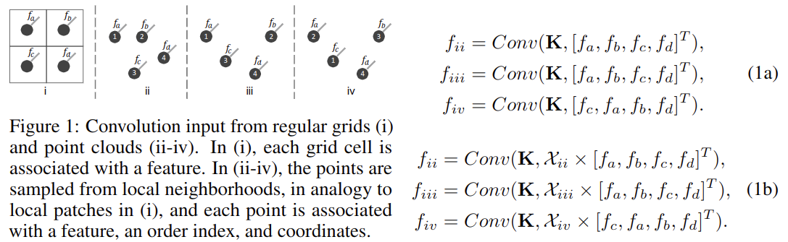

# PointCNN: Convolution On X-Transformed Points

元の論文の公開ページ : [arxiv](https://arxiv.org/abs/1801.07791)  
Github Issues : 

## どんなもの?
点群において、点と関連付けられている入力特徴の重み付けと点の潜在的な順序を同時に学習する演算とネットワークを提案した。

## 先行研究と比べてどこがすごいの?

## 技術や手法のキモはどこ? or 提案手法の詳細
画像処理などで使われる典型的な畳み込み演算子を生の点群に適応できない理由は、点群にデータの順序が無く、なおかつデータが規則的に並んでいない(不規則)からである。

## どうやって有効だと検証した?

## 議論はある?

## 次に読むべき論文は?
- なし

## 論文関連リンク
1. なし

## 会議
NIPS 2018

## 著者
Yangyan Li, Rui Bu, Mingchao Sun, Wei Wu, Xinhan Di, Baoquan Chen.

## 投稿日付(yyyy/MM/dd)
2018/01/23

## コメント
なし

## key-words
Point_Cloud, 2D_Image, Semantic_Segmenation, Classification

## status
未完

## read
A

## Citation
