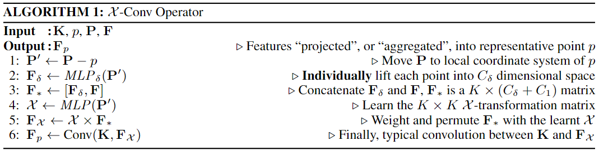

# PointCNN: Convolution On X-Transformed Points

元の論文の公開ページ : [arxiv](https://arxiv.org/abs/1801.07791)  
Github Issues : 

## どんなもの?
点群において、点と関連付けられている入力特徴の重み付けと点の潜在的な順序を同時に学習する演算とネットワークを提案した。

## 先行研究と比べてどこがすごいの?

## 技術や手法のキモはどこ? or 提案手法の詳細
画像処理などで使われる典型的な畳み込み演算子を生の点群に適応できない理由は、点群にデータの順序が無く、なおかつデータが規則的に並んでいない(不規則)からである。

順序の問題についての説明は図1の通り。この図の${Conv}(\cdot, \cdot)$は(画像で言えば)カーネルとピクセルの要素ごとの積を集約する典型的な畳み込み演算子を指す[1]。画像の場合は入力されるデータは図1(i)の様に規則正しい構造を持つが、点群の場合は図1(ii),(iii),(iv)の様に同じ表現でありながら3パターンの構造を持つ可能性がある。点群に${Conv}$を適応するには、先に点を潜在的な並びに置換する必要がある。

そこで、著者らは$K$個の入力点の座標に対して$K \times K$の$\mathcal{X}$変換を学習することを提案した。この$\mathcal{X}$はMLPで実装する($\mathcal{X}=M L P(p_ {1}, p_ {2}, \ldots, p_ {K})$)。この提案の目標は入力特徴への重みづけと置換を施し、その後に典型的な畳み込みを適応することである。

図1で言えば、違う形状を使って学習させた$\mathcal{X}_ {i i}$と$\mathcal{X}_ {i i i}$は$f_ {i i} \neq f_ {i i i}$となり、$\mathcal{X}_ {iii}$と$\mathcal{X}_ {iv}$は$\mathcal{X}_ {i i i}=\mathcal{X}_ {i v} \times \Pi$($\Pi$は($c,a,b,d$)を($a,b,c,d$)に置換する置換行列)となるように$\mathcal{X}_ {i i i}$を学習させた時、$f_ {i i i} \equiv f_ {i v}$となる。

この$\mathcal{X}$変換を適応した畳み込み$\mathcal{X}$-Convで構成されているPointCNNで実験したところ、$\mathcal{X}$変換は置換等価性の面から理想とは言い難い結果をだした。しかし、性能面ではSOTA以上の結果を出している。

### $\mathcal{X}$-Conv Operator

図2の下図に示すように、段階的に点が減少する代わりに点がもつ情報が増加するような畳み込み演算子$\mathcal{X}$-Convを作成する。畳み込むときの中心となる点はタスクごとに異なる。論文の実装では、分類タスクはランダムサンプリング、セグメンテーションタスクはFPSを適応する。セグメンテーションタスクがFPSである理由は、一様な点分布を必要とするからである(?)。

$\mathcal{X}$-Conv演算子のアルゴリズムはアルゴリズム1の通り。アルゴリズム1を一つの式にまとめると式(2)のようになる。

$$
\mathbf{F}_{p}=\mathcal{X}-\operatorname{Conv}(\mathbf{K}, p, \mathbf{P}, \mathbf{F})=\operatorname{Conv}\left(\mathbf{K}, M L P(\mathbf{P}-p) \times\left[M L P_{\delta}(\mathbf{P}-p), \mathbf{F}\right]\right) \tag{2}
$$

### PointCNN Architectures
PointCNNのアーキテクチャは図2の通り。分類器として使うのであれば図2(a)のアーキテクチャとなるが、(a)のような構造だと上位の$\mathcal{X}$-Convのトレーニングサンプルの数が急速に減少するため、訓練が非効率的になる(?)。

## どうやって有効だと検証した?

## 議論はある?
- 畳み込む際の中心点を決める手法について、もっといいものがあるはず(Deep Points[1]など)。

## 次に読むべき論文は?
- なし

## 論文関連リンク
1. [edo_m18. コンボリューション（畳み込み処理）を実装してみる. 2014. (アクセス:2019/05/30)](https://qiita.com/edo_m18/items/d9f5f4b6de7ff73075ed)
2. [Shihao Wu,Hui Huang,Minglun Gong,Matthias Zwicker,and Daniel Cohen-Or. Deep points consolidation. ToG, 34(6):176:1–176:13, October 2015.](https://dl.acm.org/citation.cfm?id=2818073)

## 会議
NIPS 2018

## 著者
Yangyan Li, Rui Bu, Mingchao Sun, Wei Wu, Xinhan Di, Baoquan Chen.

## 投稿日付(yyyy/MM/dd)
2018/01/23

## コメント
なし

## key-words
Point_Cloud, 2D_Image, Semantic_Segmenation, Classification

## status
未完

## read
A, I

## Citation
