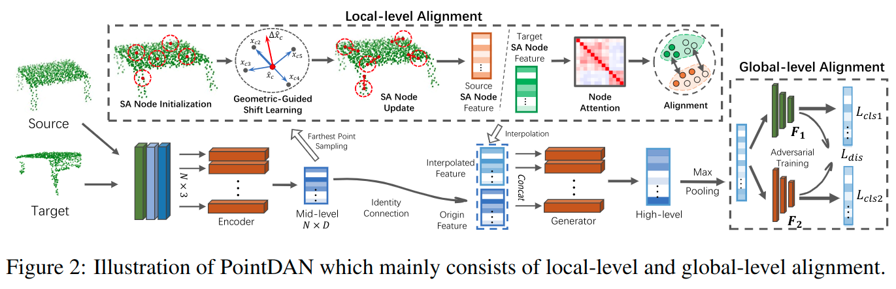

# PointDAN: A Multi-Scale 3D Domain Adaption Network for Point Cloud Representation

元の論文の公開ページ : [arxiv.org](https://arxiv.org/abs/1911.02744v1)  
提案モデルの実装 : [canqin001/PointDAN](https://github.com/canqin001/PointDAN)  
Github Issues :   

Note: 記事の見方や注意点については、[こちら](/)をご覧ください。

## どんなもの?
##### 点群データ用の新しい3Dドメイン適応(DA)ネットワーク、PointDANを提案した。
- 殆どの一般的なドメイン適応(DA)手法はグローバル特徴の調節が難しく、ローカル特徴を無視するため、3Dドメインの調節には向いていない。本提案はその問題を解決する。

## 先行研究と比べてどこがすごいの? or 関連事項
##### 省略

## 技術や手法のキモはどこ? or 提案手法の詳細
### 定義と表記
##### 3D点の教師なしドメイン適応(UDA)を行うにあたって、問題の定義と表記記号について説明する。
- ラベル付けされたソースドメイン$\mathcal{S}=\\{(\mathbf{x}_ {i}^{s}, y_ {i}^{s})\\}_ {i=1}^{n_ { s}}$とラベル付けされていない点を持つターゲットドメイン$\mathcal{T}=\\{\mathbf{x}_ {j}^{t}\\}_ {j=1}^{n_ {t}}$があるとする。
  - このとき、$n_ \mathcal{S}$個のアノテーションされたペアを持つ$y_ {i}^{s} \in \mathcal{Y}=\{1, \ldots, Y\}$[つまり教師データ]があるとする。
- 入力の点群データは3次元座標$(x,y,z)$で表現される。ここで、$\mathbf{x}_ {i}^{s}, \mathbf{x}_ {j}^{t} \in \mathcal{X} \subset \mathbb{R}^{T \times 3}$とする。
  - $T$は3Dオブジェクトのサンプリング数を表し、 $\mathcal{Y}_ s=\mathcal{Y}_ t$とする。
    - [ターゲットとソースのラベルの数は同じ]
- それぞれの分布$P_ {s}(\mathbf{x}_ {i}^{s}, y_ {i}^{s})$と$P_ {t}(\mathbf{x}_ {i}^{t}, y_ {i}^{t})$から2つのドメインはサンプリングされると仮定する。
  - 一方で、distribution shift[(分布変化?)]$P_ {s} \neq P_ {t}$により独立同分布の仮定には当てはまらないものとする。
- このUDAの重要な点は、写像関数$\Phi: \mathcal{X} \rightarrow \mathbb{R}^{d}$を学習することにある。この関数は、生の[点群]入力をcross-domain samplesに拡張可能なshared feature空間$\mathcal{H}$へ射影する。

### 手法の概要
- 本提案のパイプラインは図2の通り。

##### 1. エンコーダを用いて点群の特徴量を抽出し、その特徴量を用いてSelf-Adaptive(SA) Node特徴を得る。
- エンコーダの特徴量はSA Node特徴の生成以外にも、SA Node特徴量と連結するために使われる。
- 具体的な内容は工夫のLocal Feature Alignmentを参照。

##### 2. SA Node特徴とエンコーダの特徴量を連結し、それを生成ネットワーク$G$に入力してhigh-level global featureを生成する。
- このHigh-level global feature $\mathbb{f}_ i \in \mathbb{R}^d$はPointNetのmax-poolingから得られる特徴を使用する。
- $i$番目のサンプルのHigh-level global featureを生成する式は以下のようになる。
- $$
  \mathbf{f}_ {i}=\max -\operatorname{pooling}\left(G\left(\hat{\mathbf{h}}_ {i} | \Theta_{G}\right)\right)
  $$
  - $\hat{\mathbf{h}}_ {i}$は入力特徴を、[$\Theta_ {G}$は$G$のパラメータ]を示す。

##### 3. high-level global featureを分類器に入力する。
- 具体的な内容は工夫のGlobal Feature Alignmentを参照。

### 工夫
#### Local Feature Alignment
##### [未記入]
- まだ

#### Global Feature Alignment
##### [未記入]
- まだ

## どうやって有効だと検証した?
##### 省略

## 議論はある?
##### 省略

## 次に読むべき論文は?
##### なし

## 論文関連リンク
##### なし
1. [なし]()[1]

## 会議, 論文誌, etc.
##### NeurIPS 2019

## 著者
##### Can Qin, Haoxuan You, Lichen Wang, C.-C. Jay Kuo, Yun Fu

## 投稿日付(yyyy/MM/dd)
##### 2019/11/07

## コメント
##### あり
- どんなものを書き換える。

## key-words
##### CV, Paper, Point_Cloud, Domain_Adaptation, 省略, Implemented, Unsupervised_Learning

## status
##### 省略

## read
##### A, I

## Citation
### 未記入