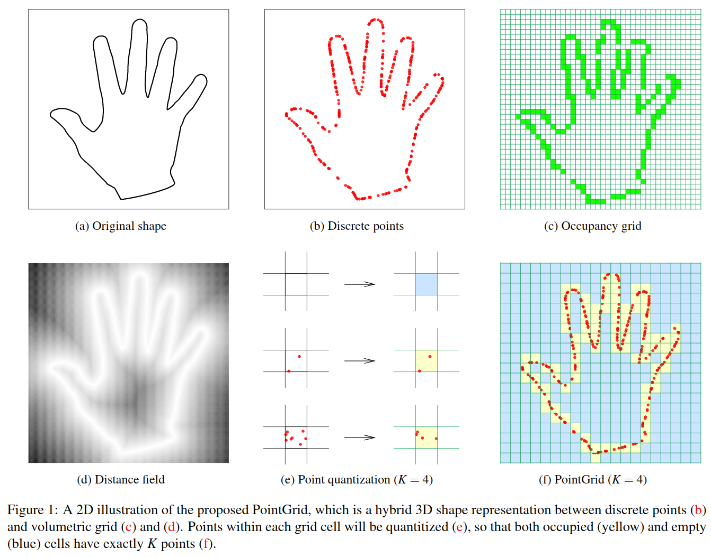

# PointGrid: A Deep Network for 3D Shape Understanding

元の論文の公開ページ : [CVF](http://openaccess.thecvf.com/content_cvpr_2018/papers/Le_PointGrid_A_Deep_CVPR_2018_paper.pdf)  
Github Issues : 

## どんなもの?

## 先行研究と比べてどこがすごいの?

## 技術や手法のキモはどこ? or 提案手法の詳細
本提案手法では占有グリッド(ボクセル表現)を使う手法とは異なり、各セル内に$K$個の点を配置することで出来上がるオブジェクトの点群を処理する。具体的には、図1に含まれる

## どうやって有効だと検証した?

## 議論はある?

## 次に読むべき論文は?
- なし

## 論文関連リンク
1. [trucleduc, trucleduc/PointGrid, (アクセス:2019/05/27)](https://github.com/trucleduc/PointGrid)

## 会議
CVPR 2018

## 著者
Truc Le and Ye Duan.

## 投稿日付(yyyy/MM/dd)
2018/06/25

## コメント
なし

## key-words
Point_Cloud

## status
未完

## read
A, M

## BibTex
@article{PointGrid,
	author = {Truc Le and Ye Duan},
	titile = {{PointGrid: A Deep Network for 3D Shape Understanding}},
	journal = {IEEE Conference on Computer Vision and Pattern Recognition (CVPR)},
	month = {June},
	year = {2018},
}