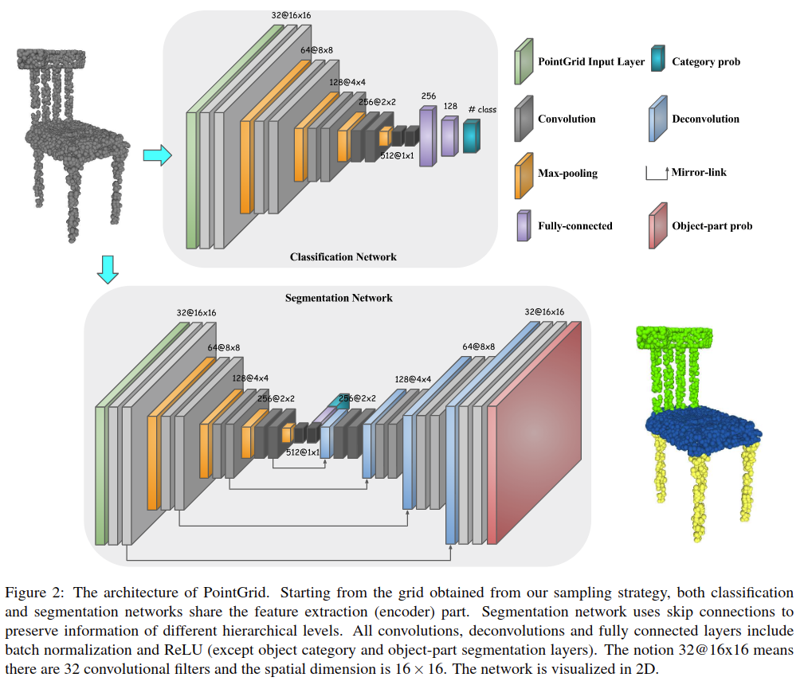
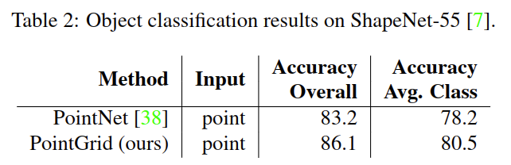
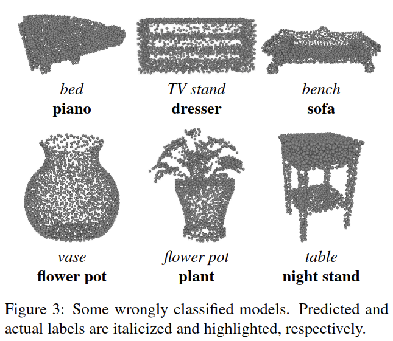

# PointGrid: A Deep Network for 3D Shape Understanding

元の論文の公開ページ : [CVF](http://openaccess.thecvf.com/content_cvpr_2018/papers/Le_PointGrid_A_Deep_CVPR_2018_paper.pdf)  
Github Issues : [#93](https://github.com/Obarads/obarads.github.io/issues/93)

## どんなもの?
点の座標値を特徴量とするボクセルを畳み込むネットワークを提案した。

## 先行研究と比べてどこがすごいの?
各セルに体積情報の代わりに点群の座標値を組み込むことで、低解像度なボクセルでも詳細な幾何学情報を扱える様になった。

## 技術や手法のキモはどこ? or 提案手法の詳細
本提案手法では占有グリッドを使う手法とは異なり、セル内の$K$個の点(点には座標値が含まれる)を特徴量として畳み込む。オブジェクトの形状(図1の(a))をかたどった点群(図1の(b))が入力されるとき、以下の処理が行われる。

2. 点群を$[-1,1]^3$で正規化する。
3. 内部に点が含まれているセルのみ点を$K$個にする。セル内の点が$K$個以上である場合は$K$個の点になるようにランダムに点を減らし、$K$個以下である場合は$K$個になるようにセル内の点を複製して増やす(図1の(e))。点が0個であるセルは空のままにする(図1の(e))。論文中ではゼロパディングを模倣したと述べている(図1の(f))。
4. 結果として$3K$の特徴を持つセルと0のセルで構成された表現になる(点群の座標値を持つボクセル表現)。セル内の点の特徴量をスタックするとあるが、どのようにして$3K$サイズにまとめるのか不明である(見逃した?)。
5. 各タスク向けに構築されたアーキテクチャに4の表現を入力する(図2)。

## どうやって有効だと検証した?
ModelNet40とShapeNet-Core55を使って分類問題を解いた。結果は表1と表2、誤分類した点群モデルは図3に示すとおり。点群では提案手法の精度がPointNet++とKd-Netより0.1%上回っている。表3では$K$とセルの数の変更による提案手法の精度の変化を示している。

また、図4では提案手法の勾配からアーキテクチャがどの部分に注目しているか視覚化した。色は勾配の大きさを示し、赤は勾配が大きいため点の少しの変化で結果がかなり変わる。青はその逆である。

### その他
セマンティックセグメンテーションは省略。

## 議論はある?
点の選択方法に例えば[2]を使えば良くなるのでは?

## 次に読むべき論文は?
- なし

## 論文関連リンク
1. [trucleduc, trucleduc/PointGrid, (アクセス:2019/05/27)](https://github.com/trucleduc/PointGrid)
2. [Y. Eldar, M. Lindenbaum, M. Porat, and Y. Y. Zeevi. The farthest point strategy for progressive image sampling. IEEE Transactions onImage Processing, 6(9):1305–1315, 9 1997.](https://ieeexplore.ieee.org/document/623193)
3. [Naoya Chiba. 三次元点群を取り扱うニューラルネットワークのサーベイ. 2018. (アクセス:2019/10/22)](https://www.slideshare.net/naoyachiba18/ss-120302579)

## 会議
CVPR 2018

## 著者
Truc Le and Ye Duan.

## 投稿日付(yyyy/MM/dd)
2018/06/25

## コメント
なし

## key-words
Point_Cloud, Classification, Semantic_Segmentation

## status
更新済

## read
A, M, E, C

## BibTex
@article{PointGrid,
	author = {Truc Le and Ye Duan},
	titile = {{PointGrid: A Deep Network for 3D Shape Understanding}},
	journal = {IEEE Conference on Computer Vision and Pattern Recognition (CVPR)},
	month = {June},
	year = {2018},
}