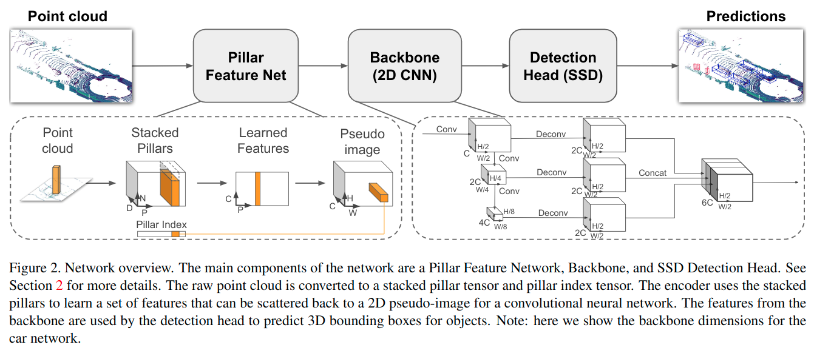

# PointPillars: Fast Encoders for Object Detection from Point Clouds

元の論文の公開ページ : [arxiv.org](https://arxiv.org/abs/1812.05784)  
提案モデルの実装 : [nutonomy/second.pytorch](https://github.com/nutonomy/second.pytorch)  
Github Issues :   

Note: 記事の見方や注意点については、[こちら](/)をご覧ください。

## どんなもの?
##### 高い精度と62Hzの検出速度を持つ3D検出モデル、PointPillarsを提案した。
- 手法はSECONDやVoxelNetの派生となっている。これら既存の手法と比較して2~4倍の速さで推論が可能である。
- SECONDなどとの最大の違いは、3D畳み込みを2D畳込みへ変更したこと。
- 貢献は以下の通り。
  - End-to-Endの学習が可能な点群からの3D検出器を提案した。
  - 他の手法よりも2~4倍の推論速度(62Hz)を持つ。
  - KITTIデータセットのBEVと3DベンチマークでSOTA。
  - 切除実験にて検出性能の要因を探る。

## 先行研究と比べてどこがすごいの? or 関連事項
##### 省略

## 技術や手法のキモはどこ? or 提案手法の詳細
### 手法の概要
- モデルの全体像は図2の通り。

##### 1. LiDARからの点群を疑似画像へ変換する。
- 最初にxy平面中のグリッドへ点群を離散させ、Pillar(柱)の集合を作成する。
- そのため、z方向へのbinは必要なくなる。それに関するハイパーパラメータもいらなくなる。
- ここで、サンプルあたりの空でない柱の数$(P)$と柱あたりの点の数$(N)$の両方に制限をかけて、密なテンソルサイズ$(D,P,N)$を得る。
  - この制限より多すぎる場合はランダムサンプリング、少なすぎる場合はゼロパディングが適応される。
- 各点に対して簡易なPointNetを適応し、$(C,P,N)$のサイズのテンソルを生成する。その後、max演算子を適応して$(C,P)$、これを元の柱の位置に戻して$(C,H,W)$の疑似画像を生成する。
- この疑似画像生成により、3D畳み込みではなく2D畳み込みを適応するだけでよくなる。

##### 2. 疑似画像をバックボーンへ入力して、特徴マップを得る。
- [1]と同様のバックボーンを使用して処理する。

##### 3. 検出器を適応して3Dオブジェクトを検出する。
- SSDを使って3Dオブジェクトの検出を行う。
- IoUもSSDと同様、2Dのものが与えられる。
- instead given a 2D match, the height and elevation become additional regression targets.
  - 2Dマッチが与えられる代わりに、高さは追加の回帰として扱われる。

## どうやって有効だと検証した?
##### 省略

## 議論はある?
##### 省略

## 次に読むべき論文は?
##### なし

## 論文関連リンク
##### なし
1. [Y. Zhou and O. Tuzel. Voxelnet: End-to-end learning for point cloud based 3d object detection. InCVPR, 2018.](https://arxiv.org/abs/1711.06396)[31]

## 会議, 論文誌, etc.
##### CVPR 2019

## 著者
##### Alex H. Lang, Sourabh Vora, Holger Caesar, Lubing Zhou, Jiong Yang, Oscar Beijbom

## 投稿日付(yyyy/MM/dd)
##### 2019/05/07

## コメント
##### なし

## key-words
##### CV, Paper, Point_Cloud, Detection, Implemented, 省略

## status
##### 省略

## read
##### なし

## Citation
##### 未記入
