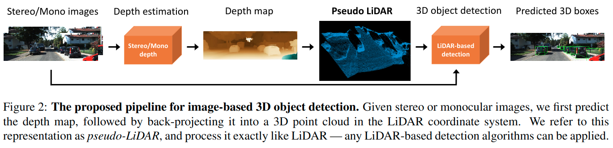

# Pseudo-LiDAR from Visual Depth Estimation: Bridging the Gap in 3D Object Detection for Autonomous Driving

元の論文の公開ページ : [arxiv.org](https://arxiv.org/abs/1812.07179)  
提案モデルの実装 : [mileyan/pseudo_lidar](https://github.com/mileyan/pseudo_lidar)  
Github Issues :   

Note: 記事の見方や注意点については、[こちら](/)をご覧ください。

## どんなもの?
##### 画像から深度推定を行い、そこから疑似点群(Pseudo LiDAR)を用いて3D検出モデルを適応する手法を提案する。
- 本提案では、予測した深度を画像としてではなく点群として扱うことで3D的な畳み込みを適応できるようにする。
  - 深度画像を畳み込みする場合は、距離を考慮しない畳み込みを行ってしまうという問題がある。
    - [この指摘は、Frustm PointNetでもされている。]
  - また、遠くなった物体はピクセル的に小さく表示されるため、非常に小さくなる。
- 著者らは、ステレオとLiDARの性能ギャップの主な原因が、奥行き精度の不一致ではなく、3D表現によるものではないかと述べている。

## 先行研究と比べてどこがすごいの? or 関連事項
##### 省略

## 技術や手法のキモはどこ? or 提案手法の詳細
##### 手法の概要
- 手法の概要は図2の通り。

## どうやって有効だと検証した?
##### 省略

## 議論はある?
##### 省略

## 次に読むべき論文は?
##### なし

## 論文関連リンク
##### なし
1. [なし]()[1]

## 会議, 論文誌, etc.
##### CVPR 2019

## 著者
##### Yan Wang, Wei-Lun Chao, Divyansh Garg, Bharath Hariharan, Mark Campbell, Kilian Q. Weinberger

## 投稿日付(yyyy/MM/dd)
##### 2018/12/18

## コメント
##### あり
- おもしろい論文。

## key-words
##### CV, Paper, RGB_Image, Implemented, Point_Cloud, Detection, 導入

## status
##### 導入

## read
##### A, I

## Citation
##### 未記入
