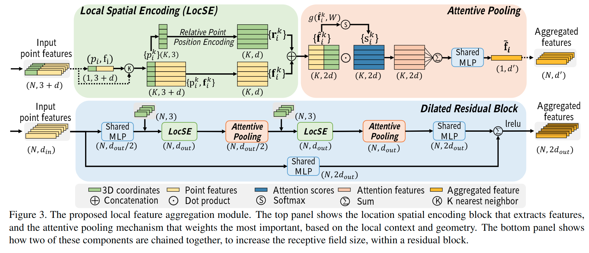

# RandLA-Net: Efficient Semantic Segmentation of Large-Scale Point Clouds

元の論文の公開ページ : [arxiv.org](https://arxiv.org/abs/1911.11236)  
提案モデルの実装 : [QingyongHu/RandLA-Net](https://github.com/QingyongHu/RandLA-Net)  
Github Issues :   

Note: 記事の見方や注意点については、[こちら](/)をご覧ください。

## どんなもの?
##### 大規模点群に対して点ごとのセマンティックラベルを推定する効率的かつ軽量なニューラルネットワーク、RandLA-Netを提案した。
- 複雑な点選択アプローチの代わりにランダムサンプリングを使用することがこのアイデアの重要な点である。
- ランダムサンプリングは計算とメモリ効率に優れるが、偶然に重要な特徴量を破棄してしまう恐れがある。
- これを克服するために、**各3D点の受容体を進歩的に増加させる新たなローカル特徴集約機構を導入して**、幾何学的情報を効果的に保存する。

##### 計算速度もかなり早く、Semantic3DとSemanticKITTIでSOTAアプローチに勝る精度を持つ。
- 既存の手法よりも最大200倍早く、100万点に対する処理も一回の入力で処理できる。

## 先行研究と比べてどこがすごいの? or 関連事項
##### 既存の手法よりも、一度に多くの点を処理できる。
- 既存の手法は4Kの点もしくは$1\times 1m$区画内の点を処理するようになっており、シーン内の点を一度に処理できない。
  - シーン内の点群には、100万単位の点と$200\times 200m$のサイズで構成されているものもあり、既存の方法では一度に処理できるものではない。
- この原因は、以下のとおりである。
  - 点のサンプリング手法に多くの計算コストとメモリが必要となる。
  - 局所特徴学習器が計算的に高価なカーネル化もしくはグラフ構築に依存しているため、大量の点を処理できない。
  - 数百のオブジェクトで構成されるシーン点群の場合、既存の局所特徴学習器は複雑な構造を取得できないか、受容野のサイズが制限された状態での取得を強いられる。
- 本提案では、効率的にシーン点群を一度に処理する手法を提案する。
- [3.2節に、この内容の詳細がある。]

##### 大量の点を処理する既存の手法(既存のlarge-scale点群処理手法)よりも処理速度が早い。
- lage-scale点群を処理する手法はあるが、これらはボクセル化やSPG化などの前処理で時間がかかる。
- 本提案では、リアルタイムでも動くほどの処理速度を持つ方法を提案する。

## 技術や手法のキモはどこ? or 提案手法の詳細
### 手法の概要
- 提案するモジュールは図3の通り。これを利用したネットワークであるRandLA-Netは図7の通り。
- 本提案では、余分なメモリを必要とせず、計算コストが圧倒的に低いランダムサンプリング($\mathcal{O}(1)$)を使用する。
  - $10^6$個の点があったとしても、4msしかかからない。
- しかしながら、ランダムサンプリングは有用な点特徴を捨ててしまう恐れがある。
- その問題を克服するために、新たなLocal Feature Aggregationモジュールを提案する。
  - 具体的には、受容野を拡大することで、ランダムサンプリングによる点の欠如を補う。
  - [さらに具体的な話は工夫のDilated Residual Blockを参照。]
- 工夫の節で記すDilated Residual Blockは、後述するLocal Spatial EncodingとAttentive Poolingを合わせたブロックである。
- [RandLA-Net自体には、Dilated Residual Blockが使われている? つまり基本的に、図7のは、LFA=Dilated Residual Block?]
  - [LFAについて読み落としているかもしれない。]

#### Local Spatial EncodingとAttentive Poolingのつながり
##### 1. 点群座標から(相対)座標特徴を抜き出し、元の特徴と連結する(Local Spatial Encoding(LocSE))。
- 詳細は工夫のLocal Spatial Encodingに記す。

##### 2. 1で連結された特徴を集約する(Attentive Pooling)。
- 詳細は工夫のAttentive Poolingに記す。

### 工夫
#### Local Spatial Encoding (LocSE)
##### 与えられた点群から、各点とそのk近傍点の座標情報を符号化し、元の座標特徴以外の特徴と連結する。
- $i$番目の点$p_ i$の$K$個の近傍点$\\{p_ {i}^{1} \cdots p_ {i}^{k} \cdots p_ {i}^{K}\\}$がある時、点の(相対的な)座標情報を得るために、これらの点情報をMLPに入力する(Relative Point Position Encoding)。
- 具体的には式(1)の通り。

$$
\mathbf{r}^k_i = MLP(p_i\oplus p_i^k\oplus(p_i-p_i^k)\oplus||p_i-p_i^k||)\tag{1}
$$

- ここで、
  - $p_ i$と$p_ i^k$は点のxyz座標。
  - $\oplus$はconcatenation演算子
  - $||\cdot||$は中心点$p_ i$と近傍点$p_ i^k$間のユークリッド距離を計算する。
- この$\mathbf{r}_ i^k$は冗長的な点座標情報から符号化されるが、これによりネットワークが局所特徴を学習るのを助け、優れた結果を得る傾向がある。
  - [冗長とあるが、これは4種類もの特徴を連結してMLPに入れているからそう書いてあると思う。]
- 最終的に、この位置情報は入力時の座標以外の特徴量(色など)と連結され、新しい特徴$\hat{\mathbf{F} }_ i=\\{\hat{\mathbf{f} }_ i^1 \cdots \hat{\mathbf{f} }_ i^k \cdots \hat{\mathbf{f} }_ i^K  \\}$が生成される。

#### Attentive Pooling
##### attention機構を取り入れたPooling手法を導入する。
- 既存の手法ではmax/mean poolingが使われているが、これらは情報の大部分を失う。
- 本提案ではattention木粉を取り入れ、重要な局所特徴を自動的に学習するようにする。
  - [1]からアイデアを得ている。
  - [局所特徴そのものを学習するのではなく、どの局所特徴が重要かを学習するっぽい。]
- このAttention poolingは、$\hat{\mathbf{F} }_ i=\\{\hat{\mathbf{f} }_ i^1 \cdots \hat{\mathbf{f} }_ i^k \cdots \hat{\mathbf{f} }_ i^K  \\}$が与えられた時、shared function $g()$で各特徴のアテンションスコアを学習するようにする。
  - 基本的に、この関数$g()$はshared MLPとsoftmax関数で構成される。
- 定義的には式(2)のようになる。

$$
\mathbf{s}^k_i = g(\hat{\mathbf{f} }_i^k, W)
$$

#### Dilated Residual Block
##### LocSEやAttentive Pooling等を複数つなげたブロックを導入する。
- large-scale点群は大幅なダウンサンプリングがなされるため、一部の点をドロップした場合でも入力点群の詳細な幾何学情報ができるだけ保存されるよう、各点の受容野を大幅に増やす必要がある。
- ResNetや[2]に基づき、複数のLocSEとAttentive Poolingとskip connectionをつなげたブロックをdilated residual blockとしてスタックする(図3)。
- 図4より、赤の3D点がK近傍点を得た後、LocSE/Attentive Poolingに入れる。これにより、[(次の処理で)]最大$K^2$近傍点の情報を受け取ることができる様になる。
  - [一つの点にK個の近傍点を集約する(この時点で各近傍点(これをAとする)には自身の情報しかない)。よって(K個)*(1個)の情報となる。->またK個の近傍点を集約する(この時点でAも前の処理でA自身のK個の近傍点情報を持っている)。よって、(K個)*(K個の情報)となる。]
- この方法により、受容野を広げていることができる。
- 理論的に、スタックするユニットが多ければ多いほど到達範囲が広くなるため、このブロックは強力となる。
- しかし、計算的な効率やover-fittedの問題があるため、LocSEとAttentive Poolingの適度な数を調べた。結果として、2つがつり合いが取れているということになった。

## どうやって有効だと検証した?
##### 省略

## 議論はある?
##### 省略

## 次に読むべき論文は?
##### なし

## 論文関連リンク
##### あり
1. [Bo Yang, Sen Wang, Andrew Markham, and Niki Trigoni. Robust attentional aggregation of deep feature sets for multi-view 3D reconstruction. IJCV, 2019.](https://arxiv.org/abs/1808.00758)[59]
2. [Francis Engelmann, Theodora Kontogianni, and Bastian Leibe. Dilated point convolutions: On the receptive field of point convolutions. arXiv preprint arXiv:1907.12046, 2019.](https://arxiv.org/abs/1907.12046)[13]

## 会議, 論文誌, etc.
##### なし

## 著者
##### Qingyong Hu, Bo Yang, Linhai Xie, Stefano Rosa, Yulan Guo, Zhihua Wang, Niki Trigoni, Andrew Markham

## 投稿日付(yyyy/MM/dd)
##### 2019/11/25

## コメント
##### あり
- つまり、受容野さえ広げてしまえば、ネットワークは点の多少欠落があったとしてそれを補える程の学習が可能であるということか?

## key-words
##### CV, Paper, Point_Cloud, Semantic_Segmentation, 省略, Implemented

## status
##### 省略

## read
##### A, I, M

## Citation
##### 未記入
