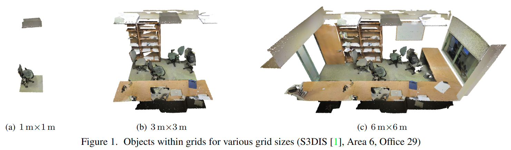

# Rethinking Task and Metrics of Instance Segmentation on 3D Point Clouds

元の論文の公開ページ : [arxiv.org](https://arxiv.org/abs/1909.12655)  
提案モデルの実装 : [2020/1/28:なし]()  
Github Issues :   

Note: 記事の見方や注意点については、[こちら](/)をご覧ください。

## どんなもの?
##### 既存の計測手法を用いた小領域(1m×1m)でのインスタンスセグメンテーションの評価は不適切であることを主張、これを実験的に示した。
- 小領域に同クラスのインスタンスが少しだけ含まれている場合があり、それがmAPなどの評価方法に大きく影響を与える。
- **また、以前の研究ではまだ調査されていない、既存の計測手法を使用した際の問題を明らかにする。**

##### 大領域の処理を可能にする小さな空間の複雑さを用いた新規インスタンスセグメンテーション手法を提案する。
- 新規インスタンスセグメンテーション手法では入力特徴空間から埋め込み空間へのマッピングを学習するための損失関数を用いる。
    - 埋め込み空間では、同じインスタンス同士が集まるため、埋め込み空間上でクラスタリングをかけることでインスタンスの判別を行う。
    - この方法はpoint pairs[?]を処理する必要がないため、空間の複雑さは$\mathcal{O}(N)$であり、点の数に対してスケーラブルである。
- 提案された手法が他のSOTA手法よりも優れていることを示す。

##### 既存の計測手法の欠点に基づいて、新しい計測手法を提案する。
- 小領域に対して既存の計測手法を使い、その計測手法の不適切さを示す。

## 先行研究と比べてどこがすごいの? or 関連事項
##### インスタンスセグメンテーションの評価方法の問題を指摘し、それに対応する。
- インスタンスセグメンテーションを行う際、入力点群は1m四方の小さな領域に分割されることが多い。しかし、このような小領域で評価を行うことは少々困難である。
- この様な小領域に対する評価方法がいくつかある。
  - 一つは、はじめに小領域を一つのシーン全体の予測へ合体させ、シーン全体を評価する方法である[2]。
    - しかし、結果は合体アルゴリズムの影響を大きく受けているため、純粋なインスタンスセグメンテーションの評価をすることは困難である。
  - もう一つは、小領域内のインスタンスセグメンテーションを評価する方法がある[3]。しかし、この方法は以下の理由により望ましくない。
    - [Another way is ~の段落の望ましくない理由について、よくわからない。多分、小さい範囲だとセマンティックセグメンテーションだけで良くて(図1の(a))、大きい範囲だと計算量やメモリ効率の関係でうまくいかないから評価が面倒くさいと言うことか?]
    - [2]で使われているmean average precision(mAP)を使った評価は低い信頼性スコアを持つfalse positivesの影響が小さいという特性がある。
      - それ故、この特性は重複する複数の候補を許可するオブジェクト検出や出力のランクが重要となる検索などのタスクに適する。
      - 一方で、この特性はインスタンスセグメンテーションには適さない。
- [これらの問題より、インスタンスセグメンテーションの評価は以下のようにするべきである。]
  - **[(インスタンスセグメンテーションモデルの)]出力は各点に対して重複しないオブジェクト[(インスタンス)]であるため、信頼性スコアに関係なく各点の出力を平等に評価しなければいけない。**[(mAPに対する問題点)]
  - **更に、インスタンスセグメンテーションを評価する際に、2つのオブジェクトが適切に適切に区別されているか、一つのオブジェクトが間違って分割されていないかどうか、注目しなければいけない。**[(mAP&小領域に対する問題点かな?)]
    - ただし、既存の評価基準を使用して評価する場合、これらの失敗を誤分類と区別できず、また、誤分類はmAPを下げる主因となっている。
- **本提案では、既存の評価基準で小領域のインスタンスセグメンテーションの評価が不適切であるという主張を実験的に示し、これらの評価基準の問題を明らかにする。**

##### 大領域の処理を可能にする小さな空間の複雑さを用いた新規インスタンスセグメンテーション手法を提案した。
- どんなもの?にある内容と同じ。空間の複雑さに対処している。
- [あと、インスタンスセグメンテーションの評価方法の問題を指摘し、それに対応する。に対処している?]

##### 既存の計測手法の欠点に基づいて、新しい計測手法を提案する。
- どんなもの?にある内容と同じ。
- 以前の研究では見落とされていた部分である。
- この新しい計測手法により、正しくインスタンスセグメンテーションの評価が行える。

## 技術や手法のキモはどこ? or 提案手法の詳細
### 手法の概要
##### 

## どうやって有効だと検証した?
##### 省略

## 議論はある?
##### 省略

## 次に読むべき論文は?
##### なし

## 論文関連リンク
##### あり
1. [Kousuke Arase, Twitter, 2019.](https://twitter.com/KosukeArase/status/1190500465772916736)
2. [W. Wang, R. Yu, Q. Huang, and U. Neumann. Sgpn: Sim-ilarity group proposal network for 3d point cloud instance segmentation. In Proceedings of the IEEE Conference on ComputerVisionandPatternRecognition,pages2569–2578,2018.](https://arxiv.org/abs/1711.08588)[22]
3. [M. Sung, H. Su, R. Yu, and L. J. Guibas. Deep functional dictionaries: Learning consistent semantic structures on 3d models from functions. InAdvances in Neural Information Processing Systems, pages 483–493, 2018.](https://papers.nips.cc/paper/7330-deep-functional-dictionaries-learning-consistent-semantic-structures-on-3d-models-from-functions)[21]

## 会議, 論文誌, etc.
##### ICCV WS 2019

## 著者
##### Kosuke Arase, Yusuke Mukuta, Tatsuya Harada

## 投稿日付(yyyy/MM/dd)
##### 2019/09/27

## コメント
##### なし

## key-words
##### CV, Point_Cloud, Instance_Segmentation, Paper, 導入

## status
##### 導入

## read
##### A, I

## Citation
##### 未記入
