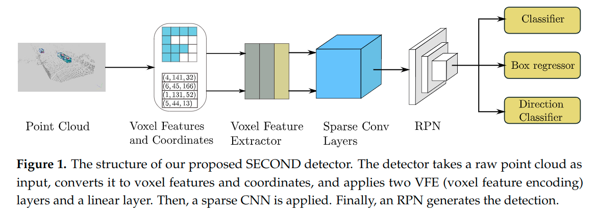

# SECOND: Sparsely Embedded Convolutional Detection

元の論文の公開ページ : [mdpi.com](https://www.mdpi.com/1424-8220/18/10/3337)  
提案モデルの実装 : [traveller59/second.pytorch](https://github.com/traveller59/second.pytorch)  
Github Issues :   

Note: 記事の見方や注意点については、[こちら](/)をご覧ください。

## どんなもの?
##### 既存の3D検出手法よりも処理速度が上がったモデル、SECONDを提案した。
- GPUは単体のGTX 1080Tiのみを使う。僅かに精度が下がった小さいモデルでは約25msの処理速度を誇り、リアルタイム処理が可能である。処理する対象はKITTIの点群データ。
- 貢献は以下の通り。
  - sparse convolutionを適応して、訓練と推論時の処理速度を向上させた。
  - sparse convolutionに対する改善案の提案により、より早い処理速度を得た。
  - 新規の角度損失回帰アプローチにより、他の手法用理も向きの回帰性能が良くなった。
  - LiDARオンリーの学習問題に対して新しいデータ拡張手法を導入し、学習の収束速度と処理速度の向上を実現した。

## 先行研究と比べてどこがすごいの? or 関連事項
##### 大本となったVoxelNetよりも高速な処理が可能となった。
- VoxelNetでは計算コストがかかるため、リアルタイムの処理が難しい。
- 本提案では、いくつかの改善を加えてより早い処理を可能にし、sotaに匹敵する精度を出す。

## 技術や手法のキモはどこ? or 提案手法の詳細
### 手法の概要
- 手法の全体像は図1の通り。
- 部分的にVoxelNet[1]と同じ方法を取っている。

##### 1. 点をボクセル表現へ落とし込む。(Point Cloud Grouping)
- [ここはVoxelNetの項であるGroupingに従った手順だそうので具体的な内容は省略。]

##### 2. ボクセル単位で特徴量を抽出する。(Voxelwise Feature Extractor)
- [ここもVoxelNetの項であるStacked Voxel Feature EncodingにあるVFE層を利用するため具体的な内容は省略。]

##### 3. スパース畳み込みを使用する。(Sparse Convolutional Middle Extractor)
- LiDARなどで得られる点群は疎な表現であることがほとんどであり、この疎な特性を利用した畳み込みを使う必要がある。
- そのような畳込みとしてsubmanifold畳み込み[3]があり、これを利用することで通常の畳込みで起こり得る問題(active pointsの増大、計算する必要のない箇所を計算してしまう等)を回避し、処理時間の短縮が実現する。
- この部分に対して提案がある。詳細は工夫のSparse Convolutional Middle Extractorへ。

##### 4. 検出箇所を提案する。
- 本提案では、SSD[5]のようなアーキテクチャを用いてRPN[4]を構築する。

### 工夫
#### Sparse Convolutional Middle Extractor
##### [未読]

## どうやって有効だと検証した?
##### 省略

## 議論はある?
##### 省略

## 次に読むべき論文は?
##### なし

## 論文関連リンク
##### あり
1. [Zhou,Y.;Tuzel,O. VoxelNet: End-to-End Learning for Point Cloud Based 3D Object Detection. arXiv 2017, arXiv:1711.06396.](https://arxiv.org/abs/1711.06396)[14]
2. [SparseConvNet Project. Available online: https://github.com/facebookresearch/SparseConvNet (accessed on 28 April 2018).](https://github.com/facebookresearch/SparseConvNet)[31]
3. [Graham,B.;vanderMaaten,L. SubmanifoldSparseConvolutionalNetworks. arXiv 2017,arXiv:1706.01307.](https://arxiv.org/abs/1706.01307)[27]
4. [Girshick, R. Fast R-CNN. In Proceedings of the IEEE International Conference on Computer Vision, Washington, DC, USA, 7–13 December 2015; pp. 1440–1448.](https://arxiv.org/abs/1504.08083)[1]
5. [Liu, W.; Anguelov, D.; Erhan, D.; Szegedy, C.; Reed, S.; Fu, C.Y.; Berg, A.C. Ssd: Single shot multibox detector. In Proceedings of the European Conference on Computer Vision, Amsterdam, The Netherlands, 8–16 October 2016; Springer: Amsterdam, The Netherlands, 2016; pp. 21–37.](https://arxiv.org/abs/1512.02325)[32]

## 会議, 論文誌, etc.
##### Remote Sensors, Control, and Telemetry

## 著者
##### Yan Yan, Yuxing Mao, Bo Li

## 投稿日付(yyyy/MM/dd)
##### 2018/??/??

## コメント
##### なし

## key-words
##### Paper, CV, Point_Cloud, Detection, 導入

## status
##### 導入

## read
##### A, I, R

## Citation
##### 未記入
