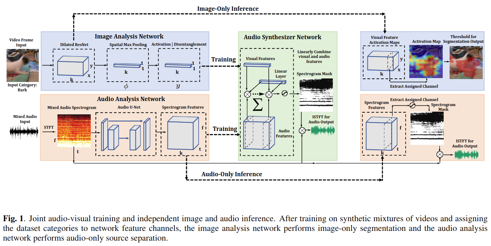

# Self-Supervised Audio-Visual Co-Segmentation

元の論文の公開ページ : https://arxiv.org/abs/1904.09013

## どんなもの?
自然なビデオからself-supervisionを介して学習する、視覚的なオブジェクト分割と音源分離のためのニューラルネットワークを開発した。このモデル自体は[1]の拡張である。

## 先行研究と比べてどこがすごいの?
セマンティックセグメンテーションと音源分離は2つとも重要なタスクである。これらのタスクの従来のアプローチはラベル付きデータセットに頼っていたが、最近ではそのようなラベルなしで視覚と音の自然な対応を利用した手法を取っている。あるアプローチは音源のネットワークを監督するために視覚特徴を利用する[2]というような、あるモダリティからの信号や特徴を使用して他のモダリティの学習を行うという手法を取っている。他のアプローチでは音を作る視覚的対照物の位置を探すために、音と視覚を使って交互に監督する[3]というものなどがある。  
最近では音源を区別するために音源を分離するために視覚的対応を使用している[1]。しかし、[1]のモデルはトレーニング後、音声動機のあるビデオのみにしか適応できない。本研究ではその問題を解決したモデル、つまり映像もしくは音のみでも分離分割タスクを行えるモデルを開発する。

## 技術や手法のキモはどこ? or 提案手法の詳細
提案するモデルのフレームワークは[1]のとおりである。

## どうやって有効だと検証した?

## 議論はある?

## 次に読むべき論文は?
- なし

## 論文関連リンク
1. [Hang Zhao, Chuang Gan, Andrew Rouditchenko, Carl Von-drick, Josh McDermott, and Antonio Torralba, “The sound of pixels,” in The European Conference on Computer Vision (ECCV), September 2018.](http://openaccess.thecvf.com/content_ECCV_2018/html/Hang_Zhao_The_Sound_of_ECCV_2018_paper.html)
2. [Yusuf Aytar, Carl Vondrick, and Antonio Torralba, “Sound-net: Learning sound representations from unlabeled video,” in Advances in Neural Information Processing Systems, 2016, pp. 892–900.](https://papers.nips.cc/paper/6146-soundnet-learning-sound-representations-from-unlabeled-video)
3. [Relja Arandjelovic and Andrew Zisserman, “Look, listen and learn,” in 2017 IEEE International Conference on Computer Vision (ICCV). IEEE, 2017, pp. 609–617.](https://arxiv.org/abs/1705.08168)

## 会議
ICASSP 2019

## 著者
Andrew Rouditchenko, Hang Zhao, Chuang Gan, Josh McDermott, Antonio Torralba.

## 投稿日付(yyyy/MM/dd)
2019/04/18

## コメント
なし

## key-words
Self-Supervised_Learning, Video

## status
省略
