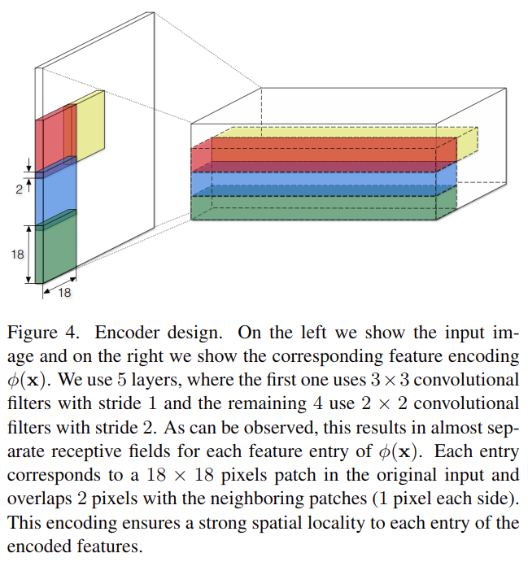
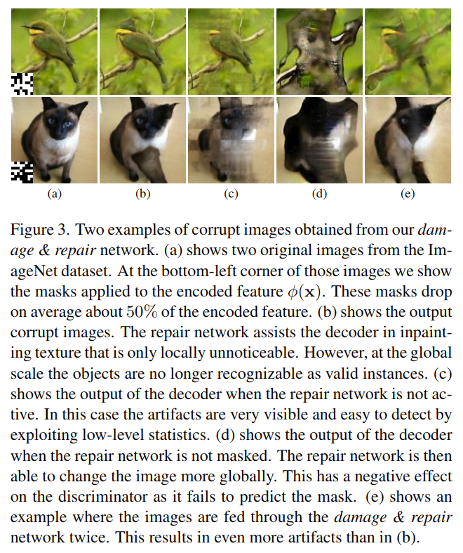

# Self-Supervised Feature Learning by Learning to Spot Artifacts

元の論文の公開ページ : https://arxiv.org/abs/1806.05024

## どんなもの?
意図的に画像の一部分を破損させ、破損させた部分を修復し、その後に識別器に本物か偽物か分類&どの部分が破損していたか識別させるself-supervised学習手法を提案した。

## 先行研究と比べてどこがすごいの?
省略

## 技術や手法のキモはどこ? or 提案手法の詳細
提案手法のモデル図は図2の通り。このモデルは$x$を入力とするエンコーダー$E$とデコーダー$\{ D_1, D_2, D_3, D_4, D_5 \}$で構成された2つのオートエンコーダーと、$E$の特徴出力に適応される空間マスク$\Omega$、本物の画像$\bf{x}$と偽物の画像${\hat{\bf x} }$を見分ける識別器$C$、リペアネットワーク$\{R_1, R_2, R_3, R_4, R_5\}$によって成り立っている。  
このリペアネットワークと識別器は本物もしくは偽物画像の分類損失による敵対的手法で訓練される。

### Learning to Spot Artifacts
この研究では、偽物の画像の破損レベルを制御する方法を活用する。よって、本物の画像と破損した画像を識別できるように分類器を訓練する(このタスクを解くことで分類器がオブジェクト分類などの他タスクで有用になるような特徴を学習することを願いながら)。また、自明な特徴(trivial feature)についての学習の回避方法についても述べる。

#### The Damage & Repair Network
著者らのアプローチは、あまり非現実的ではないが破損している画像を作成することを目標としており、そうしなければ、低レベルな統計値(多分、trivial solution)を検知するだけで本物かそうでないかを見分けることができるようになる。また、分類器の堅牢性を高めるために可変的な画像作成も行えるようにする。  
(ここ直せ)この後者の問題に対処するため、既存のデータセットの本物の画像をランダムに破損させ、破損部分を修復する。それには以下の手順を踏む。

1. 入力画像を$E$によって$\phi({\bf x})\in{\bf R}^{M\times N \times L}$($M,N,L$はそれぞれ縦,横,チャンネル)に符号化する。
2. 各空間座標(ピクセルの位置とか)において、所与の確率で$L$を全て破棄する。これはバイナリマスク行列$\Omega\in\{0,1\}^{M\times N}$によってどこを破棄するか決まる。$Omega$は訓練中オンラインで生成され、毎エポック異なるマスクが使われる。
3. 破損した画像をそのままデコーダーに入力すると図3(c)の様に非現実的になるため、リペアネットワークを適応する。リペアネットワークは破棄されたエントリ(要素)のみを修正するようになっている。$D_2 ~ D_ 4$までは最近傍(補完?)を使ってマスクをアップサンプリングさせて各層の出力に適応させる際の次元を一致させる。

エンコーダー$E$の中身は5層に分かれている。結論から言うとエントリを一つ破棄することは画像内の$18\times 18$のパッチを破棄することと同じである。エンコーダーの中身は図4の通り。

図3に生成される画像を示す。
- (a)は入力画像と左下にマスクを示している。
- (b)は著者らのアーキテクチャによって作られた破損画像。
- (c)はリペアネットワークを機能させずに作成した破損画像。
- (d)はマスクの制限無しでリペアネットワークを適応した破損画像。
- (e)は2回リペアネットワークを適応した結果、容易に検知できる低レベルなアーチファクトが含まれるようになったもの。

#### Replication of Real Images
破損した画像に含まれる自明な特徴(自明な解とも)を元に識別器が分類しないように、実画像を複製するための、先程説明したオートエンコーダーと同じ構造のオートエンコーダーをもう一個用意する。こちらのオートエンコーダーは高精度な画像を生成するため、事前訓練を行う。

#### Training the Discriminator
損失は本物か偽物かを判別するための2値確率$C^{\rm class}\in[0,1]$からなる$\mathcal{L}_ {\rm class}$と、どの部分が破損しているのかを見つける予測マスク$C^{\rm class}\in [0,1]^{M\times N}$からなる$\mathcal{L}_ {\rm mask}$である。

## どうやって有効だと検証した?
省略

## 議論はある?
省略

## 次に読むべき論文は?
- Boosting Self-Supervised Learning via Knowledge Transfer

## 論文関連リンク
1. [鈴⽊智之. Self-supervised Learningによる特徴表現学習. (アクセス日時 2019/04/22)](http://hirokatsukataoka.net/temp/cvpaper.challenge/SSL_0929_final.pdf)

## 会議
CVPR 2018

## 著者
Simon Jenni, Paolo Favaro.

## 投稿日付(yyyy/MM/dd)
2018/07/13

## コメント
なし

## key-words
2D_Image, Self-Supervision

## status
省略