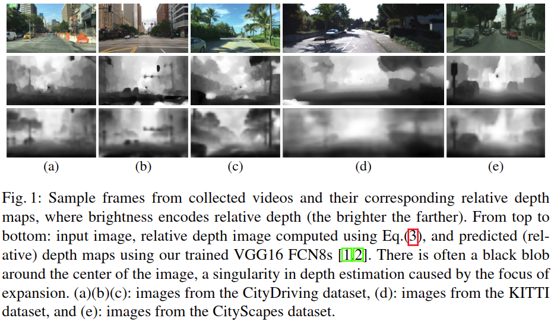

# Self-Supervised Relative Depth Learning for Urban Scene Understanding

元の論文の公開ページ : [CVF](http://openaccess.thecvf.com/content_ECCV_2018/html/Huaizu_Jiang_Self-Supervised_Relative_Depth_ECCV_2018_paper.html)  
Github Issues : [#100](https://github.com/Obarads/obarads.github.io/issues/100)

## どんなもの?
新しいproxy task(pretext task, 代用タスク)として単眼カメラから相対深度(深度$z\in[0,1]$)を想定する手法を提案した。また、代理タスクをドメイン適応に使う方法も示す。貢献は以下の通り。

- **新規自己教師あり学習** : ラベルなしビデオから相対的な奥行きを予測するための自己教師あり学習を提案する。提案手法はセグメンテーションタスクに関する他の代用タスクよりも優れた結果を出す。絶対的な深度推定(深度の絶対値推定)に関してはImageNetの教師あり事前訓練手法を超える結果を出すことができる。
- **ドメイン適応の利用** : 提案する適応モデルはKITTI推定ベンチマークでSOTA(教師あり事前訓練手法含む)と並ぶ結果を残した。

## 先行研究と比べてどこがすごいの?

## 技術や手法のキモはどこ? or 提案手法の詳細
提案する代用タスクは、相対深度画像$z(x,y)$を予測することでRGB画像$I(x,y)$の特徴表現$f(I)$を得られるようにすることである。この$f(I)$はfine-tuningによって他のタスクに流用することができる。

### Self-Supervised Relative Depth
使用するデータはYouTube video、KITTIデータセットのビデオ、CityScapes databaseのビデオ等の動いている車載カメラから街の風景を撮影したビデオを使う。学習で使うフレームの条件と保持しておくデータは以下の通り。

- [1]に従い、遅すぎも速すぎもしない程よい動きを有する2つの連続したフレームを用いる。
- 重複するフレームの排除のため、2つのフレームは2フレーム離れなければいけない。
- ~~2つのフレームのうち、はじめの方のフレームと計算された深度画像を保持する(なんではじめの方を保持する?ペアでどちらも保持するのでは?)。~~
- 合計として1.1MのRGB画像のペアとそれに対応する深度画像を集めた。解像度は$640\times 360$とする。
- 同様に、CityScapesとKITTIについてそれぞれ30Kと24Kの画像ペアと深度マップを収集する。

環境内の点$P$のinstantaneous coordinates(瞬間座標?)を$(X, Y, Z)^{T}$によって表し、環境内のカメラの並進速度を$(U, V, W)^{T}$によって表す。画像平面上の点$P$のmotion field component(理想的なオプティカルフロー)[2]を$(u,v)$とすると、これはそれぞれ水平および垂直のimage motionに対応する。motion field[2]は式(1)の様に並進と回転の成分の和として書くことができる。式(1)の$t$と$r$はそれぞれ並進と回転を示す。

$$
u=u_{t}+u_{r}, \quad v=v_{t}+v_{r} \tag{1}
$$

透視投影のジオメトリ[3]に従い、カメラが単純な並進運動を行う場合は式(2)が成り立つ。式(2)の$x$と$y$は画像平面上の点$P$の座標である(原点は画像の中心)。

$$
u_{t}=\frac{-U+x W}{Z}, \quad v_{t}=\frac{-V+y W}{Z} \tag{2}
$$

これらの式より深度$Zは式(3)の様に求めることができる。2乗しているのはロバストな深度推定値を得るためである。注意として、$u_ t$もしくは$v_ t$が小さい場合、推定値が不安定なる。

$$
Z=\sqrt{\frac{(-U+x W)^{2}+(-V+y W)^{2}}{u_{t}^{2}+v_{t}^{2} } } \tag{3}
$$

深度を推定するが、相対的な$(U,V,W)^T$を使うため、画像の深度マップも相対的な深度$z\in[0,1]$で表される(百分位数)。これらの百分位数は速度の未知のスケールに不変であるため(?)、速度の絶対スケールを復元する必要がない(要は全て相対的な値で求めるから絶対値が必要ないということ?)。これらで求めた深度マップは図1と2の様になる。

オプティカルフローの計算はSOTAな教師なし手法[4]を用いて行う。手順は以下の通り(以下の内容が正しいか要確認)。

1. はじめに2フレーム間のスパーズなピクセルマッチングの計算を行う。
2. そしてそれからスパースマッチングから密なピクセル単位のオプティカルフローフィールドを得るために補完する。ここで、教師ありエッジ検出器[5]の代わりに教師なし手法を使う[1].
3. オプティカルフローに基づき、並進運動による各ピクセルの画像の動き$(u_ t,v_ t)$とglobal camera motion$(U,V,W)^T$を復元するために[6]の手法を使用する(?)(具体的には以下の内容がよくわからなかった)。これらの手順は並進オプティカルフローフィールド$(u_ t, v_ t)$と、背景と異なるオブジェクトの動きに対応する画像中の人組の領域と、それらの領域の動作方向$(U,V,W)$を生成する(技術的詳細は[6]を見ること)。

### Predicting Relative Depth From a Single Image
現在省略

## どうやって有効だと検証した?

## 議論はある?

## 次に読むべき論文は?
- なし

## 論文関連リンク
1. [Li, Y., Paluri, M., Rehg, J.M., Doll ́ ar, P.: Unsupervised learning of edges. In: CVPR. (2016) 1619–1627](https://arxiv.org/abs/1511.04166)
2. [Motion field - Wikipedia.](https://en.wikipedia.org/wiki/Motion_field)
3. [Horn, B.K.P.: Robot Vision. MIT Press, Cambridge, MA, USA (1986)](https://www.amazon.co.jp/Vision-Electrical-Engineering-Computer-Science/dp/0262081598)
4. [Hu, Y., Li, Y., Song, R.: Robust interpolation of correspondences for large displacement optical flow. In: CVPR. (2017)](http://openaccess.thecvf.com/content_cvpr_2017/papers/Hu_Robust_Interpolation_of_CVPR_2017_paper.pdf)
5. [Dollar, P., Zitnick, C.L.: Fast edge detection using structured forests. IEEE Trans. Pattern Anal. Mach. Intell.37(8) (2015) 1558–1570](https://arxiv.org/pdf/1406.5549.pdf)
6. [Bideau, P., Learned-Miller, E.: It’s moving! A probabilistic model for causal motion seg-mentation in moving camera videos. In: ECCV. (2016)](https://arxiv.org/abs/1604.00136)

## 会議
ECCV 2018

## 著者
Huaizu Jiang, Erik Learned-Miller, Gustav Larsson, Michael Maire, Greg Shakhnarovich.

## 投稿日付(yyyy/MM/dd)
2017/12/13

## コメント
なし

## key-words
Self-Supervised_Learning, Depth_Estimation, Domain_Adaptation, Video, RGB_Image, Depth_Image, CV, Paper, 修正

## status
修正

## read
A, I, M

## Citation
