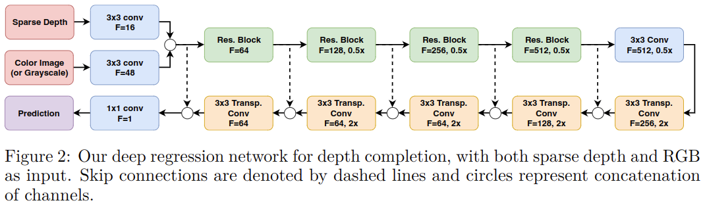
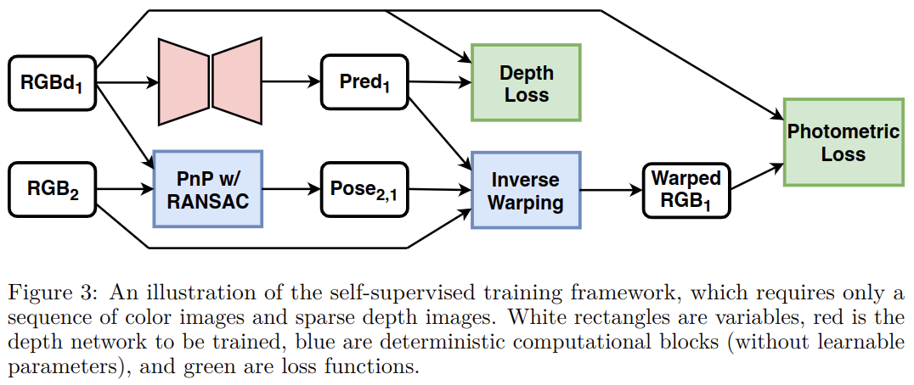

# Self-Supervised Sparse-to-Dense: Self-Supervised Depth Completion from LiDAR and Monocular Camera

元の論文の公開ページ : [arxiv](https://arxiv.org/abs/1807.00275)  
Github Issues : [#123](https://github.com/Obarads/obarads.github.io/issues/123)

## どんなもの?
スパースな深度表現から密な深度表現を予測するDepth completion(深度補完)にself-supervised learningを適応したモデルを提案した。著者らはこのタスクに含まれる以下の課題に対して取り組んだ。

1. LiDARの取得値は像空間内において非常にスパースで不規則な間隔を持つ。
2. 深度と色は異なるセンサーの形式からなるため、対応するカラー画像を用いて予測精度改善を促すことは自明ではない。
3. 密なground truth深度は一般的には使用不可であり、ピクセルレベルの注釈付けはlabor-intensiveかつnon-scalableである。

[※ 著者らの取り組んだ上記の課題の3番目はSelf-supervised Training Frameworkの節の内容を作る動機づけとなる]

貢献は以下の通り。

- **新規アーキテクチャ** : スパースな深度(可能であるなら、色画像も)から密な深度に直接マッピングを学習することができるネットワークアーキテクチャを提案する。このアーキテクチャはKITTI Depth Completion Benchmarkにおいて、SOTAを達成する。
- **depth completionのための自己教師あり学習** : 著者らはdepth completionネットワークを訓練するための自己教師ありフレームワークを提案する。このフレームワークは単眼カラーカメラとスパースな情報を取る3D LiDARの使用を想定している。本提案の自己教師あり学習に関しては、深度ラベルを使わずともsemi-dense annotationを用いたいくつかの既存の訓練手法よりも良好なパフォーマンスを持つ。

## 先行研究と比べてどこがすごいの?

## 技術や手法のキモはどこ? or 提案手法の詳細
ミソは新規の自己教師あり学習手法である。

### Network Architecture
著者らは深度補完の課題を深層回帰学習問題として扱う。提案したアーキテクチャは図2に示すとおりであり、これは[1]のアーキテクチャに基づいたエンコーダーデコーダーである。エンコーダー部分(図2上下二段の上部分)では徐々に空間的解像度をダウンサンプリングさせ、デコーダーでは逆にアップサンプリングを行う。最後の$1\times1$のたま見込みフィルタはネットワークと同じ解像度で単体画像を生成する。予測は閾値$\tau$で使う範囲を決める。経験的に$\tau$はLiDARの最小有効範囲である0.9mで設定する。

カラー画像がない場合はフィルタの数が半分になったりなど、ハイパーパラメータの数が変化する。

[※ 閾値は距離に対してどこまでの範囲を使うかというもの。]

### Self-supervised Training Framework
深度補完の既存研究では、訓練は密な注釈されたground truthに依存している。しかしながら、冒頭でも述べたとおり、密なground truthは存在せず、semi-denseデータも技術的に困難なものである。例として、[2]でも画像の下半分にsemi-denseな注釈(~30%ピクセル)のみを生成するにとどまっている上、簡単に拡張はできない。

そこで、著者らは深度補完のための自己教師あり学習手法を提案する。提案した学習手法では追加のセンサー、手動のラベリング、他のアルゴリズムやアーキテクチャを使用せず、特定のニューラルネットワークアーキテクチャの選択(内部構造)にも依存しない。

図3に学習手法の概要を示す。このフレームワークでは単眼カメラからの色もしくはグレースケール画像とLiDARからのスパースな深度画像を利用する。この２つはどちらも連続したデータ(シーケンス)であり、互いに同期がどれているものとする。

ここではdをスパースなデプス入力(測定値のないピクセルは0として扱う)、RGBはカラー画像、predは深度予測を示す。訓練時は現在のフレームRGBd1と隣接するフレーム(このフレームは現在のフレームから見た場合、未来のフレームである)RGB2が使われ、これらは(自己教師あり学習内での)教師信号を提供する役割を果たす。推論時は、現在のフレームRGBd1のみがpred1を生成するために使われる。

[※ ~~リスニングが可能であるなら、[5]を確認したほうが良いかもしれない~~]

#### Sparse Depth Supervision
ここではスパースな深度入力d1を教師信号として扱う。具体的には入力と出力の誤差を損失として、恒等写像を促す。この損失により、訓練における安定性や精度の向上を促進する。損失の定義は式(1)の通り。なお、入力する深度入力が密なものでも問題ない。

$$
\mathcal{L}_{\text { depth }}(\text { pred }, \text { d })=\| \unicode{x1D7D9}_{\{\mathrm{d}>0\}} \cdot(\text { pred }-\mathrm{d}) \|_{2}^{2} \tag{1}
$$

[※ エンコーダーが$f:A\to B$、デコーダーが$g:B \to A$できるようにする。結局のところただのオートエンコーダーみたいな感じ。]

#### Model-based Pose Estimation
測光損失に対する中間段階として、現在のフレームと隣接するフレーム間の相対姿勢を計測する必要がある。先行研究では姿勢推定のために既存の変換や他の学習済みニューラルネットワークの使用を行っている[2,3]。それとは対象的に、本フレームワークではRGBとdを利用した姿勢推定のためのモデルに基づくアプローチを適応する。具体的には、現在のフレームと隣接するフレームの相対関係を推定するためにPerspective-n-Point (PnP)問題[4]を解く。問題を解くに当たって、RGBd1とRGB2からそれぞれ抽出された一致特徴対応を使用する。

[※ ~~相対姿勢を計測する理由は既存研究論文にある?それともただ単に自己教師あり学習の学習手法としてこれを採用しただけ?~~]

#### Photometric Loss as Depth Supervision
相対変換$T_ {1\to2}$と現在の深度予測pred1が与えられた時、隣接するフレームのカラー画像RGB2を現在のフレームへワープする(?)。具体的には、カメラの内部行列$K$が与えられ、現在のフレームに含まれるあらゆるピクセル$p_ 1$は$p_{2}=K T_ {1 \rightarrow 2} \text { pred }_ {1}(p_ {1}) K^{-1} p_ {1}$として隣接するフレームに対応する射影を持つ。その故に、$p_ 2$に隣接する4つの近傍にbilinear interpolationを使ってカラー画像を作成する。言い換えれば、全ピクセル$p_ 1$に対して式(2)となる(?)。

$$
\text{warped}_{1}\left(p_{1}\right)=\text { bilinear }\left(\mathrm{RGB}_{2}\left(K T_{1 \rightarrow 2} \operatorname{pred}_{1}\left(p_{1}\right) K^{-1} p_{1}\right)\right) tag{2}
$$

環境が変化せず、また視点の変化による閉塞が制限されている場合、$\text{warped}$はRGB1に類似したものになる。深度予測がground truthに十分近いとき、測光誤差の最小化は深度予測誤差を減らす(射影した点$p_ 2$がtrue correspondenceとの誤差1px未満である時)。それ故、マルチスケール戦略を適応し、少なくてもある一つのスケール$s$で$\|p_ {2}^{(s)}-p_ {1}^{(s)}\|_ {1}<1$を保証するようにする(?)。  
さらに、奥行き損失と測光損失の矛盾を避けるため、測光損失は直接的な深度教師なしにピクセルについてのみ評価される。最終的な測光損失は式(3)の通り。

$$
\mathcal{L}_{\text { photometric }}\left(\text { warped }_{1}, \mathrm{RGB}_{2}\right)=\sum_{s \in S} \frac{1}{s} \| \unicode{x1D7D9}_{\{\mathrm{d}==0\}}^{(s)} \cdot\left(\text { warped }_{1}^{(s)}-\mathrm{RGB}_{2}^{(s)}\right) \|_{1} \tag{3}
$$

$S$はset of all scaling factors, $(\cdot)^{(s)}$は$s$のfactorによる平均プーリングを用いた画像リサイズを表している。より低い解像度での損失は、$s$によって重み付けされる。

[※ わざわざマルチスケール戦略を取っているのは、異なるスケール(=異なる解像度?意味違う?)でもピクセル誤差が少なくなるほうがいいから?]

#### Smoothness Loss
測光損失は任意の隣接制約なしに全ての個々の誤差、つまり各ピクセルごとに独立して計算した誤差、の合計を測っている。測光損失のみを最小化することは、深度ピクセルが不正確になる、不連続性を有するなどの望まない結果を生み出す。これを防止するため、深度予測の平滑度の向上を促す損失の第三項を導入する。これは[3]などに触発されたもので、著者らは区分的に線形な深度信号を促すため$\| \nabla^{2} \text { pred }_ {1} \|_ {1}$を導入する。$\| \nabla^{2} \text { pred }_ {1} \|_ {1}$は深度予測の2次導関数の$\mathcal{L}_ 1$損失である。

以上の損失をまとめると、自己教師ありフレームワークは式(4)のようになる。

$$
\mathcal{L}_{\text { self }}=\mathcal{L}_{\text { depth }}\left(\operatorname{pred}_{1}, \mathrm{d}_{1}\right)+\beta_{1} \mathcal{L}_{\text { photometric }}\left(\text { warped }_{1}, \mathrm{RGB}_{1}\right)+\beta_{2}\left\|\nabla^{2} \mathrm{pred}_{1}\right\|_{1} \tag{4}
$$

ここで、$\beta_ 1$と$\beta_ 2は$相対的な重みを表す。経験的に、$\beta_ 1=0.1$と$\beta_ 2=0.1$とした。

## どうやって有効だと検証した?

## 議論はある?

## 次に読むべき論文は?
- なし

## 論文関連リンク
1. [O. Ronneberger, P. Fischer, and T. Brox. U-net: Convolutional networks for biomedical image segmentation. In International Conference on Medical image computing and computer-assisted intervention, pages 234–241. Springer, 2015.](https://arxiv.org/abs/1505.04597)
2. [R. Li, S. Wang, Z. Long, and D. Gu. Undeepvo: Monocular visual odometry through unsupervised deep learning. arXiv preprint arXiv:1709.06841, 2017.](https://arxiv.org/abs/1709.06841)
3. [T. Zhou, M. Brown, N. Snavely, and D. G. Lowe. Unsupervised learning of depth and ego-motion from video. arXiv preprint arXiv:1704.07813, 2017.](https://arxiv.org/abs/1704.07813)
4. [V. Lepetit, F. Moreno-Noguer, and P. Fua. Epnp: An accurate o (n) solution to the pnp problem. International journal of computer vision, 81(2):155, 2009.](https://icwww.epfl.ch/~lepetit/papers/lepetit_ijcv08.pdf)
5. [Sparse-to-Dense: Self-supervised Depth Completion from LiDAR and Monocular Camera | NVIDIA GTC 2019](https://on-demand.gputechconf.com/gtc/2019/video/_/S9317/)

## 会議
ICRA 2019

## 著者
Fangchang Ma, Guilherme Venturelli Cavalheiro, and Sertac Karaman

## 投稿日付(yyyy/MM/dd)
2018/07/01

## コメント
なし

## key-words
Self-Supervised_Learning, RGB_Image, Completion, Sensor_Fusion, Video, CV

## status
修正

## read
A, I, M

## Citation
