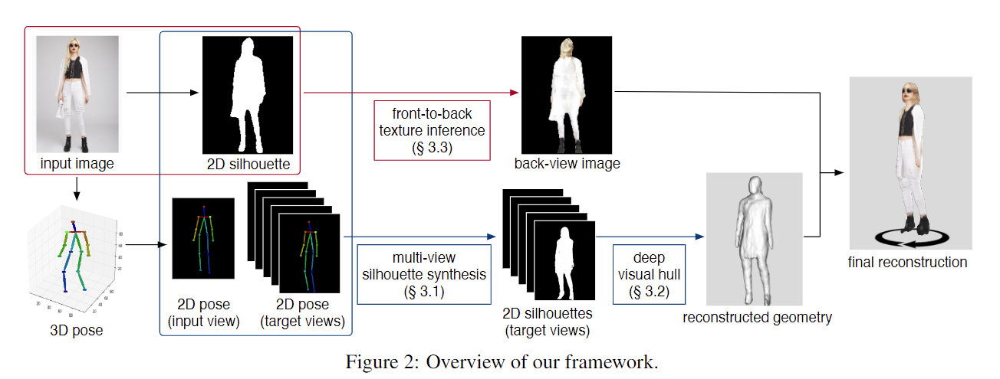
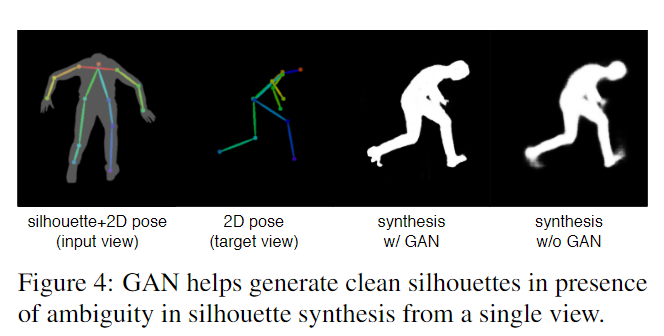
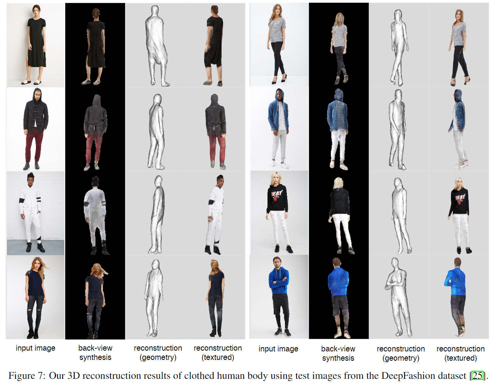

# SiCloPe: Silhouette-Based Clothed People

元の論文の公開ページ : [arxiv](https://arxiv.org/abs/1901.00049)
Github Issues : [#39](https://github.com/Obarads/obarads.github.io/issues/39)

## どんなもの?
正面像が映った1枚の2D画像から3Dの服を着た人の形状を推定するモデルを提案した。このモデルでは、キャリブレーションなどの手間を省いた状態で3D身体の推定を行う。

## 先行研究と比べてどこがすごいの?
一枚の画像からより詳細な3D推定を行う新しいモデルを提案した。また、この手法は一枚の画像から全身にテクスチャが貼られている衣服を身に着けた3D身体モデルを再構築する最初のノンパラメトリックな解決策である。

## 技術や手法のキモはどこ? or 提案手法の詳細
### 構造
提案モデルの構造は図2の通り。はじめに与えられた2D画像から2Dシルエットと3D joint locations(複数の関節位置)からなる3Dポーズを抽出する。

### Multi-View Silhouette Synthesis
変形や異なる服のタイプ等を起因とする形状の複雑さを対処することができる効果的な人間形状表現を見つける。そこで、入力の視点とは別の視点からの合成2Dシルエットを生成する、silhouette synthesis networkを提案する。概要図は図3の通り。このシルエットは、3D推定のために潜在的な中間表現として使われる。入力には入力画像のシルエット${\bf S}_ s$と推定した3Dポーズを入力画像に反映させた2Dポーズ${\bf P}_ s$、推定した3Dポーズを元に入力とは違う別の視点から被写体を映した2Dポーズ群${\bf P}_ t$を用いる。この時、$P_ t$に対応する2Dシルエット群${\bf S}_ t$はsilhouette synthesis networkにより式(1)のようにあらわされる。

$$
{\bf S}_ t = \mathcal{G}_ s({\bf S}_ s,{\bf P}_ s,{\bf P}_ t) \tag{1}
$$

この時、$\mathcal{G}_ s$の損失関数は2値クロスエントロピー損失を使った推定したシルエット群の再構築損失$\mathcal{L}_ {BCE}$とpatch-based敵対損失$\mathcal{L}_ {adv}$[1]からなる。この目的関数は式(2)のようになる。

$$
\mathcal{L}=\lambda_ {BCE}\cdot \mathcal{L}_ {BCE}+\mathcal{L}_ {adv} \tag{2}
$$

特に$\mathcal{L}_ {adv}$は重要であり、これを導入することで図4の様にシルエットが詳細かつシャープになる。

3D再構築を導くためにシルエットを使う利点は2つある。理由は以下の通り。

- シルエットは2値マスクであるため、合成は画素ごとの分類問題として定式化することができる。これは、新規視点の画像合成とは対称的に、複雑な損失関数もしくは更なるハイパーパラメータの調節を必要としないため、より堅牢な訓練ができる。
- ネットワークは、制限された出力解像度によって有界とされる体積表現[2]の様な3Dボクセル情報を明確に持たないので、はるかに高い空間解像度を予測できる。(多分、シルエット表現自体が解像度にそこまで依存しないということか)

### Deep Visual Hull Prediction
#### visual hull network
conditioned 3D jointは対応するシルエット中(指、服のしわなど)の詳細をはっきりさせることに失敗することがあるので、推定された結果が必ずしも完全に一致するとは限らない。したがって、visual hull(視体積交差法)は各視点で一貫性のないシルエットを取り去る設計がされているため、通常のvisual hullアルゴリズムを適応することは過度の崩壊(?)を招く傾向がある。この問題に対処するため、著者らはdeep visual hull networkを提案する。このネットワークは、服を着た人の体の前の(prior of)形状を使うことで完全に視点に矛盾のないシルエットを要求することなく、もっともらっしい衣服を身に着けた体の3D形状を再構築する。  
具体的には、[3]の構造を基に、異なる視点間で矛盾する新規視点のシルエットの確率マップを使用するようにする。任意の数の新規視点のシルエットを生成できるが、ネットワークの性能を最大化するために適切な入力視点を選ぶのは難しいため、いくつかの工夫を加えた。

#### Greedy view sampling
再構成の品質を上げるため、工夫としてgreedy view samplingを提案した。このアイデアのキーは候補のシルエットのプール(集合)を作り、それらからgreedyな手法で最も一貫性のある視点を選択する。
(ここのビンが分からないため、ここは飛ばす)

### Front-to-Back Texture Synthesis
一つの視点から被写体を写すとき、テクスチャの片側だけが見えるため、他の側面は予測して3Dの身体の形状とテクスチャを再構築する必要がある。これの重要な観点は、人の背面と正面は多くの視覚的特徴と同じ外形を共有しているため空間的に整った並び方をしていることである。つまり、人の正面図さえあればそこに映っている特徴を用いて背面を予測できるということである。この背面画像生成器の図5の通り。背面画像の生成には、正面画像とそれに対応するシルエット図が入力として使われる。また、生成器には[4]のネットワークが使われ、訓練もテクスチャつきの3Dボディをもとに生成したデータセットを用いて行われる。損失は特徴マッチング$\mathcal{L}_ {FM}$[4]と画像分類タスクのために事前トレーニングされたVGG19モデル[5]を使った知覚損失$\mathcal{L}_ {VGG}$と敵対損失$\mathcal{L}_ {adv}$を使った式(4)となる。

$$
\mathcal{L}=\lambda_ {FM} \cdot \mathcal{L}_ {FM} + \lambda_ {VGG} \cdot \mathcal{L}_ {VGG} + \mathcal{L}_ {adv} \tag{4}
$$

## どうやって有効だと検証した?
生成物は図7の通り。長ズボンが多い。3Dポーズから直接ボクセル予測をしたり、deep visual hull algorithmの入力としてシルエットの代わりにRGB画像をを使ったりした。表1にその結果を示す。測定方法は2DのIoUとCground-truthと再構築メッシュ間のChamfer距離である。直接ボクセル予測は2Dで側面図を一致させ、3Dでground-truthと位置合わせをするときに精度が悪くなる。また、図8にエラーマップを示す。our error mapに示す通り、ボクセルよりもシルエットのほうが誤差が少ない。

### その他
他にもいろいろ検証している。他の手法との比較もある。

## 議論はある?
- トレーニングセットが限られているため、実際の画像から偏っている場合がある。
- 出力されるメッシュにはリギングが施されていないため、アニメーションに直接使えない。
- 布と人体の幾何学形状を明確に区別できていない。(意味ラベルとかで拡張する予定)
- diffuseやspecular albedo mapsの様なrelightableテクスチャを推論すること。

## 次に読むべき論文は?
- [G.Varol,D.Ceylan,B.Russell,J.Yang,E.Yumer,I.Laptev, and C.Schmid. BodyNet: Volumetric inference of 3D human body shapes. InEuropean Conference on Computer Vision, pages 20–36, 2018.](https://arxiv.org/abs/1804.04875)

## 論文関連リンク
1. [P.Isola,J.-Y.Zhu,T.Zhou,and A.A.Efros. Image-to-image translation with conditional adversarial networks. In IEEE Conference on Computer Vision and Pattern Recognition, pages 1125–1134, 2017.](https://arxiv.org/abs/1611.07004)
2. [G.Varol,D.Ceylan,B.Russell,J.Yang,E.Yumer,I.Laptev, and C.Schmid. BodyNet: Volumetric inference of 3D human body shapes. InEuropean Conference on Computer Vision, pages 20–36, 2018.](https://arxiv.org/abs/1804.04875)
3. [Z. Huang, T. Li, W. Chen, Y. Zhao, J. Xing, C. LeGendre, L. Luo, C. Ma, and H. Li. Deep volumetric video from very sparse multi-view performance capture. In European Conference on Computer Vision, pages 336–354, 2018.](http://openaccess.thecvf.com/content_ECCV_2018/papers/Zeng_Huang_Deep_Volumetric_Video_ECCV_2018_paper.pdf)
4. [T.-C. Wang, M.-Y. Liu, J.-Y. Zhu, A. Tao, J. Kautz, and B.Catanzaro. High-resolution image synthesis and semantic manipulation with conditional gans. InIEEE Conference on Computer Vision and Pattern Recognition,pages 8798–8807,2018.](https://arxiv.org/abs/1711.11585)
5. [K. Simonyan and A. Zisserman. Very deep convolutional networks for large-scale image recognition. arXiv preprint arXiv:1409.1556, 2014.](https://arxiv.org/abs/1409.1556)

## 会議
CVPR 2019

## 著者
Ryota Natsume, Shunsuke Saito, Zeng Huang, Weikai Chen, Chongyang Ma, Hao Li, Shigeo Morishima.

## 投稿日付(yyyy/MM/dd)
2018/12/31

## コメント
ビンについて知りたい。

## key-words
RGB_Image, 3D_Estimation

## status
修正