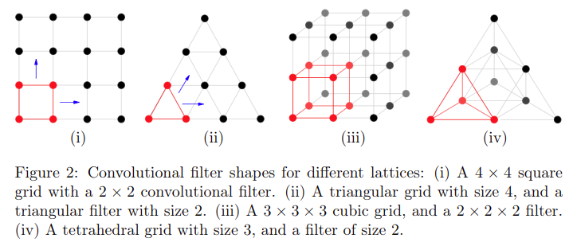

# Sparse 3D convolutional neural networks

元の論文の公開ページ : https://arxiv.org/pdf/1505.02890.pdf

## どんなもの?
スパースな表現として扱われることが多い3D表現に対して使えるCNNを提案した。3Dとは言っているが、2Dでも4Dでも使おうと思えば使える。

## 先行研究と比べてどこがすごいの?
[3]では、スパースな2次元CNNが中国語の手書き認識を行うために実装されている。これは、手書き文字は2次元グリッド状の中程度の解像度でレンダリングされた時、それをスパースな行列に見立てている。もし、ペンが通った部分を入力として扱えるCNNの隠れユニット(隠れ層とか?)のみを計算するとすると、計算量は減る。著者らはこのアイデアを3D向けに拡張した。つまり、通常のCNNを3Dに適応すると膨大な計算量になるが、こちらのCNNは計算量を抑えることができる。先にコメント内容を確認すること。

## 技術や手法のキモはどこ? or 提案手法の詳細
著者らは最初に、これらのフィルタとして、サイズ$2\times 2\times 2$立方体の格子であり$2^3=8$の入力サイトをカバーするものと、最小の形状である四面体格子であり入力サイトを4つ分カバーするものを用意する。  
次に入力がスパースな場合の問題を検討する。これで空間内全てに畳み込みを適応する必要がなくなるため計算の節約となる(畳み込みをする前に畳み込みする対象にアクティブな要素(二値で表現されるとき1であるような要素)が含まれている場合のみ計算すれば良い)。  

## CNNs on different lattices
各層のCNNは有限グラフから成り立ち、各サイトの入力と隠れユニットのベクトルを使用する。

- 四角
  - 通常の2D CNNは図2(i)のような正方形の格子に成り2方向に自由に動く。
  - 3D CNNは立方体の格子となり、図2(iii)の様に3方向に自由に動く。
  - d次元のサイズは$2^d$で$d=2,3,4,\ldots$($2^d$サイトとも)となるため、4D CNNなどの超立方体を作ることができるが、指数関数的にサイズが大きくなってしまう。
- 三角
  - 2Dの三角格子はフィルタが三角であり、図2の(ii)の様に2方向に自由に動く。
  - 3Dの四面体格子は図2の(iv)の様に3方向に動く。
  - d次元の最小格子はd+1サイトであるため、指数関数的に増えない。

## Sparse operations
[1]のスパースなCNNアルゴリズムは格子上で効率的に動作するように調節される。CNNの各データ層の空間的なサイズ([1]での空間的なサイズというのは、畳み込み層のフィルターのサイズと同じもの)は格子型のグラフで表される(図2と同様)。各グリッドの空間位置(入力ピクセルと同じもの)には入力もしくは隠れユニット(各層の出力)のdimension-lessなベクトル(0であるベクトル)が存在する。入力に応じて、一部の空間位置がアクティブ(1であるベクトル?)になるように定義される。

- もし、位置にあるベクトがゼロでない場合、入力層グラフの空間位置はactiveと宣言される。
- 隠れたレイヤの空間位置が、その下のレイヤの入力を受け取るレイヤの空間位置のいずれかがアクティブであればアクティブであることを宣言する(?)。

スパース畳み込みは3D次元の場合図1を、2次元の場合は図3を参照すること。

図1(3次元)は$2\times 2\times 2$の畳み込みを適応することでアクティブなサイト(0でないボクセル)が増える(左と真ん中)(この畳込みにはパディングが施されている?)。$2\times 2\times 2$のpooling演算を適応するとスケールが減り(解像度が落ちる)、アクティブなサイトの数が減る(真ん中と右)。

図3(2次元)はスパースなCNNに対する$2\times 2$の畳み込みを適応するもの。赤い部分に畳み込みフィルタをおいた場合、フィルタの適応範囲にはアクティブなサイトが含まれるためその部分だけは少なくとも計算する必要がある。右の図はおそらく左のものに畳み込みとプーリングを適応したもの。

以下に図2に示されているタイプのグラフに対するスパースな畳み込みの実装について説明する。

## どうやって有効だと検証した?

## 議論はある?

## 次に読むべき論文は?
- なし

## 論文関連リンク
1. [B. Graham. Spatially-sparse convolutional neural networks. 2014.](https://arxiv.org/abs/1409.6070)

## 会議
BMVC 2015

## 著者
Ben Graham

## 投稿日付(yyyy/MM/dd)
2015/03/12

## コメント
途中でlattice(格子)とかsite(位置)とかは、化学とかで使われる構造体の表現と同じっぽい。この場合、siteは格子の頂点の位置であり、おそらくは2次元画像のピクセルなどの要素に当たるもの。あと補足として、「スパース　畳み込み」で予めスパースなニューラルネットワークについて調べておくこと。

## key-words
Voxel

## status
省略