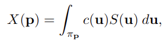
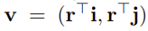
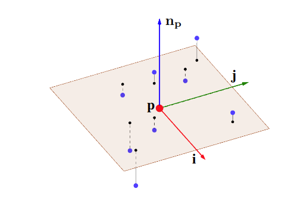
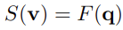
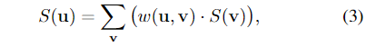
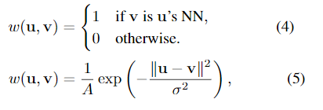

# Tangent Convolutions for Dense Prediction in 3D

## どんなもの?
tangent convolutionの概念に基づいて表面の畳み込みネットワークのための代替構成を開発した。隠れている表面を必要とせず、近似的な法線ベクトル推定をサポートしている任意の形式(点群、メッシュ、polygon soup)で扱える。
tangent convolutionは点の周りの接平面に局所表面形状を映すことに基づいている。これにより接平面の画像を作れる。これらの接平面画像は通常の2Dの畳み込みとして扱われる。tangent convolutionを基礎構成として、U-type networkを設計した。

## 先行研究と比べてどこがすごいの?
大規模点群を含む現実世界で取ったデータを処理できる。

## 技術や手法のキモはどこ?
- **tangent convolution(未完成)**  
    P={p}が点群、F(p)点Pにおけるtangent convolutionは以下のように定義される。

    
    
    このとき、u∈R**2はπpの点であり、c(u)は畳み込みカーネル、Sは接平面画像である。

    F(p)はP上の離散スカラー関数であり、中間層から色やジオメトリ、抽象特徴を符号化する。Fを畳み込むにはそれを連続関数に拡張する必要がある。また、pにとっての法線npを設定し、画像平面はpの接平面πpとして扱う。

- **接平面推定**
    まずは各点pについて、局所共分散分析を使ったカメラ画像の向きを推定する。
    ||p-q||<Rに当てはまるpを中心とする球内にある近傍点qがあるとき、接平面の向きは共分散行列Cの固有ベクトルによって決定される。Cは以下の通り。  

    

    最小固有値の固有ベクトルは推定された法線平面を定義し、他の固有ベクトルiとjは接平面画像をパラメータ化する2D画像軸を定義する。

- **補完**  
    次にpの近傍点qを接平面に投影する。このとき、投影された点vが生成される。vは以下の通りであり、投影は青点がq、赤点がpであるとき下図のようになる。

    

    

    また、S(v)は以下のように定義される。

    

    下図の(a)は上の投影図を上から見たものである。シグナル(点を平面に投影したもの)は(a)のままだと離散したままではS(u)に使うことができないので、補完を行う。S(u)は以下の通り。

    

    ここで、w(u,v)はカーネルの重さでありΣ_v w=1を満たす。
    補完は近傍とGussian kernel mixtureの2種類を考えた。下の上の式は近傍、下はGaussian kernel mixtureを表したものである。なお、Σ_v w=1となるように正規化する。

    

    

    提案した補完形式以外のより優位な形式については、特に考察していない。また、大抵の場合は単純な形式である近傍を使うと述べている。

    

## どうやって有効だと検証した?

## 議論はある?

## 次に読むべき論文は?
- 
-

### 論文関連リンク
-
-

### 参考リンク
-
-
### 会議

### 著者/所属機関
Maxim Tatarchenko, Jaesik Park, Vladlen Koltun, Qian-Yi Zhou

### 投稿日付(yyyy/MM/dd)
2018/12/21

## コメント
