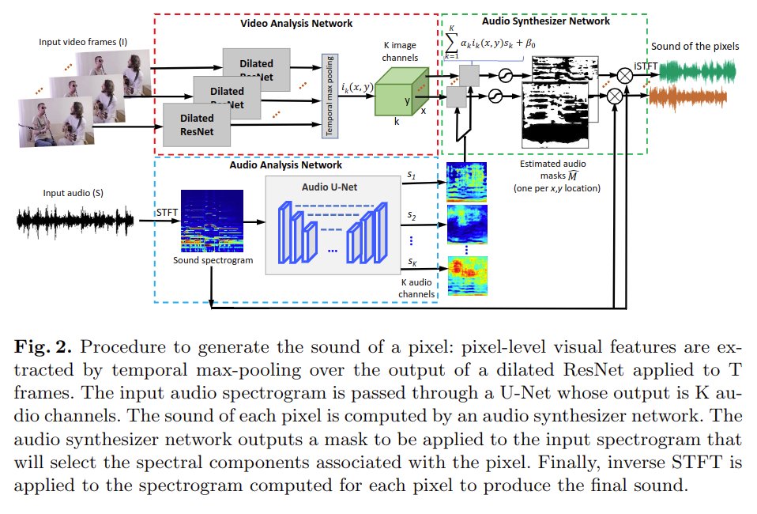

# The Sound of Pixels

元の論文の公開ページ : [arXiv](https://arxiv.org/abs/1804.03160)  
Github Issues : 

## どんなもの?
ラベルがついていない大量のビデオを利用して音が出ている領域を見つけ、入力音を各ピクセルからの音を表す一連の成分へ分離することを学習するモデル、PixelPlayerを提案した。手法の流れは下掲の図1を見たほうがわかりやすい。  

## 先行研究と比べてどこがすごいの?

## 技術や手法のキモはどこ? or 提案手法の詳細
### 概要
PixelPlayerのプロセスは図1の通りである。図1について、PixelPlayerのプロセスを図1の下に記載する。

#### a) 入力データ
一人もしくは二人が楽器を使って演奏しているビデオを大量に使用する。これらのビデオにはラベルがついていないものとする。

#### b) Audio-visual sounds source separation and localization
ビデオに含まれるデータの中で、PixelPlayerで使われるものはビデオの連続したフレームとビデオの音である。この二つのデータは二つのネットワークにそれぞれ入力され、特徴量に変換され、最終的にビデオフレームの空間位置$(x,y)$に対応する音(音の出どころ)を特定する。

#### c) 出力データ
ピクセルごとの音成分を出力とする。c)では11箇所の音を示す。青い直線は無音を、その他の赤と緑は各音の成分を示す。

### Model architectures
モデルの概要は図2の通りである。提案したアーキテクチャの部品の説明を図2の下に記載する。

#### Video analysis network
このネットワークはビデオのフレームから視覚特徴を抽出する。この部品のアーキテクチャには、視覚的なクラス分類用の任意のアーキテクチャを使用することができる。実装ではResNet-18の拡張モデルを採用した(拡張内容は後述)。  
モデルは$\mathrm{T} \times \mathrm{H} \times \mathrm{W} \times 3$サイズのビデオを入力として受け取り、フレームごとに$\mathrm{T} \times(\mathrm{H} / 16) \times(\mathrm{W} / 16) \times \mathrm{K}$サイズの特徴を抽出する。その後、temporal poolingとsigmoid活性化で各ピクセルごとに$\mathrm{K}$サイズの視覚特徴$i_ {k}(x, y)$を得る。

#### Audio analysis network
このネットワークは入力音を$\mathrm{K}$個の成分$s_ k$($k=(1, \ldots, K)$)へ分離するU-Netアーキテクチャである。経験的に、生の波形を使うよりもオーディオスペクトルグラムを使用するほうがより良いパフォーマンスを生むため、実装では音のTime-Frequency (T-F)表現を使用する。  
はじめに、入力である入り混じった音からスペクトルグラムを得るためにShort-Time Fourier Transform (STFT)を適応する。次に、スペクトルグラムの大きさをlog-frequency scaleに変換し、その後U-Netに与える。U-Netは入力音の異なる成分の特徴を含む$\mathrm{K}$個の特徴マップを生成する。

#### Audio synthesizer network
このネットワークは視覚特徴$i_ k(x,y)$と音特徴$s_ k$を使って音を予測する。出力する音スペクトルグラムは視覚に基づくスペクトルグラムマスキング技術によって生成される。  
具体的には、入力からピクセルごとの音を分離することができるマスク$M(x,y)$が推定され、入力スペクトルグラムと乗算される。最終的に、予測波形を得るため、スペクトルグラムの予測された大きさと入力スペクトルグラムの位相を組み合わせ、STFTを用いて復元する。

### Mix-and-Separate framework for Self-supervised Training
ここでは視覚情報に従って音を分離することを学習するための訓練、Mix-and-Separate traningの手順について説明する。この訓練では、音的に複雑な状況を人工的に作成したデータを利用して、視覚情報に基づいてその複雑な音を分離することを学習する。音のシグナルはほぼ加法的であるため、異なるビデオを混合することで複雑な音のシグナルを作成できる。以下に具体的な方法について説明する。

#### 複雑な音の生成
訓練データセットから$N$個のビデオ$\\{I_ n,S_ n\\}$($n=(1, \ldots, N)$)をランダムにサンプリングする。$I_ n$と$S_ n$はそれぞれ$n$番目のフレームと音を表す。サンプリングしたビデオの音$S_ n$を線形結合することで混合した音を作成する : $S_ {m i x}=\sum_ {n=1}^{N} S_ {n}$。

#### 学習
混合した音とそれに対応するビデオの視覚が与えられたとき、モデル$f$は各ビデオ$\hat{S}_ n$中の音を推定することを学習する : $\hat{S}_ {n}=f(S_ {m i x}, I_ {n})$。図3は$N=2$のときの訓練フレームワークを示す。

訓練時はテスト時と違う。

## どうやって有効だと検証した?

## 議論はある?

## 次に読むべき論文は?
- なし

## 論文関連リンク
1. なし

## 会議
ECCV 2018

## 著者
Hang Zhao, Chuang Gan, Andrew Rouditchenko, Carl Vondrick, Josh McDermott, Antonio Torralba.

## 投稿日付(yyyy/MM/dd)
2018/04/03

## コメント
なし

## key-words
Video

## status
未完

## read
A, I, M

## Citation
