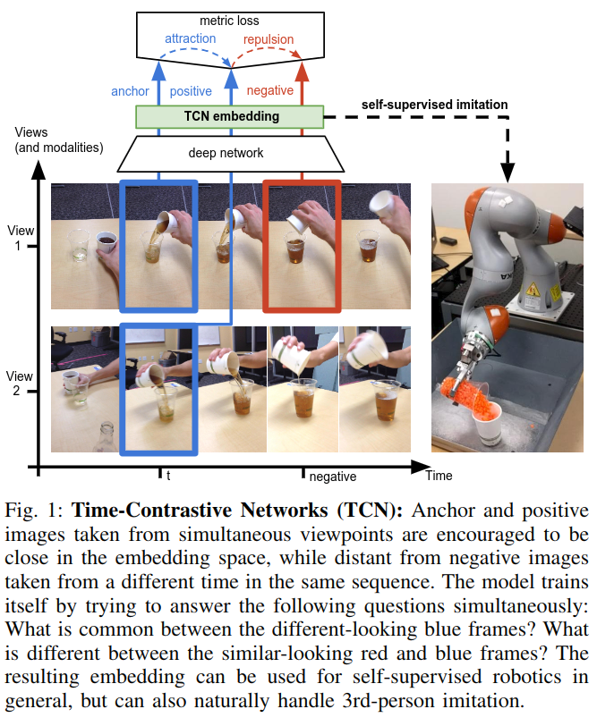

# Time-Contrastive Networks: Self-Supervised Learning from Video

元の論文の公開ページ : [arXiv](https://arxiv.org/abs/1704.06888)  
Github Issues : 

## どんなもの?
一連の動作を記録したラベルなしビデオを訓練データとして、ロボットにその一連の動作を直接模倣してもらうSelf-Supervised Learning手法を提案した。

## 先行研究と比べてどこがすごいの?
ビデオの1フレームごとにラベル付を行うという作業は非効率的かつ膨大な時間を要する。その上、タスク(論文内のロボットアームのタスクなど)によってはそれらのラベル情報が必ずしも役に立つとは限らない(つまり、ラベル以外の潜在的な情報が必要となる可能性がある)。それらの問題を解決するのが、著者らが提案するTime-Contrastive Networks(TCN)である。

## 技術や手法のキモはどこ? or 提案手法の詳細
本研究で提案する手法は図1の通り。多視点から取ったビデオを用いて、青色の枠の共通点は何か? 青枠と赤枠の動作は似ているがその違いは何なのか? といった事柄を解いてもらうことによってネットワークを学習させる。また、これらの動作をロボットに模倣してもらうため、これらの動作と一致するロボットの運動コマンドを強化学習によって学んでもらう。

## どうやって有効だと検証した?

## 議論はある?

## 次に読むべき論文は?
- なし

## 論文関連リンク
1. [Self-Supervision and Play - Pierre Sermanet @ OpenAI Robotics Symposium 2019 (public, 45 mins), (アクセス:2019/05/20)](https://docs.google.com/presentation/d/145wBH7TEJoEclVzE1YKTihqIXWMljeNIA6ozwMZLb3Q/edit#slide=id.g581ee82d09_0_517)

## 会議
ICRA 2018

## 著者
Pierre Sermanet, Corey Lynch, Yevgen Chebotar, Jasmine Hsu, Eric Jang, Stefan Schaal, Sergey Levine.

## 投稿日付(yyyy/MM/dd)
2017/04/23

## コメント
なし

## key-words
Video, Self-Supervised_Learning, Robot

## status
省略

## BibTex
@article{Sermanet2017TCN,
  author    = {Pierre Sermanet and
               Corey Lynch and
               Yevgen Chebotar and
               Jasmine Hsu and
               Eric Jang and
               Stefan Schaal and
               Sergey Levine},
  title     = {Time-Contrastive Networks: Self-Supervised Learning from Video},
  journal   = {Proceedings of International Conference in Robotics and Automation (ICRA)}},
  year      = {2018},
  url       = {http://arxiv.org/abs/1704.06888},
  biburl    = {https://github.com/sermanet/home/blob/master/docs/bib/Sermanet2017TCN.bib},
}
