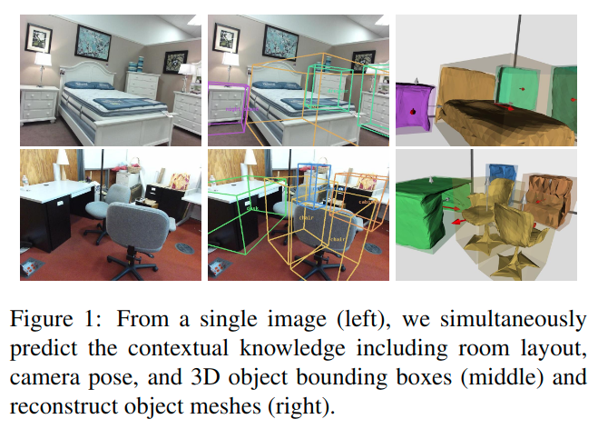
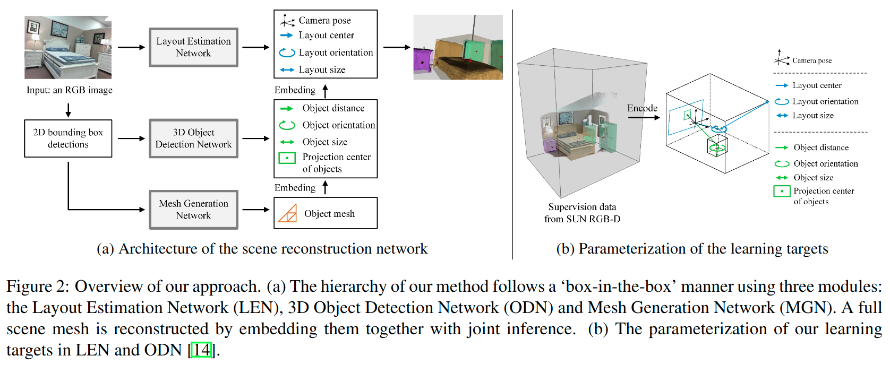

# Total3DUnderstanding: Joint Layout, Object Pose and Mesh Reconstruction for Indoor Scenes from a Single Image

元の論文の公開ページ : [arxiv.org](https://arxiv.org/abs/2002.12212)  
提案モデルの実装 : [なし:2020/4/15]()  
Github Issues :   

Note: 記事の見方や注意点については、[こちら](/)をご覧ください。  
Note: 引用中の[*]は論文内の文献番号である。該当する論文は、論文関連リンクの各リストの末尾に基づいて調べられる。  

## どんなもの?
##### 単体画像から室内の間取り、BB、再構築を行う手法を提案した。
- "We argue that understanding the context of each component can assist the task of parsing the others, which enables joint understanding and reconstruction."
- " To bridge the gap between scene understanding and object mesh reconstruction, we unify them together with joint learning, and simultaneously predict room layout, camera pose, 3D object bounding boxes and meshes (Figure 1)."
- "We propose a novel density-aware topology modifier in object mesh generation. It prunes mesh edges based on local density to approximate the target shape by progressively modifying mesh topology. Our method directly tackles the major bottleneck of [30], which is in the requirement of a strict distance threshold to remove detached faces from the target shape. Compared with [30], our method is robust to diverse shapes of indoor objects under complex backgrounds."
- "Our method takes into account the attention mechanism and multilateral relations between objects. In 3D object detection, the object pose has an implicit and multilateral relation with surroundings, especially in indoor rooms (e.g., bed, nightstand, and lamp). Our strategy extracts the latent features for better deciding object locations and poses, and improves 3D detection."

## 先行研究と比べてどこがすごいの? or 関連事項
##### 省略
- Iにもある。

## 技術や手法のキモはどこ? or 提案手法の詳細
##### 手法の概要
- 手法は図2の通り。

## どうやって有効だと検証した?
##### 省略

## 議論はある?
##### 省略

## 次に読むべき論文は?
##### なし

## 論文関連リンク
##### あり
1. [Junyi Pan, Xiaoguang Han, Weikai Chen, Jiapeng Tang, and Kui Jia. Deep mesh reconstruction from single rgb images via topology modification networks. In Proceedings of the IEEE International Conference on Computer Vision, pages 9964–9973, 2019. ](http://openaccess.thecvf.com/content_ICCV_2019/html/Pan_Deep_Mesh_Reconstruction_From_Single_RGB_Images_via_Topology_Modification_ICCV_2019_paper.html)[30]

## 会議, 論文誌, etc.
##### CVPR 2020

## 著者
##### Yinyu Nie, Xiaoguang Han, Shihui Guo, Yujian Zheng, Jian Chang, Jian Jun Zhang

## 投稿日付(yyyy/MM/dd)
##### 2020/02/27

## コメント
##### なし

## key-words
##### CV, Paper, 導入, Reconstruction, Detection, Mesh, RGB_Image

## status
##### 導入

## read
##### A, I

## Citation
##### 未記入
